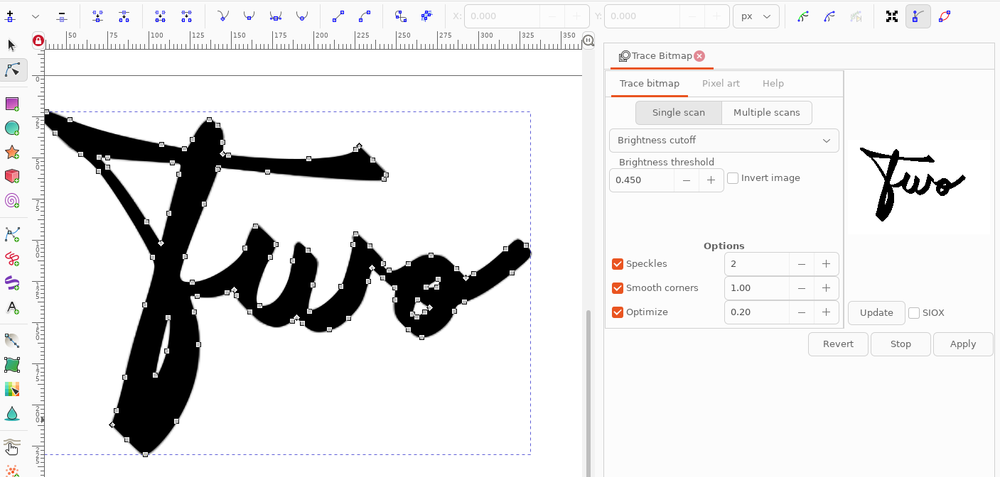
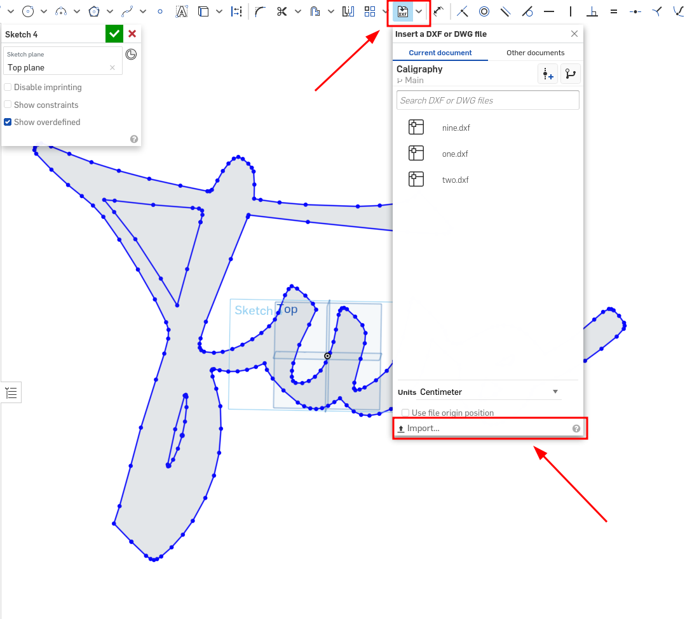
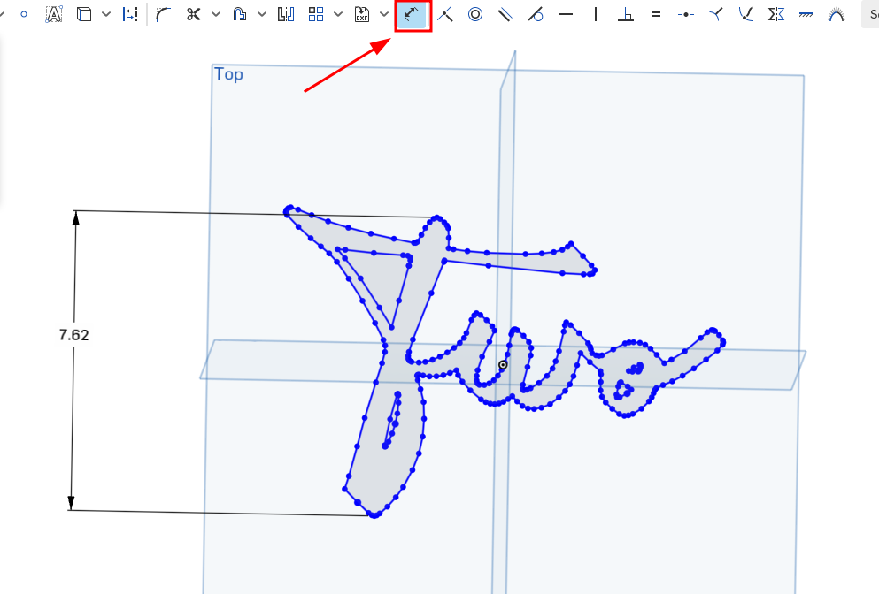
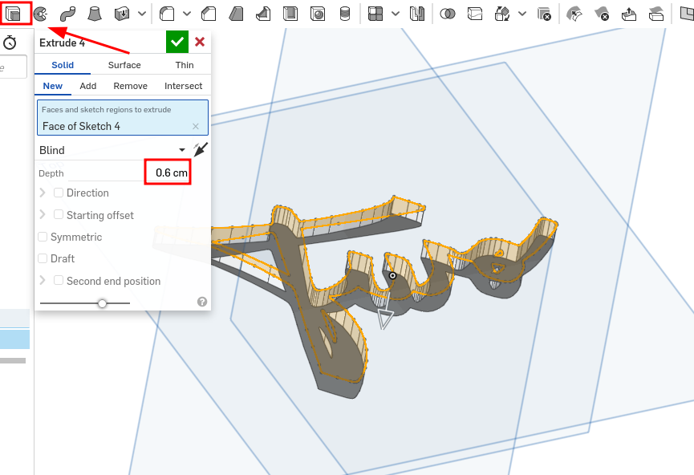
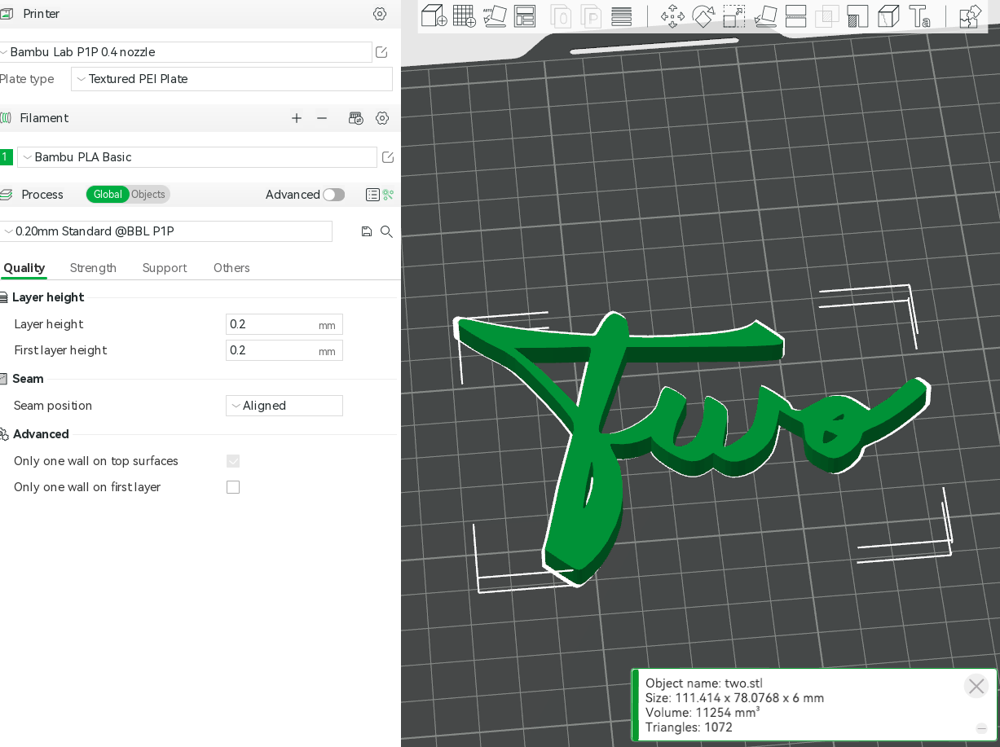

# Table Numbers

A friend requested that I 3D print table numbers for their wedding. This ended up being more involved than I anticipated, so I’m documenting the process and sharing the models here in hopes that it will save someone a bit of time.


### The Font

I assumed there would be many, readily available, fonts resembling the example in the image. This was not the case. A lot of time was wasted searching before I realized that I’d need hand-written calligraphy. I’m not very artistic, so my friend Sarah did this on her tablet using a brush tool. The `.png` files in this repository are the result of that work.

### Vectorization

The images needed to be converted to a format that a 3D modeling tool can import. Specifically, we need to convert the bitmap images into vector files. [Inkscape](https://inkscape.org/) has a **Trace Bitmap** tool for this exact purpose. In several cases, manual adjustments needed to be made. I then exported these in DXF format which [OnShape](https://www.onshape.com/en/) supports. Be sure to export to the AutoCAD R14 version with LWPOLYLINE mode, R12 will result in jagged edges.



## 3D Models

Once we have the DXF vector files, we can bring them into an [OnShape](https://www.onshape.com) sketch. 



I then used the dimension tool to scale it down to 3 inches tall. The 3 inch dimention was slighly altered per-number to compensate for the variable heights of the starting characters.



I then used the extrude tool to turn the sketch into a 6mm deep part. If you're wondering why I'm mixing metric and emperial units in this guide, I don't have a good answer for you.



**Note:** It's been brought to my attention that OnShape is not the best tool for the job.

``` stl
solid Mesh
  facet normal 0 0 -1
    outer loop
      vertex -36.2295 -35.6807 0
      vertex -39.5717 -32.323 0
      vertex -38.5679 -29.0179 0
    endloop
  endfacet
  facet normal 0 0 -1
    outer loop
      vertex -33.4335 -38.2752 0
      vertex -36.2295 -35.6807 0
      vertex -28.6656 -36.5886 0
    endloop
  endfacet
  facet normal 0 0 -1
    outer loop
      vertex 26.1864 -9.06465 0
      vertex 25.2216 -7.63556 0
      vertex 24.8232 -6.02213 0
    endloop
  endfacet
  facet normal 0 0 -1
    outer loop
      vertex 28.8765 -7.02557 0
      vertex 29.0306 -7.71988 0
      vertex 27.8751 -10.6607 0
    endloop
  endfacet
  facet normal 0 0 -1
    outer loop
      vertex -26.5916 -34.172 0
      vertex -29.5764 -21.3537 0
      vertex -24.7776 -31.5349 0
    endloop
  endfacet
  facet normal 0 0 -1
    outer loop
      vertex -29.5764 -21.3537 0
      vertex -29.361 -21.2654 0
      vertex -24.7776 -31.5349 0
    endloop
  endfacet
  facet normal 0 0 -1
    outer loop
      vertex -24.7776 -31.5349 0
      vertex -29.361 -21.2654 0
      vertex -22.493 -27.1728 0
    endloop
  endfacet
  facet normal 0 0 -1
    outer loop
      vertex -29.361 -21.2654 0
      vertex -28.6597 -20.0818 0
      vertex -22.493 -27.1728 0
    endloop
  endfacet
  facet normal 0 0 -1
    outer loop
      vertex -28.6656 -36.5886 0
      vertex -36.2295 -35.6807 0
      vertex -26.5916 -34.172 0
    endloop
  endfacet
  facet normal 0 0 -1
    outer loop
      vertex -26.5916 -34.172 0
      vertex -36.2295 -35.6807 0
      vertex -29.5764 -21.3537 0
    endloop
  endfacet
  facet normal 0 0 -1
    outer loop
      vertex -36.2295 -35.6807 0
      vertex -38.5679 -29.0179 0
      vertex -29.5764 -21.3537 0
    endloop
  endfacet
  facet normal 0 0 -1
    outer loop
      vertex -29.5764 -21.3537 0
      vertex -38.5679 -29.0179 0
      vertex -29.6608 -21.0207 0
    endloop
  endfacet
  facet normal 0 0 -1
    outer loop
      vertex -38.5679 -29.0179 0
      vertex -36.6021 -21.396 0
      vertex -29.6608 -21.0207 0
    endloop
  endfacet
  facet normal 0 0 -1
    outer loop
      vertex -29.6608 -21.0207 0
      vertex -36.6021 -21.396 0
      vertex -28.3711 -14.3457 0
    endloop
  endfacet
  facet normal 0 0 -1
    outer loop
      vertex -36.6021 -21.396 0
      vertex -34.8102 -14.1543 0
      vertex -28.3711 -14.3457 0
    endloop
  endfacet
  facet normal 0 0 -1
    outer loop
      vertex -28.3711 -14.3457 0
      vertex -34.8102 -14.1543 0
      vertex -26.7018 -7.96515 0
    endloop
  endfacet
  facet normal 0 0 -1
    outer loop
      vertex -34.8102 -14.1543 0
      vertex -32.1383 -5.06749 0
      vertex -26.7018 -7.96515 0
    endloop
  endfacet
  facet normal 0 0 -1
    outer loop
      vertex -26.7018 -7.96515 0
      vertex -32.1383 -5.06749 0
      vertex -26.4856 -7.82381 0
    endloop
  endfacet
  facet normal 0 0 -1
    outer loop
      vertex -32.1383 -5.06749 0
      vertex -30.6564 -0.136754 0
      vertex -26.4856 -7.82381 0
    endloop
  endfacet
  facet normal 0 0 -1
    outer loop
      vertex -26.4856 -7.82381 0
      vertex -30.6564 -0.136754 0
      vertex -29.9719 2.70309 0
    endloop
  endfacet
  facet normal 0 0 -1
    outer loop
      vertex 27.8751 -10.6607 0
      vertex 29.0306 -7.71988 0
      vertex 29.6595 -11.9619 0
    endloop
  endfacet
  facet normal 0 0 -1
    outer loop
      vertex 29.0306 -7.71988 0
      vertex 29.7211 -7.67105 0
      vertex 29.6595 -11.9619 0
    endloop
  endfacet
  facet normal 0 0 -1
    outer loop
      vertex 29.6595 -11.9619 0
      vertex 29.7211 -7.67105 0
      vertex 30.9569 -12.3871 0
    endloop
  endfacet
  facet normal 0 0 -1
    outer loop
      vertex 32.6278 -5.69875 0
      vertex 38.5671 -5.68974 0
      vertex 38.2757 -6.47955 0
    endloop
  endfacet
  facet normal 0 0 -1
    outer loop
      vertex 11.1793 -2.59679 0
      vertex 12.5654 -0.717176 0
      vertex 19.6048 3.35917 0
    endloop
  endfacet
  facet normal 0 0 -1
    outer loop
      vertex 12.5654 -0.717176 0
      vertex 13.3327 1.1667 0
      vertex 19.6048 3.35917 0
    endloop
  endfacet
  facet normal 0 0 -1
    outer loop
      vertex 19.6048 3.35917 0
      vertex 13.3327 1.1667 0
      vertex 14.1409 3.75474 0
    endloop
  endfacet
  facet normal 0 0 -1
    outer loop
      vertex -24.0265 26.9359 0
      vertex -14.2909 32.0241 0
      vertex -23.9458 26.1373 0
    endloop
  endfacet
  facet normal 0 0 -1
    outer loop
      vertex -14.2909 32.0241 0
      vertex -14.2909 29.3624 0
      vertex -23.9458 26.1373 0
    endloop
  endfacet
  facet normal 0 0 -1
    outer loop
      vertex -23.9458 26.1373 0
      vertex -14.2909 29.3624 0
      vertex -24.2841 24.7517 0
    endloop
  endfacet
  facet normal 0 0 -1
    outer loop
      vertex 30.9569 -12.3871 0
      vertex 29.7211 -7.67105 0
      vertex 31.9974 -12.249 0
    endloop
  endfacet
  facet normal 0 0 -1
    outer loop
      vertex 29.7211 -7.67105 0
      vertex 31.5979 -6.68177 0
      vertex 31.9974 -12.249 0
    endloop
  endfacet
  facet normal 0 0 -1
    outer loop
      vertex 31.9974 -12.249 0
      vertex 31.5979 -6.68177 0
      vertex 33.0993 -11.8607 0
    endloop
  endfacet
  facet normal 0 0 -1
    outer loop
      vertex 40.6438 -4.35918 0
      vertex 40.8792 1.18074 0
      vertex 42.9472 -3.37177 0
    endloop
  endfacet
  facet normal 0 0 -1
    outer loop
      vertex 40.8792 1.18074 0
      vertex 42.6535 2.12416 0
      vertex 42.9472 -3.37177 0
    endloop
  endfacet
  facet normal 0 0 -1
    outer loop
      vertex 42.9472 -3.37177 0
      vertex 42.6535 2.12416 0
      vertex 45.5391 -1.91399 0
    endloop
  endfacet
  facet normal 0 0 -1
    outer loop
      vertex 14.1409 3.75474 0
      vertex 15.2304 8.73898 0
      vertex 19.1372 8.42576 0
    endloop
  endfacet
  facet normal 0 0 -1
    outer loop
      vertex 6.21382 -0.427212 0
      vertex 5.12387 -4.95718 0
      vertex 2.48423 -7.91451 0
    endloop
  endfacet
  facet normal 0 0 -1
    outer loop
      vertex 5.12387 -4.95718 0
      vertex 5.07426 -6.03087 0
      vertex 2.48423 -7.91451 0
    endloop
  endfacet
  facet normal 0 0 -1
    outer loop
      vertex 2.48423 -7.91451 0
      vertex 5.07426 -6.03087 0
      vertex 3.75175 -9.22226 0
    endloop
  endfacet
  facet normal 0 0 -1
    outer loop
      vertex 5.07426 -6.03087 0
      vertex 5.34576 -6.37303 0
      vertex 3.75175 -9.22226 0
    endloop
  endfacet
  facet normal 0 0 -1
    outer loop
      vertex 3.75175 -9.22226 0
      vertex 5.34576 -6.37303 0
      vertex 5.10541 -10.3616 0
    endloop
  endfacet
  facet normal 0 0 -1
    outer loop
      vertex 5.34576 -6.37303 0
      vertex 6.13532 -6.21749 0
      vertex 5.10541 -10.3616 0
    endloop
  endfacet
  facet normal 0 0 -1
    outer loop
      vertex 5.10541 -10.3616 0
      vertex 6.13532 -6.21749 0
      vertex 6.50501 -10.9707 0
    endloop
  endfacet
  facet normal 0 0 -1
    outer loop
      vertex 6.13532 -6.21749 0
      vertex 8.07023 -11.0785 0
      vertex 6.50501 -10.9707 0
    endloop
  endfacet
  facet normal 0 0 -1
    outer loop
      vertex 5.21113 28.2612 0
      vertex 9.32953 28.5043 0
      vertex 14.6581 23.5892 0
    endloop
  endfacet
  facet normal 0 0 -1
    outer loop
      vertex 9.32953 28.5043 0
      vertex 12.3823 28.9142 0
      vertex 14.6581 23.5892 0
    endloop
  endfacet
  facet normal 0 0 -1
    outer loop
      vertex 14.6581 23.5892 0
      vertex 12.3823 28.9142 0
      vertex 20.0495 23.3999 0
    endloop
  endfacet
  facet normal 0 0 -1
    outer loop
      vertex 12.3823 28.9142 0
      vertex 14.5126 29.5188 0
      vertex 20.0495 23.3999 0
    endloop
  endfacet
  facet normal 0 0 -1
    outer loop
      vertex 20.0495 23.3999 0
      vertex 14.5126 29.5188 0
      vertex 21.5886 23.4647 0
    endloop
  endfacet
  facet normal 0 0 -1
    outer loop
      vertex 14.5126 29.5188 0
      vertex 15.8638 30.3463 0
      vertex 21.5886 23.4647 0
    endloop
  endfacet
  facet normal 0 0 -1
    outer loop
      vertex 21.5886 23.4647 0
      vertex 15.8638 30.3463 0
      vertex 16.709 31.1403 0
    endloop
  endfacet
  facet normal 0 0 -1
    outer loop
      vertex -7.51107 12.4563 0
      vertex -6.95133 13.0099 0
      vertex -5.93021 12.5718 0
    endloop
  endfacet
  facet normal 0 0 -1
    outer loop
      vertex -28.6597 -20.0818 0
      vertex -27.8012 -17.9839 0
      vertex -22.493 -27.1728 0
    endloop
  endfacet
  facet normal 0 0 -1
    outer loop
      vertex -27.8012 -17.9839 0
      vertex -27.0299 -15.4855 0
      vertex -22.493 -27.1728 0
    endloop
  endfacet
  facet normal 0 0 -1
    outer loop
      vertex -22.493 -27.1728 0
      vertex -27.0299 -15.4855 0
      vertex -26.5558 -12.8708 0
    endloop
  endfacet
  facet normal 0 0 -1
    outer loop
      vertex -26.5558 -12.8708 0
      vertex -26.3171 -10.149 0
      vertex -22.493 -27.1728 0
    endloop
  endfacet
  facet normal 0 0 -1
    outer loop
      vertex -26.3171 -10.149 0
      vertex -26.3527 -8.21529 0
      vertex -22.493 -27.1728 0
    endloop
  endfacet
  facet normal 0 0 -1
    outer loop
      vertex -22.493 -27.1728 0
      vertex -26.3527 -8.21529 0
      vertex -28.3867 8.99282 0
    endloop
  endfacet
  facet normal 0 0 -1
    outer loop
      vertex -26.3527 -8.21529 0
      vertex -26.4856 -7.82381 0
      vertex -28.3867 8.99282 0
    endloop
  endfacet
  facet normal 0 0 -1
    outer loop
      vertex -28.3867 8.99282 0
      vertex -26.4856 -7.82381 0
      vertex -29.9391 4.36769 0
    endloop
  endfacet
  facet normal 0 0 -1
    outer loop
      vertex -26.4856 -7.82381 0
      vertex -29.9719 2.70309 0
      vertex -29.9391 4.36769 0
    endloop
  endfacet
  facet normal 0 0 -1
    outer loop
      vertex -52.445 34.1136 0
      vertex -42.4436 28.6177 0
      vertex -49.2738 31.2913 0
    endloop
  endfacet
  facet normal 0 0 -1
    outer loop
      vertex -42.4436 28.6177 0
      vertex -46.655 29.2445 0
      vertex -49.2738 31.2913 0
    endloop
  endfacet
  facet normal 0 0 -1
    outer loop
      vertex 21.9904 5.04414 0
      vertex 22.195 4.35611 0
      vertex 19.6048 3.35917 0
    endloop
  endfacet
  facet normal 0 0 -1
    outer loop
      vertex 27.8751 -10.6607 0
      vertex 26.1864 -9.06465 0
      vertex 28.8765 -7.02557 0
    endloop
  endfacet
  facet normal 0 0 -1
    outer loop
      vertex 26.1864 -9.06465 0
      vertex 24.8232 -6.02213 0
      vertex 28.8765 -7.02557 0
    endloop
  endfacet
  facet normal 0 0 -1
    outer loop
      vertex 28.8765 -7.02557 0
      vertex 24.8232 -6.02213 0
      vertex 29.2924 -4.94996 0
    endloop
  endfacet
  facet normal 0 0 -1
    outer loop
      vertex 24.8232 -6.02213 0
      vertex 24.8338 -3.87301 0
      vertex 29.2924 -4.94996 0
    endloop
  endfacet
  facet normal 0 0 -1
    outer loop
      vertex 29.2924 -4.94996 0
      vertex 24.8338 -3.87301 0
      vertex 29.6467 -4.11055 0
    endloop
  endfacet
  facet normal 0 0 -1
    outer loop
      vertex 45.5391 -1.91399 0
      vertex 42.6535 2.12416 0
      vertex 48.3805 -0.0100818 0
    endloop
  endfacet
  facet normal 0 0 -1
    outer loop
      vertex 42.6535 2.12416 0
      vertex 45.9936 4.29426 0
      vertex 48.3805 -0.0100818 0
    endloop
  endfacet
  facet normal 0 0 -1
    outer loop
      vertex 48.3805 -0.0100818 0
      vertex 45.9936 4.29426 0
      vertex 51.4321 2.31572 0
    endloop
  endfacet
  facet normal 0 0 -1
    outer loop
      vertex 45.9936 4.29426 0
      vertex 49.9764 7.7869 0
      vertex 51.4321 2.31572 0
    endloop
  endfacet
  facet normal 0 0 -1
    outer loop
      vertex 51.4321 2.31572 0
      vertex 49.9764 7.7869 0
      vertex 54.2464 4.66147 0
    endloop
  endfacet
  facet normal 0 0 -1
    outer loop
      vertex 19.1372 8.42576 0
      vertex 15.2304 8.73898 0
      vertex 16.9515 10.4282 0
    endloop
  endfacet
  facet normal 0 0 -1
    outer loop
      vertex 15.2304 8.73898 0
      vertex 15.5072 10.3369 0
      vertex 16.9515 10.4282 0
    endloop
  endfacet
  facet normal 0 0 -1
    outer loop
      vertex 16.9515 10.4282 0
      vertex 15.5072 10.3369 0
      vertex 15.8324 11.1313 0
    endloop
  endfacet
  facet normal 0 0 -1
    outer loop
      vertex 8.07023 -11.0785 0
      vertex 6.13532 -6.21749 0
      vertex 9.92075 -10.714 0
    endloop
  endfacet
  facet normal 0 0 -1
    outer loop
      vertex 6.13532 -6.21749 0
      vertex 7.0796 -5.80847 0
      vertex 9.92075 -10.714 0
    endloop
  endfacet
  facet normal 0 0 -1
    outer loop
      vertex 9.92075 -10.714 0
      vertex 7.0796 -5.80847 0
      vertex 12.0987 -9.77561 0
    endloop
  endfacet
  facet normal 0 0 -1
    outer loop
      vertex 7.0796 -5.80847 0
      vertex 9.18738 -4.4218 0
      vertex 12.0987 -9.77561 0
    endloop
  endfacet
  facet normal 0 0 -1
    outer loop
      vertex 12.0987 -9.77561 0
      vertex 9.18738 -4.4218 0
      vertex 14.2822 -7.99686 0
    endloop
  endfacet
  facet normal 0 0 -1
    outer loop
      vertex -14.2909 32.0241 0
      vertex -21.239 32.6493 0
      vertex -20.248 34.4578 0
    endloop
  endfacet
  facet normal 0 0 -1
    outer loop
      vertex -28.3867 8.99282 0
      vertex -21.7141 -3.16119 0
      vertex -21.5275 -4.27915 0
    endloop
  endfacet
  facet normal 0 0 -1
    outer loop
      vertex -28.6656 -36.5886 0
      vertex -30.5882 -38.3542 0
      vertex -33.4335 -38.2752 0
    endloop
  endfacet
  facet normal 0 0 -1
    outer loop
      vertex -30.5882 -38.3542 0
      vertex -31.3642 -38.8584 0
      vertex -33.4335 -38.2752 0
    endloop
  endfacet
  facet normal 0 0 -1
    outer loop
      vertex -33.4335 -38.2752 0
      vertex -31.3642 -38.8584 0
      vertex -32.5634 -38.8571 0
    endloop
  endfacet
  facet normal 0 0 -1
    outer loop
      vertex -31.3642 -38.8584 0
      vertex -31.9481 -39.0384 0
      vertex -32.5634 -38.8571 0
    endloop
  endfacet
  facet normal 0 0 -1
    outer loop
      vertex -29.9391 4.36769 0
      vertex -30.4123 5.77268 0
      vertex -28.3867 8.99282 0
    endloop
  endfacet
  facet normal 0 0 -1
    outer loop
      vertex -30.4123 5.77268 0
      vertex -32.5977 10.0431 0
      vertex -28.3867 8.99282 0
    endloop
  endfacet
  facet normal 0 0 -1
    outer loop
      vertex -28.3867 8.99282 0
      vertex -32.5977 10.0431 0
      vertex -31.5483 13.9745 0
    endloop
  endfacet
  facet normal 0 0 -1
    outer loop
      vertex -32.5977 10.0431 0
      vertex -35.8842 15.6085 0
      vertex -31.5483 13.9745 0
    endloop
  endfacet
  facet normal 0 0 -1
    outer loop
      vertex -31.5483 13.9745 0
      vertex -35.8842 15.6085 0
      vertex -36.4663 21.3084 0
    endloop
  endfacet
  facet normal 0 0 -1
    outer loop
      vertex -35.8842 15.6085 0
      vertex -39.4678 21.1673 0
      vertex -36.4663 21.3084 0
    endloop
  endfacet
  facet normal 0 0 -1
    outer loop
      vertex -36.4663 21.3084 0
      vertex -39.4678 21.1673 0
      vertex -40.527 26.3486 0
    endloop
  endfacet
  facet normal 0 0 -1
    outer loop
      vertex -39.4678 21.1673 0
      vertex -42.5445 25.4176 0
      vertex -40.527 26.3486 0
    endloop
  endfacet
  facet normal 0 0 -1
    outer loop
      vertex -40.527 26.3486 0
      vertex -42.5445 25.4176 0
      vertex -42.4436 28.6177 0
    endloop
  endfacet
  facet normal 0 0 -1
    outer loop
      vertex -42.5445 25.4176 0
      vertex -44.5294 27.5039 0
      vertex -42.4436 28.6177 0
    endloop
  endfacet
  facet normal 0 0 -1
    outer loop
      vertex -42.4436 28.6177 0
      vertex -44.5294 27.5039 0
      vertex -46.655 29.2445 0
    endloop
  endfacet
  facet normal 0 0 -1
    outer loop
      vertex 38.2757 -6.47955 0
      vertex 37.8272 -7.54324 0
      vertex 32.6278 -5.69875 0
    endloop
  endfacet
  facet normal 0 0 -1
    outer loop
      vertex 37.8272 -7.54324 0
      vertex 37.1482 -8.59259 0
      vertex 32.6278 -5.69875 0
    endloop
  endfacet
  facet normal 0 0 -1
    outer loop
      vertex 32.6278 -5.69875 0
      vertex 37.1482 -8.59259 0
      vertex 31.5979 -6.68177 0
    endloop
  endfacet
  facet normal 0 0 -1
    outer loop
      vertex 37.1482 -8.59259 0
      vertex 35.2929 -10.4911 0
      vertex 31.5979 -6.68177 0
    endloop
  endfacet
  facet normal 0 0 -1
    outer loop
      vertex 31.5979 -6.68177 0
      vertex 35.2929 -10.4911 0
      vertex 33.0993 -11.8607 0
    endloop
  endfacet
  facet normal 0 0 -1
    outer loop
      vertex 19.6048 3.35917 0
      vertex 22.195 4.35611 0
      vertex 22.0022 1.11655 0
    endloop
  endfacet
  facet normal 0 0 -1
    outer loop
      vertex 51.6184 9.25771 0
      vertex 52.7025 9.83884 0
      vertex 53.1471 9.81469 0
    endloop
  endfacet
  facet normal 0 0 -1
    outer loop
      vertex 5.05992 7.48834 0
      vertex 6.45773 5.92004 0
      vertex 7.06248 4.44506 0
    endloop
  endfacet
  facet normal 0 0 -1
    outer loop
      vertex 11.1793 -2.59679 0
      vertex 19.6048 3.35917 0
      vertex 9.18738 -4.4218 0
    endloop
  endfacet
  facet normal 0 0 -1
    outer loop
      vertex 19.6048 3.35917 0
      vertex 18.7714 0.271969 0
      vertex 9.18738 -4.4218 0
    endloop
  endfacet
  facet normal 0 0 -1
    outer loop
      vertex 9.18738 -4.4218 0
      vertex 18.7714 0.271969 0
      vertex 17.9196 -2.53713 0
    endloop
  endfacet
  facet normal 0 0 -1
    outer loop
      vertex -11.7802 -1.59535 0
      vertex -6.40518 -1.48805 0
      vertex -11.3357 -2.82465 0
    endloop
  endfacet
  facet normal 0 0 -1
    outer loop
      vertex -6.40518 -1.48805 0
      vertex -6.63175 -2.9199 0
      vertex -11.3357 -2.82465 0
    endloop
  endfacet
  facet normal 0 0 -1
    outer loop
      vertex -11.3357 -2.82465 0
      vertex -6.63175 -2.9199 0
      vertex -10.2188 -4.45554 0
    endloop
  endfacet
  facet normal 0 0 -1
    outer loop
      vertex -6.63175 -2.9199 0
      vertex -6.63417 -4.05894 0
      vertex -10.2188 -4.45554 0
    endloop
  endfacet
  facet normal 0 0 -1
    outer loop
      vertex -10.2188 -4.45554 0
      vertex -6.63417 -4.05894 0
      vertex -8.15784 -6.65035 0
    endloop
  endfacet
  facet normal 0 0 -1
    outer loop
      vertex -6.63417 -4.05894 0
      vertex -6.39811 -4.83839 0
      vertex -8.15784 -6.65035 0
    endloop
  endfacet
  facet normal 0 0 -1
    outer loop
      vertex -8.15784 -6.65035 0
      vertex -6.39811 -4.83839 0
      vertex -5.42771 -8.88245 0
    endloop
  endfacet
  facet normal 0 0 -1
    outer loop
      vertex -6.39811 -4.83839 0
      vertex -5.90923 -5.19144 0
      vertex -5.42771 -8.88245 0
    endloop
  endfacet
  facet normal 0 0 -1
    outer loop
      vertex -5.42771 -8.88245 0
      vertex -5.90923 -5.19144 0
      vertex -4.2153 -9.55167 0
    endloop
  endfacet
  facet normal 0 0 -1
    outer loop
      vertex -5.90923 -5.19144 0
      vertex -4.64583 -5.20591 0
      vertex -4.2153 -9.55167 0
    endloop
  endfacet
  facet normal 0 0 -1
    outer loop
      vertex -4.2153 -9.55167 0
      vertex -4.64583 -5.20591 0
      vertex -3.06757 -9.9308 0
    endloop
  endfacet
  facet normal 0 0 -1
    outer loop
      vertex -4.64583 -5.20591 0
      vertex -3.43002 -4.78634 0
      vertex -3.06757 -9.9308 0
    endloop
  endfacet
  facet normal 0 0 -1
    outer loop
      vertex -3.06757 -9.9308 0
      vertex -3.43002 -4.78634 0
      vertex -1.95669 -10.0257 0
    endloop
  endfacet
  facet normal 0 0 -1
    outer loop
      vertex -55.0886 38.8108 0
      vertex -54.4545 39.0384 0
      vertex -52.5949 38.4845 0
    endloop
  endfacet
  facet normal 0 0 -1
    outer loop
      vertex 22.8706 24.531 0
      vertex 22.2967 23.6393 0
      vertex 21.9657 25.7341 0
    endloop
  endfacet
  facet normal 0 0 -1
    outer loop
      vertex 22.2967 23.6393 0
      vertex 21.5886 23.4647 0
      vertex 21.9657 25.7341 0
    endloop
  endfacet
  facet normal 0 0 -1
    outer loop
      vertex 21.9657 25.7341 0
      vertex 21.5886 23.4647 0
      vertex 19.7898 28.0434 0
    endloop
  endfacet
  facet normal 0 0 -1
    outer loop
      vertex 21.5886 23.4647 0
      vertex 16.709 31.1403 0
      vertex 19.7898 28.0434 0
    endloop
  endfacet
  facet normal 0 0 -1
    outer loop
      vertex 14.1409 3.75474 0
      vertex 19.1372 8.42576 0
      vertex 19.6048 3.35917 0
    endloop
  endfacet
  facet normal 0 0 -1
    outer loop
      vertex 19.1372 8.42576 0
      vertex 21.4576 5.89181 0
      vertex 19.6048 3.35917 0
    endloop
  endfacet
  facet normal 0 0 -1
    outer loop
      vertex 19.6048 3.35917 0
      vertex 21.4576 5.89181 0
      vertex 21.9904 5.04414 0
    endloop
  endfacet
  facet normal 0 0 -1
    outer loop
      vertex 55.5867 7.28664 0
      vertex 49.9764 7.7869 0
      vertex 54.6273 8.57415 0
    endloop
  endfacet
  facet normal 0 0 -1
    outer loop
      vertex 49.9764 7.7869 0
      vertex 51.6184 9.25771 0
      vertex 54.6273 8.57415 0
    endloop
  endfacet
  facet normal 0 0 -1
    outer loop
      vertex 54.6273 8.57415 0
      vertex 51.6184 9.25771 0
      vertex 53.5863 9.59081 0
    endloop
  endfacet
  facet normal 0 0 -1
    outer loop
      vertex 51.6184 9.25771 0
      vertex 53.1471 9.81469 0
      vertex 53.5863 9.59081 0
    endloop
  endfacet
  facet normal 0 0 -1
    outer loop
      vertex 55.5867 7.28664 0
      vertex 55.7072 6.73113 0
      vertex 49.9764 7.7869 0
    endloop
  endfacet
  facet normal 0 0 -1
    outer loop
      vertex 55.7072 6.73113 0
      vertex 55.5455 6.15043 0
      vertex 49.9764 7.7869 0
    endloop
  endfacet
  facet normal 0 0 -1
    outer loop
      vertex 49.9764 7.7869 0
      vertex 55.5455 6.15043 0
      vertex 54.2464 4.66147 0
    endloop
  endfacet
  facet normal 0 0 -1
    outer loop
      vertex -5.93021 12.5718 0
      vertex -3.54398 5.83159 0
      vertex -11.7802 -1.59535 0
    endloop
  endfacet
  facet normal 0 0 -1
    outer loop
      vertex -3.54398 5.83159 0
      vertex -5.33689 1.98691 0
      vertex -11.7802 -1.59535 0
    endloop
  endfacet
  facet normal 0 0 -1
    outer loop
      vertex -11.7802 -1.59535 0
      vertex -5.33689 1.98691 0
      vertex -6.40518 -1.48805 0
    endloop
  endfacet
  facet normal 0 0 -1
    outer loop
      vertex -2.28604 -3.96597 0
      vertex 0.265748 -9.38597 0
      vertex -3.43002 -4.78634 0
    endloop
  endfacet
  facet normal 0 0 -1
    outer loop
      vertex 0.265748 -9.38597 0
      vertex -0.854861 -9.84211 0
      vertex -3.43002 -4.78634 0
    endloop
  endfacet
  facet normal 0 0 -1
    outer loop
      vertex -3.43002 -4.78634 0
      vertex -0.854861 -9.84211 0
      vertex -1.95669 -10.0257 0
    endloop
  endfacet
  facet normal 0 0 -1
    outer loop
      vertex -1.23811 -2.77805 0
      vertex 2.48423 -7.91451 0
      vertex -2.28604 -3.96597 0
    endloop
  endfacet
  facet normal 0 0 -1
    outer loop
      vertex 2.48423 -7.91451 0
      vertex 1.43295 -8.66309 0
      vertex -2.28604 -3.96597 0
    endloop
  endfacet
  facet normal 0 0 -1
    outer loop
      vertex -2.28604 -3.96597 0
      vertex 1.43295 -8.66309 0
      vertex 0.265748 -9.38597 0
    endloop
  endfacet
  facet normal 0 0 -1
    outer loop
      vertex -12.4864 4.08919 0
      vertex -11.0575 5.37888 0
      vertex -11.7802 -1.59535 0
    endloop
  endfacet
  facet normal 0 0 -1
    outer loop
      vertex -28.3867 8.99282 0
      vertex -21.5275 -4.27915 0
      vertex -22.493 -27.1728 0
    endloop
  endfacet
  facet normal 0 0 -1
    outer loop
      vertex -21.5275 -4.27915 0
      vertex -20.7893 -6.56892 0
      vertex -22.493 -27.1728 0
    endloop
  endfacet
  facet normal 0 0 -1
    outer loop
      vertex -22.493 -27.1728 0
      vertex -20.7893 -6.56892 0
      vertex -19.9663 -9.84203 0
    endloop
  endfacet
  facet normal 0 0 -1
    outer loop
      vertex -19.9663 -9.84203 0
      vertex -19.7713 -14.0763 0
      vertex -22.493 -27.1728 0
    endloop
  endfacet
  facet normal 0 0 -1
    outer loop
      vertex -19.7713 -14.0763 0
      vertex -20.043 -18.6288 0
      vertex -22.493 -27.1728 0
    endloop
  endfacet
  facet normal 0 0 -1
    outer loop
      vertex -22.493 -27.1728 0
      vertex -20.043 -18.6288 0
      vertex -20.9325 -22.9325 0
    endloop
  endfacet
  facet normal 0 0 -1
    outer loop
      vertex 29.9515 -3.83952 0
      vertex 31.8795 -0.968941 0
      vertex 31.6912 -4.89343 0
    endloop
  endfacet
  facet normal 0 0 -1
    outer loop
      vertex 31.8795 -0.968941 0
      vertex 32.8316 -1.1199 0
      vertex 31.6912 -4.89343 0
    endloop
  endfacet
  facet normal 0 0 -1
    outer loop
      vertex 31.6912 -4.89343 0
      vertex 32.8316 -1.1199 0
      vertex 32.6278 -5.69875 0
    endloop
  endfacet
  facet normal 0 0 -1
    outer loop
      vertex 40.6438 -4.35918 0
      vertex 38.9614 -5.16038 0
      vertex 40.8792 1.18074 0
    endloop
  endfacet
  facet normal 0 0 -1
    outer loop
      vertex 38.9614 -5.16038 0
      vertex 34.8685 0.00666488 0
      vertex 40.8792 1.18074 0
    endloop
  endfacet
  facet normal 0 0 -1
    outer loop
      vertex 40.8792 1.18074 0
      vertex 34.8685 0.00666488 0
      vertex 38.9182 3.25422 0
    endloop
  endfacet
  facet normal 0 0 -1
    outer loop
      vertex 34.8685 0.00666488 0
      vertex 34.8842 0.523289 0
      vertex 38.9182 3.25422 0
    endloop
  endfacet
  facet normal 0 0 -1
    outer loop
      vertex 38.9182 3.25422 0
      vertex 34.8842 0.523289 0
      vertex 37.3072 4.8304 0
    endloop
  endfacet
  facet normal 0 0 -1
    outer loop
      vertex 34.8842 0.523289 0
      vertex 34.6452 0.750813 0
      vertex 37.3072 4.8304 0
    endloop
  endfacet
  facet normal 0 0 -1
    outer loop
      vertex 37.3072 4.8304 0
      vertex 34.6452 0.750813 0
      vertex 35.9557 5.78449 0
    endloop
  endfacet
  facet normal 0 0 -1
    outer loop
      vertex 32.6278 -5.69875 0
      vertex 32.8316 -1.1199 0
      vertex 38.5671 -5.68974 0
    endloop
  endfacet
  facet normal 0 0 -1
    outer loop
      vertex 32.8316 -1.1199 0
      vertex 34.2887 -0.898167 0
      vertex 38.5671 -5.68974 0
    endloop
  endfacet
  facet normal 0 0 -1
    outer loop
      vertex 38.5671 -5.68974 0
      vertex 34.2887 -0.898167 0
      vertex 38.9614 -5.16038 0
    endloop
  endfacet
  facet normal 0 0 -1
    outer loop
      vertex 34.2887 -0.898167 0
      vertex 34.6521 -0.550136 0
      vertex 38.9614 -5.16038 0
    endloop
  endfacet
  facet normal 0 0 -1
    outer loop
      vertex 38.9614 -5.16038 0
      vertex 34.6521 -0.550136 0
      vertex 34.8685 0.00666488 0
    endloop
  endfacet
  facet normal 0 0 -1
    outer loop
      vertex 22.195 4.35611 0
      vertex 22.5238 3.37012 0
      vertex 22.0022 1.11655 0
    endloop
  endfacet
  facet normal 0 0 -1
    outer loop
      vertex 22.5238 3.37012 0
      vertex 23.5236 2.86779 0
      vertex 22.0022 1.11655 0
    endloop
  endfacet
  facet normal 0 0 -1
    outer loop
      vertex 22.0022 1.11655 0
      vertex 23.5236 2.86779 0
      vertex 24.7048 -1.12607 0
    endloop
  endfacet
  facet normal 0 0 -1
    outer loop
      vertex 23.5236 2.86779 0
      vertex 24.2687 2.73919 0
      vertex 24.7048 -1.12607 0
    endloop
  endfacet
  facet normal 0 0 -1
    outer loop
      vertex 24.2687 2.73919 0
      vertex 25.0531 2.89084 0
      vertex 24.7048 -1.12607 0
    endloop
  endfacet
  facet normal 0 0 -1
    outer loop
      vertex 24.7048 -1.12607 0
      vertex 25.0531 2.89084 0
      vertex 27.8868 4.45126 0
    endloop
  endfacet
  facet normal 0 0 -1
    outer loop
      vertex -5.93021 12.5718 0
      vertex -4.35647 11.2821 0
      vertex -3.54398 5.83159 0
    endloop
  endfacet
  facet normal 0 0 -1
    outer loop
      vertex -4.35647 11.2821 0
      vertex -2.91209 9.77322 0
      vertex -3.54398 5.83159 0
    endloop
  endfacet
  facet normal 0 0 -1
    outer loop
      vertex -3.54398 5.83159 0
      vertex -2.91209 9.77322 0
      vertex -2.27908 8.67751 0
    endloop
  endfacet
  facet normal 0 0 -1
    outer loop
      vertex -55.3544 37.0606 0
      vertex -55.7072 37.747 0
      vertex -55.5945 38.2634 0
    endloop
  endfacet
  facet normal 0 0 -1
    outer loop
      vertex -19.2132 35.8863 0
      vertex -18.2287 36.8244 0
      vertex -17.3887 37.1616 0
    endloop
  endfacet
  facet normal 0 0 -1
    outer loop
      vertex -23.8991 2.85779 0
      vertex -24.0681 1.83247 0
      vertex -28.3867 8.99282 0
    endloop
  endfacet
  facet normal 0 0 -1
    outer loop
      vertex -24.0681 1.83247 0
      vertex -24.0174 1.10634 0
      vertex -28.3867 8.99282 0
    endloop
  endfacet
  facet normal 0 0 -1
    outer loop
      vertex -28.3867 8.99282 0
      vertex -24.0174 1.10634 0
      vertex -21.7141 -3.16119 0
    endloop
  endfacet
  facet normal 0 0 -1
    outer loop
      vertex -24.0174 1.10634 0
      vertex -23.733 0.629449 0
      vertex -21.7141 -3.16119 0
    endloop
  endfacet
  facet normal 0 0 -1
    outer loop
      vertex -21.7141 -3.16119 0
      vertex -23.733 0.629449 0
      vertex -21.5826 -2.93495 0
    endloop
  endfacet
  facet normal 0 0 -1
    outer loop
      vertex -23.733 0.629449 0
      vertex -23.2009 0.351799 0
      vertex -21.5826 -2.93495 0
    endloop
  endfacet
  facet normal 0 0 -1
    outer loop
      vertex -21.5826 -2.93495 0
      vertex -23.2009 0.351799 0
      vertex -21.2917 -2.87363 0
    endloop
  endfacet
  facet normal 0 0 -1
    outer loop
      vertex -23.2009 0.351799 0
      vertex -21.3383 0.194334 0
      vertex -21.2917 -2.87363 0
    endloop
  endfacet
  facet normal 0 0 -1
    outer loop
      vertex -21.2917 -2.87363 0
      vertex -21.3383 0.194334 0
      vertex -20.203 -3.07505 0
    endloop
  endfacet
  facet normal 0 0 -1
    outer loop
      vertex -21.3383 0.194334 0
      vertex -19.6996 0.400499 0
      vertex -20.203 -3.07505 0
    endloop
  endfacet
  facet normal 0 0 -1
    outer loop
      vertex -20.203 -3.07505 0
      vertex -19.6996 0.400499 0
      vertex -18.5826 -3.2835 0
    endloop
  endfacet
  facet normal 0 0 -1
    outer loop
      vertex -11.0575 5.37888 0
      vertex -9.99389 6.67619 0
      vertex -11.7802 -1.59535 0
    endloop
  endfacet
  facet normal 0 0 -1
    outer loop
      vertex -9.99389 6.67619 0
      vertex -9.40341 7.91141 0
      vertex -11.7802 -1.59535 0
    endloop
  endfacet
  facet normal 0 0 -1
    outer loop
      vertex -11.7802 -1.59535 0
      vertex -9.40341 7.91141 0
      vertex -5.93021 12.5718 0
    endloop
  endfacet
  facet normal 0 0 -1
    outer loop
      vertex -9.40341 7.91141 0
      vertex -8.16841 11.2929 0
      vertex -5.93021 12.5718 0
    endloop
  endfacet
  facet normal 0 0 -1
    outer loop
      vertex -5.93021 12.5718 0
      vertex -8.16841 11.2929 0
      vertex -7.51107 12.4563 0
    endloop
  endfacet
  facet normal 0 0 -1
    outer loop
      vertex 24.7048 -1.12607 0
      vertex 33.1427 -0.0346478 0
      vertex 24.8686 -1.93299 0
    endloop
  endfacet
  facet normal 0 0 -1
    outer loop
      vertex 33.1427 -0.0346478 0
      vertex 31.8795 -0.968941 0
      vertex 24.8686 -1.93299 0
    endloop
  endfacet
  facet normal 0 0 -1
    outer loop
      vertex 24.8686 -1.93299 0
      vertex 31.8795 -0.968941 0
      vertex 24.8338 -3.87301 0
    endloop
  endfacet
  facet normal 0 0 -1
    outer loop
      vertex 31.8795 -0.968941 0
      vertex 29.9515 -3.83952 0
      vertex 24.8338 -3.87301 0
    endloop
  endfacet
  facet normal 0 0 -1
    outer loop
      vertex 24.8338 -3.87301 0
      vertex 29.9515 -3.83952 0
      vertex 29.6467 -4.11055 0
    endloop
  endfacet
  facet normal 0 0 -1
    outer loop
      vertex 17.9196 -2.53713 0
      vertex 17.0138 -4.619 0
      vertex 9.18738 -4.4218 0
    endloop
  endfacet
  facet normal 0 0 -1
    outer loop
      vertex 17.0138 -4.619 0
      vertex 15.8644 -6.3226 0
      vertex 9.18738 -4.4218 0
    endloop
  endfacet
  facet normal 0 0 -1
    outer loop
      vertex 9.18738 -4.4218 0
      vertex 15.8644 -6.3226 0
      vertex 14.2822 -7.99686 0
    endloop
  endfacet
  facet normal 0 0 -1
    outer loop
      vertex -1.23811 -2.77805 0
      vertex -0.310468 -1.25581 0
      vertex 2.48423 -7.91451 0
    endloop
  endfacet
  facet normal 0 0 -1
    outer loop
      vertex -0.310468 -1.25581 0
      vertex 0.47265 0.567499 0
      vertex 2.48423 -7.91451 0
    endloop
  endfacet
  facet normal 0 0 -1
    outer loop
      vertex 2.48423 -7.91451 0
      vertex 0.47265 0.567499 0
      vertex 1.08702 2.65864 0
    endloop
  endfacet
  facet normal 0 0 -1
    outer loop
      vertex -55.5945 38.2634 0
      vertex -55.0886 38.8108 0
      vertex -55.3544 37.0606 0
    endloop
  endfacet
  facet normal 0 0 -1
    outer loop
      vertex -55.0886 38.8108 0
      vertex -52.5949 38.4845 0
      vertex -55.3544 37.0606 0
    endloop
  endfacet
  facet normal 0 0 -1
    outer loop
      vertex -55.3544 37.0606 0
      vertex -52.5949 38.4845 0
      vertex -52.445 34.1136 0
    endloop
  endfacet
  facet normal 0 0 -1
    outer loop
      vertex -52.5949 38.4845 0
      vertex -49.1423 37.1529 0
      vertex -52.445 34.1136 0
    endloop
  endfacet
  facet normal 0 0 -1
    outer loop
      vertex -52.445 34.1136 0
      vertex -49.1423 37.1529 0
      vertex -42.4436 28.6177 0
    endloop
  endfacet
  facet normal 0 0 -1
    outer loop
      vertex -49.1423 37.1529 0
      vertex -44.9554 35.6501 0
      vertex -42.4436 28.6177 0
    endloop
  endfacet
  facet normal 0 0 -1
    outer loop
      vertex -42.4436 28.6177 0
      vertex -44.9554 35.6501 0
      vertex -40.4729 28.4906 0
    endloop
  endfacet
  facet normal 0 0 -1
    outer loop
      vertex -44.9554 35.6501 0
      vertex -39.7827 34.1381 0
      vertex -40.4729 28.4906 0
    endloop
  endfacet
  facet normal 0 0 -1
    outer loop
      vertex -40.4729 28.4906 0
      vertex -39.7827 34.1381 0
      vertex -33.2184 27.8341 0
    endloop
  endfacet
  facet normal 0 0 -1
    outer loop
      vertex -39.7827 34.1381 0
      vertex -34.049 32.7305 0
      vertex -33.2184 27.8341 0
    endloop
  endfacet
  facet normal 0 0 -1
    outer loop
      vertex -33.2184 27.8341 0
      vertex -34.049 32.7305 0
      vertex -25.8036 27.3962 0
    endloop
  endfacet
  facet normal 0 0 -1
    outer loop
      vertex -34.049 32.7305 0
      vertex -28.1795 31.5412 0
      vertex -25.8036 27.3962 0
    endloop
  endfacet
  facet normal 0 0 -1
    outer loop
      vertex -25.8036 27.3962 0
      vertex -28.1795 31.5412 0
      vertex -24.6159 27.3035 0
    endloop
  endfacet
  facet normal 0 0 -1
    outer loop
      vertex -28.1795 31.5412 0
      vertex -23.0829 30.594 0
      vertex -24.6159 27.3035 0
    endloop
  endfacet
  facet normal 0 0 -1
    outer loop
      vertex -24.6159 27.3035 0
      vertex -23.0829 30.594 0
      vertex -24.0265 26.9359 0
    endloop
  endfacet
  facet normal 0 0 -1
    outer loop
      vertex -23.0829 30.594 0
      vertex -22.6468 30.5976 0
      vertex -24.0265 26.9359 0
    endloop
  endfacet
  facet normal 0 0 -1
    outer loop
      vertex -24.0265 26.9359 0
      vertex -22.6468 30.5976 0
      vertex -14.2909 32.0241 0
    endloop
  endfacet
  facet normal 0 0 -1
    outer loop
      vertex -22.6468 30.5976 0
      vertex -22.2488 30.8804 0
      vertex -14.2909 32.0241 0
    endloop
  endfacet
  facet normal 0 0 -1
    outer loop
      vertex -14.2909 32.0241 0
      vertex -22.2488 30.8804 0
      vertex -21.239 32.6493 0
    endloop
  endfacet
  facet normal 0 0 -1
    outer loop
      vertex -14.4707 34.4726 0
      vertex -14.2909 32.0241 0
      vertex -14.8306 35.1764 0
    endloop
  endfacet
  facet normal 0 0 -1
    outer loop
      vertex -14.2909 32.0241 0
      vertex -20.248 34.4578 0
      vertex -14.8306 35.1764 0
    endloop
  endfacet
  facet normal 0 0 -1
    outer loop
      vertex -14.8306 35.1764 0
      vertex -20.248 34.4578 0
      vertex -15.4907 35.9238 0
    endloop
  endfacet
  facet normal 0 0 -1
    outer loop
      vertex -20.248 34.4578 0
      vertex -19.2132 35.8863 0
      vertex -15.4907 35.9238 0
    endloop
  endfacet
  facet normal 0 0 -1
    outer loop
      vertex -15.4907 35.9238 0
      vertex -19.2132 35.8863 0
      vertex -16.5431 36.798 0
    endloop
  endfacet
  facet normal 0 0 -1
    outer loop
      vertex -19.2132 35.8863 0
      vertex -17.3887 37.1616 0
      vertex -16.5431 36.798 0
    endloop
  endfacet
  facet normal 0 0 -1
    outer loop
      vertex 5.21113 28.2612 0
      vertex 14.6581 23.5892 0
      vertex -4.59295 28.4085 0
    endloop
  endfacet
  facet normal 0 0 -1
    outer loop
      vertex 14.6581 23.5892 0
      vertex -4.11779 25.1708 0
      vertex -4.59295 28.4085 0
    endloop
  endfacet
  facet normal 0 0 -1
    outer loop
      vertex -4.59295 28.4085 0
      vertex -4.11779 25.1708 0
      vertex -9.50485 28.7283 0
    endloop
  endfacet
  facet normal 0 0 -1
    outer loop
      vertex -9.50485 28.7283 0
      vertex -4.11779 25.1708 0
      vertex -13.0709 29.1469 0
    endloop
  endfacet
  facet normal 0 0 -1
    outer loop
      vertex -4.11779 25.1708 0
      vertex -15.285 26.2759 0
      vertex -13.0709 29.1469 0
    endloop
  endfacet
  facet normal 0 0 -1
    outer loop
      vertex -13.0709 29.1469 0
      vertex -15.285 26.2759 0
      vertex -14.2909 29.3624 0
    endloop
  endfacet
  facet normal 0 0 -1
    outer loop
      vertex -15.285 26.2759 0
      vertex -26.6408 15.8514 0
      vertex -14.2909 29.3624 0
    endloop
  endfacet
  facet normal 0 0 -1
    outer loop
      vertex -14.2909 29.3624 0
      vertex -26.6408 15.8514 0
      vertex -24.2841 24.7517 0
    endloop
  endfacet
  facet normal 0 0 -1
    outer loop
      vertex 34.6452 0.750813 0
      vertex 33.1427 -0.0346478 0
      vertex 35.9557 5.78449 0
    endloop
  endfacet
  facet normal 0 0 -1
    outer loop
      vertex 33.1427 -0.0346478 0
      vertex 24.7048 -1.12607 0
      vertex 35.9557 5.78449 0
    endloop
  endfacet
  facet normal 0 0 -1
    outer loop
      vertex 35.9557 5.78449 0
      vertex 24.7048 -1.12607 0
      vertex 34.6001 6.25523 0
    endloop
  endfacet
  facet normal 0 0 -1
    outer loop
      vertex 24.7048 -1.12607 0
      vertex 32.9768 6.38131 0
      vertex 34.6001 6.25523 0
    endloop
  endfacet
  facet normal 0 0 -1
    outer loop
      vertex -15.285 26.2759 0
      vertex -15.417 25.8788 0
      vertex -26.6408 15.8514 0
    endloop
  endfacet
  facet normal 0 0 -1
    outer loop
      vertex -15.417 25.8788 0
      vertex -18.4735 17.9022 0
      vertex -26.6408 15.8514 0
    endloop
  endfacet
  facet normal 0 0 -1
    outer loop
      vertex -26.6408 15.8514 0
      vertex -18.4735 17.9022 0
      vertex -28.3867 8.99282 0
    endloop
  endfacet
  facet normal 0 0 -1
    outer loop
      vertex -18.4735 17.9022 0
      vertex -22.9575 6.00597 0
      vertex -28.3867 8.99282 0
    endloop
  endfacet
  facet normal 0 0 -1
    outer loop
      vertex -28.3867 8.99282 0
      vertex -22.9575 6.00597 0
      vertex -23.8991 2.85779 0
    endloop
  endfacet
  facet normal 0 0 -1
    outer loop
      vertex 27.8868 4.45126 0
      vertex 30.8224 6.04225 0
      vertex 24.7048 -1.12607 0
    endloop
  endfacet
  facet normal 0 0 -1
    outer loop
      vertex 30.8224 6.04225 0
      vertex 31.8554 6.31448 0
      vertex 24.7048 -1.12607 0
    endloop
  endfacet
  facet normal 0 0 -1
    outer loop
      vertex 24.7048 -1.12607 0
      vertex 31.8554 6.31448 0
      vertex 32.9768 6.38131 0
    endloop
  endfacet
  facet normal 0 0 -1
    outer loop
      vertex 7.06248 4.44506 0
      vertex 6.95442 2.51283 0
      vertex 5.05992 7.48834 0
    endloop
  endfacet
  facet normal 0 0 -1
    outer loop
      vertex 6.95442 2.51283 0
      vertex 6.21382 -0.427212 0
      vertex 5.05992 7.48834 0
    endloop
  endfacet
  facet normal 0 0 -1
    outer loop
      vertex 5.05992 7.48834 0
      vertex 6.21382 -0.427212 0
      vertex 3.49425 8.86644 0
    endloop
  endfacet
  facet normal 0 0 -1
    outer loop
      vertex 6.21382 -0.427212 0
      vertex 2.48423 -7.91451 0
      vertex 3.49425 8.86644 0
    endloop
  endfacet
  facet normal 0 0 -1
    outer loop
      vertex 3.49425 8.86644 0
      vertex 2.48423 -7.91451 0
      vertex 1.5084 4.98436 0
    endloop
  endfacet
  facet normal 0 0 -1
    outer loop
      vertex 2.48423 -7.91451 0
      vertex 1.08702 2.65864 0
      vertex 1.5084 4.98436 0
    endloop
  endfacet
  facet normal 0 0 -1
    outer loop
      vertex -18.5826 -3.2835 0
      vertex -19.6996 0.400499 0
      vertex -16.8333 -3.218 0
    endloop
  endfacet
  facet normal 0 0 -1
    outer loop
      vertex -19.6996 0.400499 0
      vertex -17.8873 0.962764 0
      vertex -16.8333 -3.218 0
    endloop
  endfacet
  facet normal 0 0 -1
    outer loop
      vertex -16.8333 -3.218 0
      vertex -17.8873 0.962764 0
      vertex -15.071 -2.89148 0
    endloop
  endfacet
  facet normal 0 0 -1
    outer loop
      vertex -17.8873 0.962764 0
      vertex -16.0091 1.81143 0
      vertex -15.071 -2.89148 0
    endloop
  endfacet
  facet normal 0 0 -1
    outer loop
      vertex -15.071 -2.89148 0
      vertex -16.0091 1.81143 0
      vertex -13.4113 -2.31686 0
    endloop
  endfacet
  facet normal 0 0 -1
    outer loop
      vertex -13.4113 -2.31686 0
      vertex -16.0091 1.81143 0
      vertex -11.7802 -1.59535 0
    endloop
  endfacet
  facet normal 0 0 -1
    outer loop
      vertex -16.0091 1.81143 0
      vertex -14.1729 2.8768 0
      vertex -11.7802 -1.59535 0
    endloop
  endfacet
  facet normal 0 0 -1
    outer loop
      vertex -11.7802 -1.59535 0
      vertex -14.1729 2.8768 0
      vertex -12.4864 4.08919 0
    endloop
  endfacet
  facet normal 0 0 -1
    outer loop
      vertex 2.54395 9.02376 0
      vertex 2.95751 9.1085 0
      vertex 2.22292 8.59059 0
    endloop
  endfacet
  facet normal 0 0 -1
    outer loop
      vertex 2.95751 9.1085 0
      vertex 3.49425 8.86644 0
      vertex 2.22292 8.59059 0
    endloop
  endfacet
  facet normal 0 0 -1
    outer loop
      vertex 2.22292 8.59059 0
      vertex 3.49425 8.86644 0
      vertex 1.96376 7.78737 0
    endloop
  endfacet
  facet normal 0 0 -1
    outer loop
      vertex 3.49425 8.86644 0
      vertex 1.5084 4.98436 0
      vertex 1.96376 7.78737 0
    endloop
  endfacet
  facet normal 0 0 1
    outer loop
      vertex 38.2757 -6.47955 6
      vertex 38.5671 -5.68974 6
      vertex 32.6278 -5.69875 6
    endloop
  endfacet
  facet normal 0 0 1
    outer loop
      vertex 24.7048 -1.12607 6
      vertex 31.8795 -0.968941 6
      vertex 22.0022 1.11655 6
    endloop
  endfacet
  facet normal 0 0 1
    outer loop
      vertex 31.8795 -0.968941 6
      vertex 19.6048 3.35917 6
      vertex 22.0022 1.11655 6
    endloop
  endfacet
  facet normal 0 0 1
    outer loop
      vertex -14.2909 32.0241 6
      vertex -24.0265 26.9359 6
      vertex -14.2909 29.3624 6
    endloop
  endfacet
  facet normal 0 0 1
    outer loop
      vertex -24.0265 26.9359 6
      vertex -23.9458 26.1373 6
      vertex -14.2909 29.3624 6
    endloop
  endfacet
  facet normal 0 0 1
    outer loop
      vertex -14.2909 29.3624 6
      vertex -23.9458 26.1373 6
      vertex -15.285 26.2759 6
    endloop
  endfacet
  facet normal 0 0 1
    outer loop
      vertex 29.0306 -7.71988 6
      vertex 29.6595 -11.9619 6
      vertex 29.7211 -7.67105 6
    endloop
  endfacet
  facet normal 0 0 1
    outer loop
      vertex 29.6595 -11.9619 6
      vertex 30.9569 -12.3871 6
      vertex 29.7211 -7.67105 6
    endloop
  endfacet
  facet normal 0 0 1
    outer loop
      vertex 29.7211 -7.67105 6
      vertex 30.9569 -12.3871 6
      vertex 31.5979 -6.68177 6
    endloop
  endfacet
  facet normal 0 0 1
    outer loop
      vertex 30.9569 -12.3871 6
      vertex 31.9974 -12.249 6
      vertex 31.5979 -6.68177 6
    endloop
  endfacet
  facet normal 0 0 1
    outer loop
      vertex 31.5979 -6.68177 6
      vertex 31.9974 -12.249 6
      vertex 33.0993 -11.8607 6
    endloop
  endfacet
  facet normal 0 0 1
    outer loop
      vertex -38.5679 -29.0179 6
      vertex -39.5717 -32.323 6
      vertex -36.2295 -35.6807 6
    endloop
  endfacet
  facet normal 0 0 1
    outer loop
      vertex -55.3544 37.0606 6
      vertex -52.445 34.1136 6
      vertex -52.5949 38.4845 6
    endloop
  endfacet
  facet normal 0 0 1
    outer loop
      vertex 33.0993 -11.8607 6
      vertex 35.2929 -10.4911 6
      vertex 31.5979 -6.68177 6
    endloop
  endfacet
  facet normal 0 0 1
    outer loop
      vertex 35.2929 -10.4911 6
      vertex 37.1482 -8.59259 6
      vertex 31.5979 -6.68177 6
    endloop
  endfacet
  facet normal 0 0 1
    outer loop
      vertex 31.5979 -6.68177 6
      vertex 37.1482 -8.59259 6
      vertex 32.6278 -5.69875 6
    endloop
  endfacet
  facet normal 0 0 1
    outer loop
      vertex 37.1482 -8.59259 6
      vertex 37.8272 -7.54324 6
      vertex 32.6278 -5.69875 6
    endloop
  endfacet
  facet normal 0 0 1
    outer loop
      vertex 32.6278 -5.69875 6
      vertex 37.8272 -7.54324 6
      vertex 38.2757 -6.47955 6
    endloop
  endfacet
  facet normal 0 0 1
    outer loop
      vertex 32.8316 -1.1199 6
      vertex 31.8795 -0.968941 6
      vertex 29.9515 -3.83952 6
    endloop
  endfacet
  facet normal 0 0 1
    outer loop
      vertex 31.8795 -0.968941 6
      vertex 24.7048 -1.12607 6
      vertex 29.9515 -3.83952 6
    endloop
  endfacet
  facet normal 0 0 1
    outer loop
      vertex 29.9515 -3.83952 6
      vertex 24.7048 -1.12607 6
      vertex 29.6467 -4.11055 6
    endloop
  endfacet
  facet normal 0 0 1
    outer loop
      vertex 24.7048 -1.12607 6
      vertex 24.8686 -1.93299 6
      vertex 29.6467 -4.11055 6
    endloop
  endfacet
  facet normal 0 0 1
    outer loop
      vertex 29.6467 -4.11055 6
      vertex 24.8686 -1.93299 6
      vertex 29.2924 -4.94996 6
    endloop
  endfacet
  facet normal 0 0 1
    outer loop
      vertex 29.9515 -3.83952 6
      vertex 31.6912 -4.89343 6
      vertex 32.8316 -1.1199 6
    endloop
  endfacet
  facet normal 0 0 1
    outer loop
      vertex 31.6912 -4.89343 6
      vertex 32.6278 -5.69875 6
      vertex 32.8316 -1.1199 6
    endloop
  endfacet
  facet normal 0 0 1
    outer loop
      vertex 32.8316 -1.1199 6
      vertex 32.6278 -5.69875 6
      vertex 34.2887 -0.898167 6
    endloop
  endfacet
  facet normal 0 0 1
    outer loop
      vertex 32.6278 -5.69875 6
      vertex 38.5671 -5.68974 6
      vertex 34.2887 -0.898167 6
    endloop
  endfacet
  facet normal 0 0 1
    outer loop
      vertex 34.2887 -0.898167 6
      vertex 38.5671 -5.68974 6
      vertex 34.6521 -0.550136 6
    endloop
  endfacet
  facet normal 0 0 1
    outer loop
      vertex 38.5671 -5.68974 6
      vertex 38.9614 -5.16038 6
      vertex 34.6521 -0.550136 6
    endloop
  endfacet
  facet normal 0 0 1
    outer loop
      vertex 34.6521 -0.550136 6
      vertex 38.9614 -5.16038 6
      vertex 34.8685 0.00666488 6
    endloop
  endfacet
  facet normal 0 0 1
    outer loop
      vertex 21.5886 23.4647 6
      vertex 15.8638 30.3463 6
      vertex 20.0495 23.3999 6
    endloop
  endfacet
  facet normal 0 0 1
    outer loop
      vertex 15.8638 30.3463 6
      vertex 14.5126 29.5188 6
      vertex 20.0495 23.3999 6
    endloop
  endfacet
  facet normal 0 0 1
    outer loop
      vertex 20.0495 23.3999 6
      vertex 14.5126 29.5188 6
      vertex 14.6581 23.5892 6
    endloop
  endfacet
  facet normal 0 0 1
    outer loop
      vertex 14.5126 29.5188 6
      vertex 12.3823 28.9142 6
      vertex 14.6581 23.5892 6
    endloop
  endfacet
  facet normal 0 0 1
    outer loop
      vertex 28.8765 -7.02557 6
      vertex 26.1864 -9.06465 6
      vertex 29.0306 -7.71988 6
    endloop
  endfacet
  facet normal 0 0 1
    outer loop
      vertex 26.1864 -9.06465 6
      vertex 27.8751 -10.6607 6
      vertex 29.0306 -7.71988 6
    endloop
  endfacet
  facet normal 0 0 1
    outer loop
      vertex 29.0306 -7.71988 6
      vertex 27.8751 -10.6607 6
      vertex 29.6595 -11.9619 6
    endloop
  endfacet
  facet normal 0 0 1
    outer loop
      vertex -29.6608 -21.0207 6
      vertex -28.3711 -14.3457 6
      vertex -28.3867 8.99282 6
    endloop
  endfacet
  facet normal 0 0 1
    outer loop
      vertex -28.3711 -14.3457 6
      vertex -26.7018 -7.96515 6
      vertex -28.3867 8.99282 6
    endloop
  endfacet
  facet normal 0 0 1
    outer loop
      vertex -28.3867 8.99282 6
      vertex -26.7018 -7.96515 6
      vertex -26.6408 15.8514 6
    endloop
  endfacet
  facet normal 0 0 1
    outer loop
      vertex -26.7018 -7.96515 6
      vertex -26.4856 -7.82381 6
      vertex -26.6408 15.8514 6
    endloop
  endfacet
  facet normal 0 0 1
    outer loop
      vertex -26.6408 15.8514 6
      vertex -26.4856 -7.82381 6
      vertex -24.2841 24.7517 6
    endloop
  endfacet
  facet normal 0 0 1
    outer loop
      vertex -26.4856 -7.82381 6
      vertex -23.9458 26.1373 6
      vertex -24.2841 24.7517 6
    endloop
  endfacet
  facet normal 0 0 1
    outer loop
      vertex 5.10541 -10.3616 6
      vertex 6.50501 -10.9707 6
      vertex 8.07023 -11.0785 6
    endloop
  endfacet
  facet normal 0 0 1
    outer loop
      vertex 19.6048 3.35917 6
      vertex 22.5238 3.37012 6
      vertex 22.195 4.35611 6
    endloop
  endfacet
  facet normal 0 0 1
    outer loop
      vertex -29.6608 -21.0207 6
      vertex -38.5679 -29.0179 6
      vertex -29.5764 -21.3537 6
    endloop
  endfacet
  facet normal 0 0 1
    outer loop
      vertex -38.5679 -29.0179 6
      vertex -36.2295 -35.6807 6
      vertex -29.5764 -21.3537 6
    endloop
  endfacet
  facet normal 0 0 1
    outer loop
      vertex -29.5764 -21.3537 6
      vertex -36.2295 -35.6807 6
      vertex -28.6656 -36.5886 6
    endloop
  endfacet
  facet normal 0 0 1
    outer loop
      vertex -36.2295 -35.6807 6
      vertex -33.4335 -38.2752 6
      vertex -28.6656 -36.5886 6
    endloop
  endfacet
  facet normal 0 0 1
    outer loop
      vertex -28.6656 -36.5886 6
      vertex -33.4335 -38.2752 6
      vertex -30.5882 -38.3542 6
    endloop
  endfacet
  facet normal 0 0 1
    outer loop
      vertex 21.5886 23.4647 6
      vertex 22.2967 23.6393 6
      vertex 22.8706 24.531 6
    endloop
  endfacet
  facet normal 0 0 1
    outer loop
      vertex 34.8685 0.00666488 6
      vertex 38.9614 -5.16038 6
      vertex 34.8842 0.523289 6
    endloop
  endfacet
  facet normal 0 0 1
    outer loop
      vertex 38.9614 -5.16038 6
      vertex 40.6438 -4.35918 6
      vertex 34.8842 0.523289 6
    endloop
  endfacet
  facet normal 0 0 1
    outer loop
      vertex 34.8842 0.523289 6
      vertex 40.6438 -4.35918 6
      vertex 40.8792 1.18074 6
    endloop
  endfacet
  facet normal 0 0 1
    outer loop
      vertex 40.6438 -4.35918 6
      vertex 42.9472 -3.37177 6
      vertex 40.8792 1.18074 6
    endloop
  endfacet
  facet normal 0 0 1
    outer loop
      vertex 40.8792 1.18074 6
      vertex 42.9472 -3.37177 6
      vertex 42.6535 2.12416 6
    endloop
  endfacet
  facet normal 0 0 1
    outer loop
      vertex 42.9472 -3.37177 6
      vertex 45.5391 -1.91399 6
      vertex 42.6535 2.12416 6
    endloop
  endfacet
  facet normal 0 0 1
    outer loop
      vertex 42.6535 2.12416 6
      vertex 45.5391 -1.91399 6
      vertex 45.9936 4.29426 6
    endloop
  endfacet
  facet normal 0 0 1
    outer loop
      vertex 2.48423 -7.91451 6
      vertex 3.75175 -9.22226 6
      vertex 5.34576 -6.37303 6
    endloop
  endfacet
  facet normal 0 0 1
    outer loop
      vertex -28.6656 -36.5886 6
      vertex -26.5916 -34.172 6
      vertex -29.5764 -21.3537 6
    endloop
  endfacet
  facet normal 0 0 1
    outer loop
      vertex -26.5916 -34.172 6
      vertex -24.7776 -31.5349 6
      vertex -29.5764 -21.3537 6
    endloop
  endfacet
  facet normal 0 0 1
    outer loop
      vertex -29.5764 -21.3537 6
      vertex -24.7776 -31.5349 6
      vertex -29.361 -21.2654 6
    endloop
  endfacet
  facet normal 0 0 1
    outer loop
      vertex -24.7776 -31.5349 6
      vertex -22.493 -27.1728 6
      vertex -29.361 -21.2654 6
    endloop
  endfacet
  facet normal 0 0 1
    outer loop
      vertex -29.361 -21.2654 6
      vertex -22.493 -27.1728 6
      vertex -28.6597 -20.0818 6
    endloop
  endfacet
  facet normal 0 0 1
    outer loop
      vertex -22.493 -27.1728 6
      vertex -20.9325 -22.9325 6
      vertex -28.6597 -20.0818 6
    endloop
  endfacet
  facet normal 0 0 1
    outer loop
      vertex -28.6597 -20.0818 6
      vertex -20.9325 -22.9325 6
      vertex -27.8012 -17.9839 6
    endloop
  endfacet
  facet normal 0 0 1
    outer loop
      vertex -20.9325 -22.9325 6
      vertex -20.043 -18.6288 6
      vertex -27.8012 -17.9839 6
    endloop
  endfacet
  facet normal 0 0 1
    outer loop
      vertex -30.4123 5.77268 6
      vertex -29.9391 4.36769 6
      vertex -28.3867 8.99282 6
    endloop
  endfacet
  facet normal 0 0 1
    outer loop
      vertex -29.9391 4.36769 6
      vertex -29.9719 2.70309 6
      vertex -28.3867 8.99282 6
    endloop
  endfacet
  facet normal 0 0 1
    outer loop
      vertex -28.3867 8.99282 6
      vertex -29.9719 2.70309 6
      vertex -29.6608 -21.0207 6
    endloop
  endfacet
  facet normal 0 0 1
    outer loop
      vertex -29.9719 2.70309 6
      vertex -30.6564 -0.136754 6
      vertex -29.6608 -21.0207 6
    endloop
  endfacet
  facet normal 0 0 1
    outer loop
      vertex -29.6608 -21.0207 6
      vertex -30.6564 -0.136754 6
      vertex -32.1383 -5.06749 6
    endloop
  endfacet
  facet normal 0 0 1
    outer loop
      vertex 16.709 31.1403 6
      vertex 15.8638 30.3463 6
      vertex 19.7898 28.0434 6
    endloop
  endfacet
  facet normal 0 0 1
    outer loop
      vertex 15.8638 30.3463 6
      vertex 21.5886 23.4647 6
      vertex 19.7898 28.0434 6
    endloop
  endfacet
  facet normal 0 0 1
    outer loop
      vertex 19.7898 28.0434 6
      vertex 21.5886 23.4647 6
      vertex 21.9657 25.7341 6
    endloop
  endfacet
  facet normal 0 0 1
    outer loop
      vertex 21.5886 23.4647 6
      vertex 22.8706 24.531 6
      vertex 21.9657 25.7341 6
    endloop
  endfacet
  facet normal 0 0 1
    outer loop
      vertex 24.8686 -1.93299 6
      vertex 24.8338 -3.87301 6
      vertex 29.2924 -4.94996 6
    endloop
  endfacet
  facet normal 0 0 1
    outer loop
      vertex 24.8338 -3.87301 6
      vertex 24.8232 -6.02213 6
      vertex 29.2924 -4.94996 6
    endloop
  endfacet
  facet normal 0 0 1
    outer loop
      vertex 29.2924 -4.94996 6
      vertex 24.8232 -6.02213 6
      vertex 28.8765 -7.02557 6
    endloop
  endfacet
  facet normal 0 0 1
    outer loop
      vertex 24.8232 -6.02213 6
      vertex 25.2216 -7.63556 6
      vertex 28.8765 -7.02557 6
    endloop
  endfacet
  facet normal 0 0 1
    outer loop
      vertex 28.8765 -7.02557 6
      vertex 25.2216 -7.63556 6
      vertex 26.1864 -9.06465 6
    endloop
  endfacet
  facet normal 0 0 1
    outer loop
      vertex -21.3383 0.194334 6
      vertex -23.2009 0.351799 6
      vertex -21.5826 -2.93495 6
    endloop
  endfacet
  facet normal 0 0 1
    outer loop
      vertex -23.2009 0.351799 6
      vertex -23.733 0.629449 6
      vertex -21.5826 -2.93495 6
    endloop
  endfacet
  facet normal 0 0 1
    outer loop
      vertex -21.5826 -2.93495 6
      vertex -23.733 0.629449 6
      vertex -21.7141 -3.16119 6
    endloop
  endfacet
  facet normal 0 0 1
    outer loop
      vertex -23.733 0.629449 6
      vertex -24.0174 1.10634 6
      vertex -21.7141 -3.16119 6
    endloop
  endfacet
  facet normal 0 0 1
    outer loop
      vertex -21.7141 -3.16119 6
      vertex -24.0174 1.10634 6
      vertex -21.5275 -4.27915 6
    endloop
  endfacet
  facet normal 0 0 1
    outer loop
      vertex 22.5238 3.37012 6
      vertex 19.6048 3.35917 6
      vertex 23.5236 2.86779 6
    endloop
  endfacet
  facet normal 0 0 1
    outer loop
      vertex 19.6048 3.35917 6
      vertex 31.8795 -0.968941 6
      vertex 23.5236 2.86779 6
    endloop
  endfacet
  facet normal 0 0 1
    outer loop
      vertex 23.5236 2.86779 6
      vertex 31.8795 -0.968941 6
      vertex 24.2687 2.73919 6
    endloop
  endfacet
  facet normal 0 0 1
    outer loop
      vertex -42.4436 28.6177 6
      vertex -52.445 34.1136 6
      vertex -49.2738 31.2913 6
    endloop
  endfacet
  facet normal 0 0 1
    outer loop
      vertex -32.1383 -5.06749 6
      vertex -34.8102 -14.1543 6
      vertex -29.6608 -21.0207 6
    endloop
  endfacet
  facet normal 0 0 1
    outer loop
      vertex -34.8102 -14.1543 6
      vertex -36.6021 -21.396 6
      vertex -29.6608 -21.0207 6
    endloop
  endfacet
  facet normal 0 0 1
    outer loop
      vertex -29.6608 -21.0207 6
      vertex -36.6021 -21.396 6
      vertex -38.5679 -29.0179 6
    endloop
  endfacet
  facet normal 0 0 1
    outer loop
      vertex -20.248 34.4578 6
      vertex -14.2909 32.0241 6
      vertex -14.4707 34.4726 6
    endloop
  endfacet
  facet normal 0 0 1
    outer loop
      vertex 45.5391 -1.91399 6
      vertex 48.3805 -0.0100818 6
      vertex 45.9936 4.29426 6
    endloop
  endfacet
  facet normal 0 0 1
    outer loop
      vertex 48.3805 -0.0100818 6
      vertex 51.4321 2.31572 6
      vertex 45.9936 4.29426 6
    endloop
  endfacet
  facet normal 0 0 1
    outer loop
      vertex 45.9936 4.29426 6
      vertex 51.4321 2.31572 6
      vertex 49.9764 7.7869 6
    endloop
  endfacet
  facet normal 0 0 1
    outer loop
      vertex 51.4321 2.31572 6
      vertex 54.2464 4.66147 6
      vertex 49.9764 7.7869 6
    endloop
  endfacet
  facet normal 0 0 1
    outer loop
      vertex 49.9764 7.7869 6
      vertex 54.2464 4.66147 6
      vertex 55.5455 6.15043 6
    endloop
  endfacet
  facet normal 0 0 1
    outer loop
      vertex -11.7802 -1.59535 6
      vertex -11.3357 -2.82465 6
      vertex -6.63175 -2.9199 6
    endloop
  endfacet
  facet normal 0 0 1
    outer loop
      vertex 5.34576 -6.37303 6
      vertex 3.75175 -9.22226 6
      vertex 6.13532 -6.21749 6
    endloop
  endfacet
  facet normal 0 0 1
    outer loop
      vertex 33.1427 -0.0346478 6
      vertex 27.8868 4.45126 6
      vertex 31.8795 -0.968941 6
    endloop
  endfacet
  facet normal 0 0 1
    outer loop
      vertex 27.8868 4.45126 6
      vertex 25.0531 2.89084 6
      vertex 31.8795 -0.968941 6
    endloop
  endfacet
  facet normal 0 0 1
    outer loop
      vertex 31.8795 -0.968941 6
      vertex 25.0531 2.89084 6
      vertex 24.2687 2.73919 6
    endloop
  endfacet
  facet normal 0 0 1
    outer loop
      vertex 22.195 4.35611 6
      vertex 21.9904 5.04414 6
      vertex 19.6048 3.35917 6
    endloop
  endfacet
  facet normal 0 0 1
    outer loop
      vertex 21.9904 5.04414 6
      vertex 21.4576 5.89181 6
      vertex 19.6048 3.35917 6
    endloop
  endfacet
  facet normal 0 0 1
    outer loop
      vertex 19.6048 3.35917 6
      vertex 21.4576 5.89181 6
      vertex 19.1372 8.42576 6
    endloop
  endfacet
  facet normal 0 0 1
    outer loop
      vertex -30.5882 -38.3542 6
      vertex -33.4335 -38.2752 6
      vertex -31.3642 -38.8584 6
    endloop
  endfacet
  facet normal 0 0 1
    outer loop
      vertex -33.4335 -38.2752 6
      vertex -32.5634 -38.8571 6
      vertex -31.3642 -38.8584 6
    endloop
  endfacet
  facet normal 0 0 1
    outer loop
      vertex -31.3642 -38.8584 6
      vertex -32.5634 -38.8571 6
      vertex -31.9481 -39.0384 6
    endloop
  endfacet
  facet normal 0 0 1
    outer loop
      vertex -49.2738 31.2913 6
      vertex -46.655 29.2445 6
      vertex -42.4436 28.6177 6
    endloop
  endfacet
  facet normal 0 0 1
    outer loop
      vertex -46.655 29.2445 6
      vertex -44.5294 27.5039 6
      vertex -42.4436 28.6177 6
    endloop
  endfacet
  facet normal 0 0 1
    outer loop
      vertex -42.4436 28.6177 6
      vertex -44.5294 27.5039 6
      vertex -40.527 26.3486 6
    endloop
  endfacet
  facet normal 0 0 1
    outer loop
      vertex -44.5294 27.5039 6
      vertex -42.5445 25.4176 6
      vertex -40.527 26.3486 6
    endloop
  endfacet
  facet normal 0 0 1
    outer loop
      vertex -40.527 26.3486 6
      vertex -42.5445 25.4176 6
      vertex -36.4663 21.3084 6
    endloop
  endfacet
  facet normal 0 0 1
    outer loop
      vertex -42.5445 25.4176 6
      vertex -39.4678 21.1673 6
      vertex -36.4663 21.3084 6
    endloop
  endfacet
  facet normal 0 0 1
    outer loop
      vertex -36.4663 21.3084 6
      vertex -39.4678 21.1673 6
      vertex -31.5483 13.9745 6
    endloop
  endfacet
  facet normal 0 0 1
    outer loop
      vertex -39.4678 21.1673 6
      vertex -35.8842 15.6085 6
      vertex -31.5483 13.9745 6
    endloop
  endfacet
  facet normal 0 0 1
    outer loop
      vertex -31.5483 13.9745 6
      vertex -35.8842 15.6085 6
      vertex -28.3867 8.99282 6
    endloop
  endfacet
  facet normal 0 0 1
    outer loop
      vertex -35.8842 15.6085 6
      vertex -32.5977 10.0431 6
      vertex -28.3867 8.99282 6
    endloop
  endfacet
  facet normal 0 0 1
    outer loop
      vertex -28.3867 8.99282 6
      vertex -32.5977 10.0431 6
      vertex -30.4123 5.77268 6
    endloop
  endfacet
  facet normal 0 0 1
    outer loop
      vertex -4.11779 25.1708 6
      vertex -9.50485 28.7283 6
      vertex -15.285 26.2759 6
    endloop
  endfacet
  facet normal 0 0 1
    outer loop
      vertex -9.50485 28.7283 6
      vertex -13.0709 29.1469 6
      vertex -15.285 26.2759 6
    endloop
  endfacet
  facet normal 0 0 1
    outer loop
      vertex -15.285 26.2759 6
      vertex -13.0709 29.1469 6
      vertex -14.2909 29.3624 6
    endloop
  endfacet
  facet normal 0 0 1
    outer loop
      vertex -20.248 34.4578 6
      vertex -21.239 32.6493 6
      vertex -14.2909 32.0241 6
    endloop
  endfacet
  facet normal 0 0 1
    outer loop
      vertex -21.239 32.6493 6
      vertex -22.2488 30.8804 6
      vertex -14.2909 32.0241 6
    endloop
  endfacet
  facet normal 0 0 1
    outer loop
      vertex -14.2909 32.0241 6
      vertex -22.2488 30.8804 6
      vertex -24.0265 26.9359 6
    endloop
  endfacet
  facet normal 0 0 1
    outer loop
      vertex -22.2488 30.8804 6
      vertex -22.6468 30.5976 6
      vertex -24.0265 26.9359 6
    endloop
  endfacet
  facet normal 0 0 1
    outer loop
      vertex -24.0265 26.9359 6
      vertex -22.6468 30.5976 6
      vertex -24.6159 27.3035 6
    endloop
  endfacet
  facet normal 0 0 1
    outer loop
      vertex -22.6468 30.5976 6
      vertex -23.0829 30.594 6
      vertex -24.6159 27.3035 6
    endloop
  endfacet
  facet normal 0 0 1
    outer loop
      vertex -24.6159 27.3035 6
      vertex -23.0829 30.594 6
      vertex -25.8036 27.3962 6
    endloop
  endfacet
  facet normal 0 0 1
    outer loop
      vertex -23.0829 30.594 6
      vertex -28.1795 31.5412 6
      vertex -25.8036 27.3962 6
    endloop
  endfacet
  facet normal 0 0 1
    outer loop
      vertex -25.8036 27.3962 6
      vertex -28.1795 31.5412 6
      vertex -33.2184 27.8341 6
    endloop
  endfacet
  facet normal 0 0 1
    outer loop
      vertex -28.1795 31.5412 6
      vertex -34.049 32.7305 6
      vertex -33.2184 27.8341 6
    endloop
  endfacet
  facet normal 0 0 1
    outer loop
      vertex -33.2184 27.8341 6
      vertex -34.049 32.7305 6
      vertex -40.4729 28.4906 6
    endloop
  endfacet
  facet normal 0 0 1
    outer loop
      vertex -34.049 32.7305 6
      vertex -39.7827 34.1381 6
      vertex -40.4729 28.4906 6
    endloop
  endfacet
  facet normal 0 0 1
    outer loop
      vertex -40.4729 28.4906 6
      vertex -39.7827 34.1381 6
      vertex -42.4436 28.6177 6
    endloop
  endfacet
  facet normal 0 0 1
    outer loop
      vertex -39.7827 34.1381 6
      vertex -44.9554 35.6501 6
      vertex -42.4436 28.6177 6
    endloop
  endfacet
  facet normal 0 0 1
    outer loop
      vertex -42.4436 28.6177 6
      vertex -44.9554 35.6501 6
      vertex -52.445 34.1136 6
    endloop
  endfacet
  facet normal 0 0 1
    outer loop
      vertex -44.9554 35.6501 6
      vertex -49.1423 37.1529 6
      vertex -52.445 34.1136 6
    endloop
  endfacet
  facet normal 0 0 1
    outer loop
      vertex -52.445 34.1136 6
      vertex -49.1423 37.1529 6
      vertex -52.5949 38.4845 6
    endloop
  endfacet
  facet normal 0 0 1
    outer loop
      vertex 53.1471 9.81469 6
      vertex 52.7025 9.83884 6
      vertex 53.5863 9.59081 6
    endloop
  endfacet
  facet normal 0 0 1
    outer loop
      vertex 52.7025 9.83884 6
      vertex 51.6184 9.25771 6
      vertex 53.5863 9.59081 6
    endloop
  endfacet
  facet normal 0 0 1
    outer loop
      vertex 53.5863 9.59081 6
      vertex 51.6184 9.25771 6
      vertex 54.6273 8.57415 6
    endloop
  endfacet
  facet normal 0 0 1
    outer loop
      vertex 51.6184 9.25771 6
      vertex 49.9764 7.7869 6
      vertex 54.6273 8.57415 6
    endloop
  endfacet
  facet normal 0 0 1
    outer loop
      vertex 54.6273 8.57415 6
      vertex 49.9764 7.7869 6
      vertex 55.5867 7.28664 6
    endloop
  endfacet
  facet normal 0 0 1
    outer loop
      vertex 49.9764 7.7869 6
      vertex 55.5455 6.15043 6
      vertex 55.5867 7.28664 6
    endloop
  endfacet
  facet normal 0 0 1
    outer loop
      vertex 55.5867 7.28664 6
      vertex 55.5455 6.15043 6
      vertex 55.7072 6.73113 6
    endloop
  endfacet
  facet normal 0 0 1
    outer loop
      vertex -21.5275 -4.27915 6
      vertex -26.4856 -7.82381 6
      vertex -20.7893 -6.56892 6
    endloop
  endfacet
  facet normal 0 0 1
    outer loop
      vertex -26.4856 -7.82381 6
      vertex -26.3527 -8.21529 6
      vertex -20.7893 -6.56892 6
    endloop
  endfacet
  facet normal 0 0 1
    outer loop
      vertex -20.7893 -6.56892 6
      vertex -26.3527 -8.21529 6
      vertex -19.9663 -9.84203 6
    endloop
  endfacet
  facet normal 0 0 1
    outer loop
      vertex -26.3527 -8.21529 6
      vertex -26.3171 -10.149 6
      vertex -19.9663 -9.84203 6
    endloop
  endfacet
  facet normal 0 0 1
    outer loop
      vertex -19.9663 -9.84203 6
      vertex -26.3171 -10.149 6
      vertex -19.7713 -14.0763 6
    endloop
  endfacet
  facet normal 0 0 1
    outer loop
      vertex -26.3171 -10.149 6
      vertex -26.5558 -12.8708 6
      vertex -19.7713 -14.0763 6
    endloop
  endfacet
  facet normal 0 0 1
    outer loop
      vertex -19.7713 -14.0763 6
      vertex -26.5558 -12.8708 6
      vertex -20.043 -18.6288 6
    endloop
  endfacet
  facet normal 0 0 1
    outer loop
      vertex -26.5558 -12.8708 6
      vertex -27.0299 -15.4855 6
      vertex -20.043 -18.6288 6
    endloop
  endfacet
  facet normal 0 0 1
    outer loop
      vertex -20.043 -18.6288 6
      vertex -27.0299 -15.4855 6
      vertex -27.8012 -17.9839 6
    endloop
  endfacet
  facet normal 0 0 1
    outer loop
      vertex -21.5275 -4.27915 6
      vertex -24.0174 1.10634 6
      vertex -26.4856 -7.82381 6
    endloop
  endfacet
  facet normal 0 0 1
    outer loop
      vertex -24.0174 1.10634 6
      vertex -24.0681 1.83247 6
      vertex -26.4856 -7.82381 6
    endloop
  endfacet
  facet normal 0 0 1
    outer loop
      vertex -26.4856 -7.82381 6
      vertex -24.0681 1.83247 6
      vertex -23.9458 26.1373 6
    endloop
  endfacet
  facet normal 0 0 1
    outer loop
      vertex -24.0681 1.83247 6
      vertex -23.8991 2.85779 6
      vertex -23.9458 26.1373 6
    endloop
  endfacet
  facet normal 0 0 1
    outer loop
      vertex -23.9458 26.1373 6
      vertex -23.8991 2.85779 6
      vertex -22.9575 6.00597 6
    endloop
  endfacet
  facet normal 0 0 1
    outer loop
      vertex -5.93021 12.5718 6
      vertex -9.40341 7.91141 6
      vertex -11.7802 -1.59535 6
    endloop
  endfacet
  facet normal 0 0 1
    outer loop
      vertex -9.40341 7.91141 6
      vertex -9.99389 6.67619 6
      vertex -11.7802 -1.59535 6
    endloop
  endfacet
  facet normal 0 0 1
    outer loop
      vertex -11.7802 -1.59535 6
      vertex -9.99389 6.67619 6
      vertex -11.0575 5.37888 6
    endloop
  endfacet
  facet normal 0 0 1
    outer loop
      vertex -21.5826 -2.93495 6
      vertex -21.2917 -2.87363 6
      vertex -21.3383 0.194334 6
    endloop
  endfacet
  facet normal 0 0 1
    outer loop
      vertex -21.2917 -2.87363 6
      vertex -20.203 -3.07505 6
      vertex -21.3383 0.194334 6
    endloop
  endfacet
  facet normal 0 0 1
    outer loop
      vertex -21.3383 0.194334 6
      vertex -20.203 -3.07505 6
      vertex -19.6996 0.400499 6
    endloop
  endfacet
  facet normal 0 0 1
    outer loop
      vertex -20.203 -3.07505 6
      vertex -18.5826 -3.2835 6
      vertex -19.6996 0.400499 6
    endloop
  endfacet
  facet normal 0 0 1
    outer loop
      vertex -19.6996 0.400499 6
      vertex -18.5826 -3.2835 6
      vertex -17.8873 0.962764 6
    endloop
  endfacet
  facet normal 0 0 1
    outer loop
      vertex 19.1372 8.42576 6
      vertex 16.9515 10.4282 6
      vertex 19.6048 3.35917 6
    endloop
  endfacet
  facet normal 0 0 1
    outer loop
      vertex 16.9515 10.4282 6
      vertex 15.8324 11.1313 6
      vertex 19.6048 3.35917 6
    endloop
  endfacet
  facet normal 0 0 1
    outer loop
      vertex 19.6048 3.35917 6
      vertex 15.8324 11.1313 6
      vertex 15.5072 10.3369 6
    endloop
  endfacet
  facet normal 0 0 1
    outer loop
      vertex 32.9768 6.38131 6
      vertex 31.8554 6.31448 6
      vertex 33.1427 -0.0346478 6
    endloop
  endfacet
  facet normal 0 0 1
    outer loop
      vertex 31.8554 6.31448 6
      vertex 30.8224 6.04225 6
      vertex 33.1427 -0.0346478 6
    endloop
  endfacet
  facet normal 0 0 1
    outer loop
      vertex 33.1427 -0.0346478 6
      vertex 30.8224 6.04225 6
      vertex 27.8868 4.45126 6
    endloop
  endfacet
  facet normal 0 0 1
    outer loop
      vertex 12.3823 28.9142 6
      vertex 9.32953 28.5043 6
      vertex 14.6581 23.5892 6
    endloop
  endfacet
  facet normal 0 0 1
    outer loop
      vertex 9.32953 28.5043 6
      vertex 5.21113 28.2612 6
      vertex 14.6581 23.5892 6
    endloop
  endfacet
  facet normal 0 0 1
    outer loop
      vertex 14.6581 23.5892 6
      vertex 5.21113 28.2612 6
      vertex -4.11779 25.1708 6
    endloop
  endfacet
  facet normal 0 0 1
    outer loop
      vertex 5.21113 28.2612 6
      vertex -4.59295 28.4085 6
      vertex -4.11779 25.1708 6
    endloop
  endfacet
  facet normal 0 0 1
    outer loop
      vertex -4.11779 25.1708 6
      vertex -4.59295 28.4085 6
      vertex -9.50485 28.7283 6
    endloop
  endfacet
  facet normal 0 0 1
    outer loop
      vertex -17.3887 37.1616 6
      vertex -18.2287 36.8244 6
      vertex -16.5431 36.798 6
    endloop
  endfacet
  facet normal 0 0 1
    outer loop
      vertex -18.2287 36.8244 6
      vertex -19.2132 35.8863 6
      vertex -16.5431 36.798 6
    endloop
  endfacet
  facet normal 0 0 1
    outer loop
      vertex -16.5431 36.798 6
      vertex -19.2132 35.8863 6
      vertex -15.4907 35.9238 6
    endloop
  endfacet
  facet normal 0 0 1
    outer loop
      vertex -19.2132 35.8863 6
      vertex -20.248 34.4578 6
      vertex -15.4907 35.9238 6
    endloop
  endfacet
  facet normal 0 0 1
    outer loop
      vertex -15.4907 35.9238 6
      vertex -20.248 34.4578 6
      vertex -14.8306 35.1764 6
    endloop
  endfacet
  facet normal 0 0 1
    outer loop
      vertex -20.248 34.4578 6
      vertex -14.4707 34.4726 6
      vertex -14.8306 35.1764 6
    endloop
  endfacet
  facet normal 0 0 1
    outer loop
      vertex -55.5945 38.2634 6
      vertex -55.7072 37.747 6
      vertex -55.0886 38.8108 6
    endloop
  endfacet
  facet normal 0 0 1
    outer loop
      vertex -55.7072 37.747 6
      vertex -55.3544 37.0606 6
      vertex -55.0886 38.8108 6
    endloop
  endfacet
  facet normal 0 0 1
    outer loop
      vertex -55.0886 38.8108 6
      vertex -55.3544 37.0606 6
      vertex -54.4545 39.0384 6
    endloop
  endfacet
  facet normal 0 0 1
    outer loop
      vertex -55.3544 37.0606 6
      vertex -52.5949 38.4845 6
      vertex -54.4545 39.0384 6
    endloop
  endfacet
  facet normal 0 0 1
    outer loop
      vertex -22.9575 6.00597 6
      vertex -18.4735 17.9022 6
      vertex -23.9458 26.1373 6
    endloop
  endfacet
  facet normal 0 0 1
    outer loop
      vertex -18.4735 17.9022 6
      vertex -15.417 25.8788 6
      vertex -23.9458 26.1373 6
    endloop
  endfacet
  facet normal 0 0 1
    outer loop
      vertex -23.9458 26.1373 6
      vertex -15.417 25.8788 6
      vertex -15.285 26.2759 6
    endloop
  endfacet
  facet normal 0 0 1
    outer loop
      vertex -6.95133 13.0099 6
      vertex -7.51107 12.4563 6
      vertex -5.93021 12.5718 6
    endloop
  endfacet
  facet normal 0 0 1
    outer loop
      vertex -7.51107 12.4563 6
      vertex -8.16841 11.2929 6
      vertex -5.93021 12.5718 6
    endloop
  endfacet
  facet normal 0 0 1
    outer loop
      vertex -5.93021 12.5718 6
      vertex -8.16841 11.2929 6
      vertex -9.40341 7.91141 6
    endloop
  endfacet
  facet normal 0 0 1
    outer loop
      vertex -6.63175 -2.9199 6
      vertex -11.3357 -2.82465 6
      vertex -6.63417 -4.05894 6
    endloop
  endfacet
  facet normal 0 0 1
    outer loop
      vertex -11.3357 -2.82465 6
      vertex -10.2188 -4.45554 6
      vertex -6.63417 -4.05894 6
    endloop
  endfacet
  facet normal 0 0 1
    outer loop
      vertex -6.63417 -4.05894 6
      vertex -10.2188 -4.45554 6
      vertex -6.39811 -4.83839 6
    endloop
  endfacet
  facet normal 0 0 1
    outer loop
      vertex -10.2188 -4.45554 6
      vertex -8.15784 -6.65035 6
      vertex -6.39811 -4.83839 6
    endloop
  endfacet
  facet normal 0 0 1
    outer loop
      vertex -6.39811 -4.83839 6
      vertex -8.15784 -6.65035 6
      vertex -5.90923 -5.19144 6
    endloop
  endfacet
  facet normal 0 0 1
    outer loop
      vertex -8.15784 -6.65035 6
      vertex -5.42771 -8.88245 6
      vertex -5.90923 -5.19144 6
    endloop
  endfacet
  facet normal 0 0 1
    outer loop
      vertex -5.90923 -5.19144 6
      vertex -5.42771 -8.88245 6
      vertex -4.64583 -5.20591 6
    endloop
  endfacet
  facet normal 0 0 1
    outer loop
      vertex -5.42771 -8.88245 6
      vertex -4.2153 -9.55167 6
      vertex -4.64583 -5.20591 6
    endloop
  endfacet
  facet normal 0 0 1
    outer loop
      vertex -4.64583 -5.20591 6
      vertex -4.2153 -9.55167 6
      vertex -3.43002 -4.78634 6
    endloop
  endfacet
  facet normal 0 0 1
    outer loop
      vertex -4.2153 -9.55167 6
      vertex -3.06757 -9.9308 6
      vertex -3.43002 -4.78634 6
    endloop
  endfacet
  facet normal 0 0 1
    outer loop
      vertex -3.43002 -4.78634 6
      vertex -3.06757 -9.9308 6
      vertex -1.95669 -10.0257 6
    endloop
  endfacet
  facet normal 0 0 1
    outer loop
      vertex 15.5072 10.3369 6
      vertex 15.2304 8.73898 6
      vertex 19.6048 3.35917 6
    endloop
  endfacet
  facet normal 0 0 1
    outer loop
      vertex 15.2304 8.73898 6
      vertex 14.1409 3.75474 6
      vertex 19.6048 3.35917 6
    endloop
  endfacet
  facet normal 0 0 1
    outer loop
      vertex 19.6048 3.35917 6
      vertex 14.1409 3.75474 6
      vertex 18.7714 0.271969 6
    endloop
  endfacet
  facet normal 0 0 1
    outer loop
      vertex 14.1409 3.75474 6
      vertex 13.3327 1.1667 6
      vertex 18.7714 0.271969 6
    endloop
  endfacet
  facet normal 0 0 1
    outer loop
      vertex 18.7714 0.271969 6
      vertex 13.3327 1.1667 6
      vertex 17.9196 -2.53713 6
    endloop
  endfacet
  facet normal 0 0 1
    outer loop
      vertex 13.3327 1.1667 6
      vertex 12.5654 -0.717176 6
      vertex 17.9196 -2.53713 6
    endloop
  endfacet
  facet normal 0 0 1
    outer loop
      vertex 17.9196 -2.53713 6
      vertex 12.5654 -0.717176 6
      vertex 17.0138 -4.619 6
    endloop
  endfacet
  facet normal 0 0 1
    outer loop
      vertex 12.5654 -0.717176 6
      vertex 11.1793 -2.59679 6
      vertex 17.0138 -4.619 6
    endloop
  endfacet
  facet normal 0 0 1
    outer loop
      vertex 3.75175 -9.22226 6
      vertex 5.10541 -10.3616 6
      vertex 6.13532 -6.21749 6
    endloop
  endfacet
  facet normal 0 0 1
    outer loop
      vertex 5.10541 -10.3616 6
      vertex 8.07023 -11.0785 6
      vertex 6.13532 -6.21749 6
    endloop
  endfacet
  facet normal 0 0 1
    outer loop
      vertex 6.13532 -6.21749 6
      vertex 8.07023 -11.0785 6
      vertex 7.0796 -5.80847 6
    endloop
  endfacet
  facet normal 0 0 1
    outer loop
      vertex 8.07023 -11.0785 6
      vertex 9.92075 -10.714 6
      vertex 7.0796 -5.80847 6
    endloop
  endfacet
  facet normal 0 0 1
    outer loop
      vertex 7.0796 -5.80847 6
      vertex 9.92075 -10.714 6
      vertex 9.18738 -4.4218 6
    endloop
  endfacet
  facet normal 0 0 1
    outer loop
      vertex 40.8792 1.18074 6
      vertex 38.9182 3.25422 6
      vertex 34.8842 0.523289 6
    endloop
  endfacet
  facet normal 0 0 1
    outer loop
      vertex 38.9182 3.25422 6
      vertex 37.3072 4.8304 6
      vertex 34.8842 0.523289 6
    endloop
  endfacet
  facet normal 0 0 1
    outer loop
      vertex 34.8842 0.523289 6
      vertex 37.3072 4.8304 6
      vertex 34.6452 0.750813 6
    endloop
  endfacet
  facet normal 0 0 1
    outer loop
      vertex 37.3072 4.8304 6
      vertex 35.9557 5.78449 6
      vertex 34.6452 0.750813 6
    endloop
  endfacet
  facet normal 0 0 1
    outer loop
      vertex 34.6452 0.750813 6
      vertex 35.9557 5.78449 6
      vertex 33.1427 -0.0346478 6
    endloop
  endfacet
  facet normal 0 0 1
    outer loop
      vertex 35.9557 5.78449 6
      vertex 34.6001 6.25523 6
      vertex 33.1427 -0.0346478 6
    endloop
  endfacet
  facet normal 0 0 1
    outer loop
      vertex 33.1427 -0.0346478 6
      vertex 34.6001 6.25523 6
      vertex 32.9768 6.38131 6
    endloop
  endfacet
  facet normal 0 0 1
    outer loop
      vertex -1.95669 -10.0257 6
      vertex -0.854861 -9.84211 6
      vertex -3.43002 -4.78634 6
    endloop
  endfacet
  facet normal 0 0 1
    outer loop
      vertex -0.854861 -9.84211 6
      vertex 0.265748 -9.38597 6
      vertex -3.43002 -4.78634 6
    endloop
  endfacet
  facet normal 0 0 1
    outer loop
      vertex -3.43002 -4.78634 6
      vertex 0.265748 -9.38597 6
      vertex -2.28604 -3.96597 6
    endloop
  endfacet
  facet normal 0 0 1
    outer loop
      vertex 0.265748 -9.38597 6
      vertex 1.43295 -8.66309 6
      vertex -2.28604 -3.96597 6
    endloop
  endfacet
  facet normal 0 0 1
    outer loop
      vertex -2.28604 -3.96597 6
      vertex 1.43295 -8.66309 6
      vertex -1.23811 -2.77805 6
    endloop
  endfacet
  facet normal 0 0 1
    outer loop
      vertex 1.43295 -8.66309 6
      vertex 2.48423 -7.91451 6
      vertex -1.23811 -2.77805 6
    endloop
  endfacet
  facet normal 0 0 1
    outer loop
      vertex -6.63175 -2.9199 6
      vertex -6.40518 -1.48805 6
      vertex -11.7802 -1.59535 6
    endloop
  endfacet
  facet normal 0 0 1
    outer loop
      vertex -6.40518 -1.48805 6
      vertex -5.33689 1.98691 6
      vertex -11.7802 -1.59535 6
    endloop
  endfacet
  facet normal 0 0 1
    outer loop
      vertex -11.7802 -1.59535 6
      vertex -5.33689 1.98691 6
      vertex -5.93021 12.5718 6
    endloop
  endfacet
  facet normal 0 0 1
    outer loop
      vertex -5.33689 1.98691 6
      vertex -3.54398 5.83159 6
      vertex -5.93021 12.5718 6
    endloop
  endfacet
  facet normal 0 0 1
    outer loop
      vertex 7.06248 4.44506 6
      vertex 6.45773 5.92004 6
      vertex 6.95442 2.51283 6
    endloop
  endfacet
  facet normal 0 0 1
    outer loop
      vertex 6.45773 5.92004 6
      vertex 5.05992 7.48834 6
      vertex 6.95442 2.51283 6
    endloop
  endfacet
  facet normal 0 0 1
    outer loop
      vertex 6.95442 2.51283 6
      vertex 5.05992 7.48834 6
      vertex 6.21382 -0.427212 6
    endloop
  endfacet
  facet normal 0 0 1
    outer loop
      vertex 5.05992 7.48834 6
      vertex 3.49425 8.86644 6
      vertex 6.21382 -0.427212 6
    endloop
  endfacet
  facet normal 0 0 1
    outer loop
      vertex 6.21382 -0.427212 6
      vertex 3.49425 8.86644 6
      vertex 5.12387 -4.95718 6
    endloop
  endfacet
  facet normal 0 0 1
    outer loop
      vertex 3.49425 8.86644 6
      vertex 2.48423 -7.91451 6
      vertex 5.12387 -4.95718 6
    endloop
  endfacet
  facet normal 0 0 1
    outer loop
      vertex 5.12387 -4.95718 6
      vertex 2.48423 -7.91451 6
      vertex 5.07426 -6.03087 6
    endloop
  endfacet
  facet normal 0 0 1
    outer loop
      vertex 2.48423 -7.91451 6
      vertex 5.34576 -6.37303 6
      vertex 5.07426 -6.03087 6
    endloop
  endfacet
  facet normal 0 0 1
    outer loop
      vertex 1.08702 2.65864 6
      vertex 0.47265 0.567499 6
      vertex 2.48423 -7.91451 6
    endloop
  endfacet
  facet normal 0 0 1
    outer loop
      vertex 0.47265 0.567499 6
      vertex -0.310468 -1.25581 6
      vertex 2.48423 -7.91451 6
    endloop
  endfacet
  facet normal 0 0 1
    outer loop
      vertex 2.48423 -7.91451 6
      vertex -0.310468 -1.25581 6
      vertex -1.23811 -2.77805 6
    endloop
  endfacet
  facet normal 0 0 1
    outer loop
      vertex -2.27908 8.67751 6
      vertex -2.91209 9.77322 6
      vertex -3.54398 5.83159 6
    endloop
  endfacet
  facet normal 0 0 1
    outer loop
      vertex -2.91209 9.77322 6
      vertex -4.35647 11.2821 6
      vertex -3.54398 5.83159 6
    endloop
  endfacet
  facet normal 0 0 1
    outer loop
      vertex -3.54398 5.83159 6
      vertex -4.35647 11.2821 6
      vertex -5.93021 12.5718 6
    endloop
  endfacet
  facet normal 0 0 1
    outer loop
      vertex 9.92075 -10.714 6
      vertex 12.0987 -9.77561 6
      vertex 9.18738 -4.4218 6
    endloop
  endfacet
  facet normal 0 0 1
    outer loop
      vertex 12.0987 -9.77561 6
      vertex 14.2822 -7.99686 6
      vertex 9.18738 -4.4218 6
    endloop
  endfacet
  facet normal 0 0 1
    outer loop
      vertex 9.18738 -4.4218 6
      vertex 14.2822 -7.99686 6
      vertex 11.1793 -2.59679 6
    endloop
  endfacet
  facet normal 0 0 1
    outer loop
      vertex 14.2822 -7.99686 6
      vertex 15.8644 -6.3226 6
      vertex 11.1793 -2.59679 6
    endloop
  endfacet
  facet normal 0 0 1
    outer loop
      vertex 11.1793 -2.59679 6
      vertex 15.8644 -6.3226 6
      vertex 17.0138 -4.619 6
    endloop
  endfacet
  facet normal 0 0 1
    outer loop
      vertex -18.5826 -3.2835 6
      vertex -16.8333 -3.218 6
      vertex -17.8873 0.962764 6
    endloop
  endfacet
  facet normal 0 0 1
    outer loop
      vertex -16.8333 -3.218 6
      vertex -15.071 -2.89148 6
      vertex -17.8873 0.962764 6
    endloop
  endfacet
  facet normal 0 0 1
    outer loop
      vertex -17.8873 0.962764 6
      vertex -15.071 -2.89148 6
      vertex -16.0091 1.81143 6
    endloop
  endfacet
  facet normal 0 0 1
    outer loop
      vertex -15.071 -2.89148 6
      vertex -13.4113 -2.31686 6
      vertex -16.0091 1.81143 6
    endloop
  endfacet
  facet normal 0 0 1
    outer loop
      vertex -16.0091 1.81143 6
      vertex -13.4113 -2.31686 6
      vertex -14.1729 2.8768 6
    endloop
  endfacet
  facet normal 0 0 1
    outer loop
      vertex -13.4113 -2.31686 6
      vertex -11.7802 -1.59535 6
      vertex -14.1729 2.8768 6
    endloop
  endfacet
  facet normal 0 0 1
    outer loop
      vertex -14.1729 2.8768 6
      vertex -11.7802 -1.59535 6
      vertex -12.4864 4.08919 6
    endloop
  endfacet
  facet normal 0 0 1
    outer loop
      vertex -11.7802 -1.59535 6
      vertex -11.0575 5.37888 6
      vertex -12.4864 4.08919 6
    endloop
  endfacet
  facet normal 0 0 1
    outer loop
      vertex 1.08702 2.65864 6
      vertex 2.48423 -7.91451 6
      vertex 1.5084 4.98436 6
    endloop
  endfacet
  facet normal 0 0 1
    outer loop
      vertex 2.48423 -7.91451 6
      vertex 3.49425 8.86644 6
      vertex 1.5084 4.98436 6
    endloop
  endfacet
  facet normal 0 0 1
    outer loop
      vertex 1.5084 4.98436 6
      vertex 3.49425 8.86644 6
      vertex 1.96376 7.78737 6
    endloop
  endfacet
  facet normal 0 0 1
    outer loop
      vertex 2.95751 9.1085 6
      vertex 2.54395 9.02376 6
      vertex 3.49425 8.86644 6
    endloop
  endfacet
  facet normal 0 0 1
    outer loop
      vertex 2.54395 9.02376 6
      vertex 2.22292 8.59059 6
      vertex 3.49425 8.86644 6
    endloop
  endfacet
  facet normal 0 0 1
    outer loop
      vertex 3.49425 8.86644 6
      vertex 2.22292 8.59059 6
      vertex 1.96376 7.78737 6
    endloop
  endfacet
  facet normal -0.994932 -0.100553 0
    outer loop
      vertex -23.9458 26.1373 6
      vertex -24.0265 26.9359 6
      vertex -23.9458 26.1373 0
    endloop
  endfacet
  facet normal -0.994932 -0.100553 0
    outer loop
      vertex -24.0265 26.9359 6
      vertex -24.0265 26.9359 0
      vertex -23.9458 26.1373 0
    endloop
  endfacet
  facet normal -0.956844 0.290603 0
    outer loop
      vertex -39.5717 -32.323 6
      vertex -38.5679 -29.0179 6
      vertex -39.5717 -32.323 0
    endloop
  endfacet
  facet normal -0.956844 0.290603 0
    outer loop
      vertex -38.5679 -29.0179 6
      vertex -38.5679 -29.0179 0
      vertex -39.5717 -32.323 0
    endloop
  endfacet
  facet normal -0.996175 0.0873782 0
    outer loop
      vertex -26.5558 -12.8708 6
      vertex -26.3171 -10.149 6
      vertex -26.5558 -12.8708 0
    endloop
  endfacet
  facet normal -0.996175 0.0873782 0
    outer loop
      vertex -26.3171 -10.149 6
      vertex -26.3171 -10.149 0
      vertex -26.5558 -12.8708 0
    endloop
  endfacet
  facet normal -0.651966 -0.758248 0
    outer loop
      vertex 32.6278 -5.69875 6
      vertex 31.6912 -4.89343 6
      vertex 32.6278 -5.69875 0
    endloop
  endfacet
  facet normal -0.651966 -0.758248 0
    outer loop
      vertex 31.6912 -4.89343 6
      vertex 31.6912 -4.89343 0
      vertex 32.6278 -5.69875 0
    endloop
  endfacet
  facet normal -0.932064 0.362293 0
    outer loop
      vertex 34.6521 -0.550136 6
      vertex 34.8685 0.00666488 6
      vertex 34.6521 -0.550136 0
    endloop
  endfacet
  facet normal -0.932064 0.362293 0
    outer loop
      vertex 34.8685 0.00666488 6
      vertex 34.8685 0.00666488 0
      vertex 34.6521 -0.550136 0
    endloop
  endfacet
  facet normal -0.968312 0.249742 0
    outer loop
      vertex -38.5679 -29.0179 6
      vertex -36.6021 -21.396 6
      vertex -38.5679 -29.0179 0
    endloop
  endfacet
  facet normal -0.968312 0.249742 0
    outer loop
      vertex -36.6021 -21.396 6
      vertex -36.6021 -21.396 0
      vertex -38.5679 -29.0179 0
    endloop
  endfacet
  facet normal -0.970726 0.240188 0
    outer loop
      vertex -36.6021 -21.396 6
      vertex -34.8102 -14.1543 6
      vertex -36.6021 -21.396 0
    endloop
  endfacet
  facet normal -0.970726 0.240188 0
    outer loop
      vertex -34.8102 -14.1543 6
      vertex -34.8102 -14.1543 0
      vertex -36.6021 -21.396 0
    endloop
  endfacet
  facet normal -0.959383 0.282106 0
    outer loop
      vertex -34.8102 -14.1543 6
      vertex -32.1383 -5.06749 6
      vertex -34.8102 -14.1543 0
    endloop
  endfacet
  facet normal -0.959383 0.282106 0
    outer loop
      vertex -32.1383 -5.06749 6
      vertex -32.1383 -5.06749 0
      vertex -34.8102 -14.1543 0
    endloop
  endfacet
  facet normal -0.957682 0.287829 0
    outer loop
      vertex -32.1383 -5.06749 6
      vertex -30.6564 -0.136754 6
      vertex -32.1383 -5.06749 0
    endloop
  endfacet
  facet normal -0.957682 0.287829 0
    outer loop
      vertex -30.6564 -0.136754 6
      vertex -30.6564 -0.136754 0
      vertex -32.1383 -5.06749 0
    endloop
  endfacet
  facet normal -0.972161 0.234312 0
    outer loop
      vertex -30.6564 -0.136754 6
      vertex -29.9719 2.70309 6
      vertex -30.6564 -0.136754 0
    endloop
  endfacet
  facet normal -0.972161 0.234312 0
    outer loop
      vertex -29.9719 2.70309 6
      vertex -29.9719 2.70309 0
      vertex -30.6564 -0.136754 0
    endloop
  endfacet
  facet normal -0.999806 0.0196846 0
    outer loop
      vertex -29.9719 2.70309 6
      vertex -29.9391 4.36769 6
      vertex -29.9719 2.70309 0
    endloop
  endfacet
  facet normal -0.999806 0.0196846 0
    outer loop
      vertex -29.9391 4.36769 6
      vertex -29.9391 4.36769 0
      vertex -29.9719 2.70309 0
    endloop
  endfacet
  facet normal -0.947703 -0.319154 0
    outer loop
      vertex -29.9391 4.36769 6
      vertex -30.4123 5.77268 6
      vertex -29.9391 4.36769 0
    endloop
  endfacet
  facet normal -0.947703 -0.319154 0
    outer loop
      vertex -30.4123 5.77268 6
      vertex -30.4123 5.77268 0
      vertex -29.9391 4.36769 0
    endloop
  endfacet
  facet normal -0.890199 -0.455572 0
    outer loop
      vertex -30.4123 5.77268 6
      vertex -32.5977 10.0431 6
      vertex -30.4123 5.77268 0
    endloop
  endfacet
  facet normal -0.890199 -0.455572 0
    outer loop
      vertex -32.5977 10.0431 6
      vertex -32.5977 10.0431 0
      vertex -30.4123 5.77268 0
    endloop
  endfacet
  facet normal -0.861076 -0.508476 0
    outer loop
      vertex -32.5977 10.0431 6
      vertex -35.8842 15.6085 6
      vertex -32.5977 10.0431 0
    endloop
  endfacet
  facet normal -0.861076 -0.508476 0
    outer loop
      vertex -35.8842 15.6085 6
      vertex -35.8842 15.6085 0
      vertex -32.5977 10.0431 0
    endloop
  endfacet
  facet normal -0.840486 -0.541834 0
    outer loop
      vertex -35.8842 15.6085 6
      vertex -39.4678 21.1673 6
      vertex -35.8842 15.6085 0
    endloop
  endfacet
  facet normal -0.840486 -0.541834 0
    outer loop
      vertex -39.4678 21.1673 6
      vertex -39.4678 21.1673 0
      vertex -35.8842 15.6085 0
    endloop
  endfacet
  facet normal -0.810044 -0.586369 0
    outer loop
      vertex -39.4678 21.1673 6
      vertex -42.5445 25.4176 6
      vertex -39.4678 21.1673 0
    endloop
  endfacet
  facet normal -0.810044 -0.586369 0
    outer loop
      vertex -42.5445 25.4176 6
      vertex -42.5445 25.4176 0
      vertex -39.4678 21.1673 0
    endloop
  endfacet
  facet normal -0.724477 -0.689299 0
    outer loop
      vertex -42.5445 25.4176 6
      vertex -44.5294 27.5039 6
      vertex -42.5445 25.4176 0
    endloop
  endfacet
  facet normal -0.724477 -0.689299 0
    outer loop
      vertex -44.5294 27.5039 6
      vertex -44.5294 27.5039 0
      vertex -42.5445 25.4176 0
    endloop
  endfacet
  facet normal -0.633559 -0.773695 0
    outer loop
      vertex -44.5294 27.5039 6
      vertex -46.655 29.2445 6
      vertex -44.5294 27.5039 0
    endloop
  endfacet
  facet normal -0.633559 -0.773695 0
    outer loop
      vertex -46.655 29.2445 6
      vertex -46.655 29.2445 0
      vertex -44.5294 27.5039 0
    endloop
  endfacet
  facet normal -0.615795 -0.787907 0
    outer loop
      vertex -46.655 29.2445 6
      vertex -49.2738 31.2913 6
      vertex -46.655 29.2445 0
    endloop
  endfacet
  facet normal -0.615795 -0.787907 0
    outer loop
      vertex -49.2738 31.2913 6
      vertex -49.2738 31.2913 0
      vertex -46.655 29.2445 0
    endloop
  endfacet
  facet normal -0.66484 -0.746986 0
    outer loop
      vertex -49.2738 31.2913 6
      vertex -52.445 34.1136 6
      vertex -49.2738 31.2913 0
    endloop
  endfacet
  facet normal -0.66484 -0.746986 0
    outer loop
      vertex -52.445 34.1136 6
      vertex -52.445 34.1136 0
      vertex -49.2738 31.2913 0
    endloop
  endfacet
  facet normal -0.711614 -0.702571 0
    outer loop
      vertex -52.445 34.1136 6
      vertex -55.3544 37.0606 6
      vertex -52.445 34.1136 0
    endloop
  endfacet
  facet normal -0.711614 -0.702571 0
    outer loop
      vertex -55.3544 37.0606 6
      vertex -55.3544 37.0606 0
      vertex -52.445 34.1136 0
    endloop
  endfacet
  facet normal -0.889409 -0.457113 0
    outer loop
      vertex -55.3544 37.0606 6
      vertex -55.7072 37.747 6
      vertex -55.3544 37.0606 0
    endloop
  endfacet
  facet normal -0.889409 -0.457113 0
    outer loop
      vertex -55.7072 37.747 6
      vertex -55.7072 37.747 0
      vertex -55.3544 37.0606 0
    endloop
  endfacet
  facet normal -0.976984 0.213313 0
    outer loop
      vertex -55.7072 37.747 6
      vertex -55.5945 38.2634 6
      vertex -55.7072 37.747 0
    endloop
  endfacet
  facet normal -0.976984 0.213313 0
    outer loop
      vertex -55.5945 38.2634 6
      vertex -55.5945 38.2634 0
      vertex -55.7072 37.747 0
    endloop
  endfacet
  facet normal -0.734341 0.678781 0
    outer loop
      vertex -55.5945 38.2634 6
      vertex -55.0886 38.8108 6
      vertex -55.5945 38.2634 0
    endloop
  endfacet
  facet normal -0.734341 0.678781 0
    outer loop
      vertex -55.0886 38.8108 6
      vertex -55.0886 38.8108 0
      vertex -55.5945 38.2634 0
    endloop
  endfacet
  facet normal -0.337932 0.941171 0
    outer loop
      vertex -55.0886 38.8108 6
      vertex -54.4545 39.0384 6
      vertex -55.0886 38.8108 0
    endloop
  endfacet
  facet normal -0.337932 0.941171 0
    outer loop
      vertex -54.4545 39.0384 6
      vertex -54.4545 39.0384 0
      vertex -55.0886 38.8108 0
    endloop
  endfacet
  facet normal 0.285452 0.958393 0
    outer loop
      vertex -54.4545 39.0384 6
      vertex -52.5949 38.4845 6
      vertex -54.4545 39.0384 0
    endloop
  endfacet
  facet normal 0.285452 0.958393 0
    outer loop
      vertex -52.5949 38.4845 6
      vertex -52.5949 38.4845 0
      vertex -54.4545 39.0384 0
    endloop
  endfacet
  facet normal 0.359855 0.933008 0
    outer loop
      vertex -52.5949 38.4845 6
      vertex -49.1423 37.1529 6
      vertex -52.5949 38.4845 0
    endloop
  endfacet
  facet normal 0.359855 0.933008 0
    outer loop
      vertex -49.1423 37.1529 6
      vertex -49.1423 37.1529 0
      vertex -52.5949 38.4845 0
    endloop
  endfacet
  facet normal 0.337819 0.941211 0
    outer loop
      vertex -49.1423 37.1529 6
      vertex -44.9554 35.6501 6
      vertex -49.1423 37.1529 0
    endloop
  endfacet
  facet normal 0.337819 0.941211 0
    outer loop
      vertex -44.9554 35.6501 6
      vertex -44.9554 35.6501 0
      vertex -49.1423 37.1529 0
    endloop
  endfacet
  facet normal 0.280571 0.959833 0
    outer loop
      vertex -44.9554 35.6501 6
      vertex -39.7827 34.1381 6
      vertex -44.9554 35.6501 0
    endloop
  endfacet
  facet normal 0.280571 0.959833 0
    outer loop
      vertex -39.7827 34.1381 6
      vertex -39.7827 34.1381 0
      vertex -44.9554 35.6501 0
    endloop
  endfacet
  facet normal 0.238416 0.971163 0
    outer loop
      vertex -39.7827 34.1381 6
      vertex -34.049 32.7305 6
      vertex -39.7827 34.1381 0
    endloop
  endfacet
  facet normal 0.238416 0.971163 0
    outer loop
      vertex -34.049 32.7305 6
      vertex -34.049 32.7305 0
      vertex -39.7827 34.1381 0
    endloop
  endfacet
  facet normal 0.198589 0.980083 0
    outer loop
      vertex -34.049 32.7305 6
      vertex -28.1795 31.5412 6
      vertex -34.049 32.7305 0
    endloop
  endfacet
  facet normal 0.198589 0.980083 0
    outer loop
      vertex -28.1795 31.5412 6
      vertex -28.1795 31.5412 0
      vertex -34.049 32.7305 0
    endloop
  endfacet
  facet normal 0.182715 0.983166 0
    outer loop
      vertex -28.1795 31.5412 6
      vertex -23.0829 30.594 6
      vertex -28.1795 31.5412 0
    endloop
  endfacet
  facet normal 0.182715 0.983166 0
    outer loop
      vertex -23.0829 30.594 6
      vertex -23.0829 30.594 0
      vertex -28.1795 31.5412 0
    endloop
  endfacet
  facet normal -0.00815016 0.999967 0
    outer loop
      vertex -23.0829 30.594 6
      vertex -22.6468 30.5976 6
      vertex -23.0829 30.594 0
    endloop
  endfacet
  facet normal -0.00815016 0.999967 0
    outer loop
      vertex -22.6468 30.5976 6
      vertex -22.6468 30.5976 0
      vertex -23.0829 30.594 0
    endloop
  endfacet
  facet normal -0.579258 0.815144 0
    outer loop
      vertex -22.6468 30.5976 6
      vertex -22.2488 30.8804 6
      vertex -22.6468 30.5976 0
    endloop
  endfacet
  facet normal -0.579258 0.815144 0
    outer loop
      vertex -22.2488 30.8804 6
      vertex -22.2488 30.8804 0
      vertex -22.6468 30.5976 0
    endloop
  endfacet
  facet normal -0.868449 0.495778 0
    outer loop
      vertex -22.2488 30.8804 6
      vertex -21.239 32.6493 6
      vertex -22.2488 30.8804 0
    endloop
  endfacet
  facet normal -0.868449 0.495778 0
    outer loop
      vertex -21.239 32.6493 6
      vertex -21.239 32.6493 0
      vertex -22.2488 30.8804 0
    endloop
  endfacet
  facet normal -0.876976 0.480534 0
    outer loop
      vertex -21.239 32.6493 6
      vertex -20.248 34.4578 6
      vertex -21.239 32.6493 0
    endloop
  endfacet
  facet normal -0.876976 0.480534 0
    outer loop
      vertex -20.248 34.4578 6
      vertex -20.248 34.4578 0
      vertex -21.239 32.6493 0
    endloop
  endfacet
  facet normal -0.809829 0.586666 0
    outer loop
      vertex -20.248 34.4578 6
      vertex -19.2132 35.8863 6
      vertex -20.248 34.4578 0
    endloop
  endfacet
  facet normal -0.809829 0.586666 0
    outer loop
      vertex -19.2132 35.8863 6
      vertex -19.2132 35.8863 0
      vertex -20.248 34.4578 0
    endloop
  endfacet
  facet normal -0.689821 0.72398 0
    outer loop
      vertex -19.2132 35.8863 6
      vertex -18.2287 36.8244 6
      vertex -19.2132 35.8863 0
    endloop
  endfacet
  facet normal -0.689821 0.72398 0
    outer loop
      vertex -18.2287 36.8244 6
      vertex -18.2287 36.8244 0
      vertex -19.2132 35.8863 0
    endloop
  endfacet
  facet normal -0.372569 0.928004 0
    outer loop
      vertex -18.2287 36.8244 6
      vertex -17.3887 37.1616 6
      vertex -18.2287 36.8244 0
    endloop
  endfacet
  facet normal -0.372569 0.928004 0
    outer loop
      vertex -17.3887 37.1616 6
      vertex -17.3887 37.1616 0
      vertex -18.2287 36.8244 0
    endloop
  endfacet
  facet normal 0.395041 0.918664 0
    outer loop
      vertex -17.3887 37.1616 6
      vertex -16.5431 36.798 6
      vertex -17.3887 37.1616 0
    endloop
  endfacet
  facet normal 0.395041 0.918664 0
    outer loop
      vertex -16.5431 36.798 6
      vertex -16.5431 36.798 0
      vertex -17.3887 37.1616 0
    endloop
  endfacet
  facet normal 0.638968 0.769234 0
    outer loop
      vertex -16.5431 36.798 6
      vertex -15.4907 35.9238 6
      vertex -16.5431 36.798 0
    endloop
  endfacet
  facet normal 0.638968 0.769234 0
    outer loop
      vertex -15.4907 35.9238 6
      vertex -15.4907 35.9238 0
      vertex -16.5431 36.798 0
    endloop
  endfacet
  facet normal 0.749521 0.661981 0
    outer loop
      vertex -15.4907 35.9238 6
      vertex -14.8306 35.1764 6
      vertex -15.4907 35.9238 0
    endloop
  endfacet
  facet normal 0.749521 0.661981 0
    outer loop
      vertex -14.8306 35.1764 6
      vertex -14.8306 35.1764 0
      vertex -15.4907 35.9238 0
    endloop
  endfacet
  facet normal 0.890329 0.455317 0
    outer loop
      vertex -14.8306 35.1764 6
      vertex -14.4707 34.4726 6
      vertex -14.8306 35.1764 0
    endloop
  endfacet
  facet normal 0.890329 0.455317 0
    outer loop
      vertex -14.4707 34.4726 6
      vertex -14.4707 34.4726 0
      vertex -14.8306 35.1764 0
    endloop
  endfacet
  facet normal 0.997315 0.0732379 0
    outer loop
      vertex -14.4707 34.4726 6
      vertex -14.2909 32.0241 6
      vertex -14.4707 34.4726 0
    endloop
  endfacet
  facet normal 0.997315 0.0732379 0
    outer loop
      vertex -14.2909 32.0241 6
      vertex -14.2909 32.0241 0
      vertex -14.4707 34.4726 0
    endloop
  endfacet
  facet normal 1 0 0
    outer loop
      vertex -14.2909 32.0241 6
      vertex -14.2909 29.3624 6
      vertex -14.2909 32.0241 0
    endloop
  endfacet
  facet normal 1 0 0
    outer loop
      vertex -14.2909 29.3624 6
      vertex -14.2909 29.3624 0
      vertex -14.2909 32.0241 0
    endloop
  endfacet
  facet normal 0.174003 0.984745 0
    outer loop
      vertex -14.2909 29.3624 6
      vertex -13.0709 29.1469 6
      vertex -14.2909 29.3624 0
    endloop
  endfacet
  facet normal 0.174003 0.984745 0
    outer loop
      vertex -13.0709 29.1469 6
      vertex -13.0709 29.1469 0
      vertex -14.2909 29.3624 0
    endloop
  endfacet
  facet normal 0.116566 0.993183 0
    outer loop
      vertex -13.0709 29.1469 6
      vertex -9.50485 28.7283 6
      vertex -13.0709 29.1469 0
    endloop
  endfacet
  facet normal 0.116566 0.993183 0
    outer loop
      vertex -9.50485 28.7283 6
      vertex -9.50485 28.7283 0
      vertex -13.0709 29.1469 0
    endloop
  endfacet
  facet normal 0.0649877 0.997886 0
    outer loop
      vertex -9.50485 28.7283 6
      vertex -4.59295 28.4085 6
      vertex -9.50485 28.7283 0
    endloop
  endfacet
  facet normal 0.0649877 0.997886 0
    outer loop
      vertex -4.59295 28.4085 6
      vertex -4.59295 28.4085 0
      vertex -9.50485 28.7283 0
    endloop
  endfacet
  facet normal 0.01502 0.999887 0
    outer loop
      vertex -4.59295 28.4085 6
      vertex 5.21113 28.2612 6
      vertex -4.59295 28.4085 0
    endloop
  endfacet
  facet normal 0.01502 0.999887 0
    outer loop
      vertex 5.21113 28.2612 6
      vertex 5.21113 28.2612 0
      vertex -4.59295 28.4085 0
    endloop
  endfacet
  facet normal -0.0589305 0.998262 0
    outer loop
      vertex 5.21113 28.2612 6
      vertex 9.32953 28.5043 6
      vertex 5.21113 28.2612 0
    endloop
  endfacet
  facet normal -0.0589305 0.998262 0
    outer loop
      vertex 9.32953 28.5043 6
      vertex 9.32953 28.5043 0
      vertex 5.21113 28.2612 0
    endloop
  endfacet
  facet normal -0.133067 0.991107 0
    outer loop
      vertex 9.32953 28.5043 6
      vertex 12.3823 28.9142 6
      vertex 9.32953 28.5043 0
    endloop
  endfacet
  facet normal -0.133067 0.991107 0
    outer loop
      vertex 12.3823 28.9142 6
      vertex 12.3823 28.9142 0
      vertex 9.32953 28.5043 0
    endloop
  endfacet
  facet normal -0.27304 0.962003 0
    outer loop
      vertex 12.3823 28.9142 6
      vertex 14.5126 29.5188 6
      vertex 12.3823 28.9142 0
    endloop
  endfacet
  facet normal -0.27304 0.962003 0
    outer loop
      vertex 14.5126 29.5188 6
      vertex 14.5126 29.5188 0
      vertex 12.3823 28.9142 0
    endloop
  endfacet
  facet normal -0.522251 0.852792 0
    outer loop
      vertex 14.5126 29.5188 6
      vertex 15.8638 30.3463 6
      vertex 14.5126 29.5188 0
    endloop
  endfacet
  facet normal -0.522251 0.852792 0
    outer loop
      vertex 15.8638 30.3463 6
      vertex 15.8638 30.3463 0
      vertex 14.5126 29.5188 0
    endloop
  endfacet
  facet normal -0.684697 0.728828 0
    outer loop
      vertex 15.8638 30.3463 6
      vertex 16.709 31.1403 6
      vertex 15.8638 30.3463 0
    endloop
  endfacet
  facet normal -0.684697 0.728828 0
    outer loop
      vertex 16.709 31.1403 6
      vertex 16.709 31.1403 0
      vertex 15.8638 30.3463 0
    endloop
  endfacet
  facet normal 0.708947 0.705262 0
    outer loop
      vertex 16.709 31.1403 6
      vertex 19.7898 28.0434 6
      vertex 16.709 31.1403 0
    endloop
  endfacet
  facet normal 0.708947 0.705262 0
    outer loop
      vertex 19.7898 28.0434 6
      vertex 19.7898 28.0434 0
      vertex 16.709 31.1403 0
    endloop
  endfacet
  facet normal 0.727816 0.685773 0
    outer loop
      vertex 19.7898 28.0434 6
      vertex 21.9657 25.7341 6
      vertex 19.7898 28.0434 0
    endloop
  endfacet
  facet normal 0.727816 0.685773 0
    outer loop
      vertex 21.9657 25.7341 6
      vertex 21.9657 25.7341 0
      vertex 19.7898 28.0434 0
    endloop
  endfacet
  facet normal 0.799151 0.601131 0
    outer loop
      vertex 21.9657 25.7341 6
      vertex 22.8706 24.531 6
      vertex 21.9657 25.7341 0
    endloop
  endfacet
  facet normal 0.799151 0.601131 0
    outer loop
      vertex 22.8706 24.531 6
      vertex 22.8706 24.531 0
      vertex 21.9657 25.7341 0
    endloop
  endfacet
  facet normal 0.840891 -0.541205 0
    outer loop
      vertex 22.8706 24.531 6
      vertex 22.2967 23.6393 6
      vertex 22.8706 24.531 0
    endloop
  endfacet
  facet normal 0.840891 -0.541205 0
    outer loop
      vertex 22.2967 23.6393 6
      vertex 22.2967 23.6393 0
      vertex 22.8706 24.531 0
    endloop
  endfacet
  facet normal 0.239443 -0.97091 0
    outer loop
      vertex 22.2967 23.6393 6
      vertex 21.5886 23.4647 6
      vertex 22.2967 23.6393 0
    endloop
  endfacet
  facet normal 0.239443 -0.97091 0
    outer loop
      vertex 21.5886 23.4647 6
      vertex 21.5886 23.4647 0
      vertex 22.2967 23.6393 0
    endloop
  endfacet
  facet normal 0.0420832 -0.999114 0
    outer loop
      vertex 21.5886 23.4647 6
      vertex 20.0495 23.3999 6
      vertex 21.5886 23.4647 0
    endloop
  endfacet
  facet normal 0.0420832 -0.999114 0
    outer loop
      vertex 20.0495 23.3999 6
      vertex 20.0495 23.3999 0
      vertex 21.5886 23.4647 0
    endloop
  endfacet
  facet normal -0.0350965 -0.999384 0
    outer loop
      vertex 20.0495 23.3999 6
      vertex 14.6581 23.5892 6
      vertex 20.0495 23.3999 0
    endloop
  endfacet
  facet normal -0.0350965 -0.999384 0
    outer loop
      vertex 14.6581 23.5892 6
      vertex 14.6581 23.5892 0
      vertex 20.0495 23.3999 0
    endloop
  endfacet
  facet normal -0.0839394 -0.996471 0
    outer loop
      vertex 14.6581 23.5892 6
      vertex -4.11779 25.1708 6
      vertex 14.6581 23.5892 0
    endloop
  endfacet
  facet normal -0.0839394 -0.996471 0
    outer loop
      vertex -4.11779 25.1708 6
      vertex -4.11779 25.1708 0
      vertex 14.6581 23.5892 0
    endloop
  endfacet
  facet normal -0.0984801 -0.995139 0
    outer loop
      vertex -4.11779 25.1708 6
      vertex -15.285 26.2759 6
      vertex -4.11779 25.1708 0
    endloop
  endfacet
  facet normal -0.0984801 -0.995139 0
    outer loop
      vertex -15.285 26.2759 6
      vertex -15.285 26.2759 0
      vertex -4.11779 25.1708 0
    endloop
  endfacet
  facet normal 0.948906 -0.315559 0
    outer loop
      vertex -15.285 26.2759 6
      vertex -15.417 25.8788 6
      vertex -15.285 26.2759 0
    endloop
  endfacet
  facet normal 0.948906 -0.315559 0
    outer loop
      vertex -15.417 25.8788 6
      vertex -15.417 25.8788 0
      vertex -15.285 26.2759 0
    endloop
  endfacet
  facet normal 0.933795 -0.357808 0
    outer loop
      vertex -15.417 25.8788 6
      vertex -18.4735 17.9022 6
      vertex -15.417 25.8788 0
    endloop
  endfacet
  facet normal 0.933795 -0.357808 0
    outer loop
      vertex -18.4735 17.9022 6
      vertex -18.4735 17.9022 0
      vertex -15.417 25.8788 0
    endloop
  endfacet
  facet normal 0.935735 -0.352704 0
    outer loop
      vertex -18.4735 17.9022 6
      vertex -22.9575 6.00597 6
      vertex -18.4735 17.9022 0
    endloop
  endfacet
  facet normal 0.935735 -0.352704 0
    outer loop
      vertex -22.9575 6.00597 6
      vertex -22.9575 6.00597 0
      vertex -18.4735 17.9022 0
    endloop
  endfacet
  facet normal 0.958063 -0.286558 0
    outer loop
      vertex -22.9575 6.00597 6
      vertex -23.8991 2.85779 6
      vertex -22.9575 6.00597 0
    endloop
  endfacet
  facet normal 0.958063 -0.286558 0
    outer loop
      vertex -23.8991 2.85779 6
      vertex -23.8991 2.85779 0
      vertex -22.9575 6.00597 0
    endloop
  endfacet
  facet normal 0.986684 -0.16265 0
    outer loop
      vertex -23.8991 2.85779 6
      vertex -24.0681 1.83247 6
      vertex -23.8991 2.85779 0
    endloop
  endfacet
  facet normal 0.986684 -0.16265 0
    outer loop
      vertex -24.0681 1.83247 6
      vertex -24.0681 1.83247 0
      vertex -23.8991 2.85779 0
    endloop
  endfacet
  facet normal 0.997567 0.0697135 0
    outer loop
      vertex -24.0681 1.83247 6
      vertex -24.0174 1.10634 6
      vertex -24.0681 1.83247 0
    endloop
  endfacet
  facet normal 0.997567 0.0697135 0
    outer loop
      vertex -24.0174 1.10634 6
      vertex -24.0174 1.10634 0
      vertex -24.0681 1.83247 0
    endloop
  endfacet
  facet normal 0.858847 0.512232 0
    outer loop
      vertex -24.0174 1.10634 6
      vertex -23.733 0.629449 6
      vertex -24.0174 1.10634 0
    endloop
  endfacet
  facet normal 0.858847 0.512232 0
    outer loop
      vertex -23.733 0.629449 6
      vertex -23.733 0.629449 0
      vertex -24.0174 1.10634 0
    endloop
  endfacet
  facet normal 0.46265 0.886541 0
    outer loop
      vertex -23.733 0.629449 6
      vertex -23.2009 0.351799 6
      vertex -23.733 0.629449 0
    endloop
  endfacet
  facet normal 0.46265 0.886541 0
    outer loop
      vertex -23.2009 0.351799 6
      vertex -23.2009 0.351799 0
      vertex -23.733 0.629449 0
    endloop
  endfacet
  facet normal 0.08424 0.996445 0
    outer loop
      vertex -23.2009 0.351799 6
      vertex -21.3383 0.194334 6
      vertex -23.2009 0.351799 0
    endloop
  endfacet
  facet normal 0.08424 0.996445 0
    outer loop
      vertex -21.3383 0.194334 6
      vertex -21.3383 0.194334 0
      vertex -23.2009 0.351799 0
    endloop
  endfacet
  facet normal -0.124826 0.992179 0
    outer loop
      vertex -21.3383 0.194334 6
      vertex -19.6996 0.400499 6
      vertex -21.3383 0.194334 0
    endloop
  endfacet
  facet normal -0.124826 0.992179 0
    outer loop
      vertex -19.6996 0.400499 6
      vertex -19.6996 0.400499 0
      vertex -21.3383 0.194334 0
    endloop
  endfacet
  facet normal -0.296311 0.955091 0
    outer loop
      vertex -19.6996 0.400499 6
      vertex -17.8873 0.962764 6
      vertex -19.6996 0.400499 0
    endloop
  endfacet
  facet normal -0.296311 0.955091 0
    outer loop
      vertex -17.8873 0.962764 6
      vertex -17.8873 0.962764 0
      vertex -19.6996 0.400499 0
    endloop
  endfacet
  facet normal -0.411773 0.911286 0
    outer loop
      vertex -17.8873 0.962764 6
      vertex -16.0091 1.81143 6
      vertex -17.8873 0.962764 0
    endloop
  endfacet
  facet normal -0.411773 0.911286 0
    outer loop
      vertex -16.0091 1.81143 6
      vertex -16.0091 1.81143 0
      vertex -17.8873 0.962764 0
    endloop
  endfacet
  facet normal -0.501848 0.864956 0
    outer loop
      vertex -16.0091 1.81143 6
      vertex -14.1729 2.8768 6
      vertex -16.0091 1.81143 0
    endloop
  endfacet
  facet normal -0.501848 0.864956 0
    outer loop
      vertex -14.1729 2.8768 6
      vertex -14.1729 2.8768 0
      vertex -16.0091 1.81143 0
    endloop
  endfacet
  facet normal -0.58371 0.811962 0
    outer loop
      vertex -14.1729 2.8768 6
      vertex -12.4864 4.08919 6
      vertex -14.1729 2.8768 0
    endloop
  endfacet
  facet normal -0.58371 0.811962 0
    outer loop
      vertex -12.4864 4.08919 6
      vertex -12.4864 4.08919 0
      vertex -14.1729 2.8768 0
    endloop
  endfacet
  facet normal -0.670014 0.742349 0
    outer loop
      vertex -12.4864 4.08919 6
      vertex -11.0575 5.37888 6
      vertex -12.4864 4.08919 0
    endloop
  endfacet
  facet normal -0.670014 0.742349 0
    outer loop
      vertex -11.0575 5.37888 6
      vertex -11.0575 5.37888 0
      vertex -12.4864 4.08919 0
    endloop
  endfacet
  facet normal -0.773323 0.634012 0
    outer loop
      vertex -11.0575 5.37888 6
      vertex -9.99389 6.67619 6
      vertex -11.0575 5.37888 0
    endloop
  endfacet
  facet normal -0.773323 0.634012 0
    outer loop
      vertex -9.99389 6.67619 6
      vertex -9.99389 6.67619 0
      vertex -11.0575 5.37888 0
    endloop
  endfacet
  facet normal -0.902212 0.431293 0
    outer loop
      vertex -9.99389 6.67619 6
      vertex -9.40341 7.91141 6
      vertex -9.99389 6.67619 0
    endloop
  endfacet
  facet normal -0.902212 0.431293 0
    outer loop
      vertex -9.40341 7.91141 6
      vertex -9.40341 7.91141 0
      vertex -9.99389 6.67619 0
    endloop
  endfacet
  facet normal -0.939315 0.343057 0
    outer loop
      vertex -9.40341 7.91141 6
      vertex -8.16841 11.2929 6
      vertex -9.40341 7.91141 0
    endloop
  endfacet
  facet normal -0.939315 0.343057 0
    outer loop
      vertex -8.16841 11.2929 6
      vertex -8.16841 11.2929 0
      vertex -9.40341 7.91141 0
    endloop
  endfacet
  facet normal -0.87063 0.491939 0
    outer loop
      vertex -8.16841 11.2929 6
      vertex -7.51107 12.4563 6
      vertex -8.16841 11.2929 0
    endloop
  endfacet
  facet normal -0.87063 0.491939 0
    outer loop
      vertex -7.51107 12.4563 6
      vertex -7.51107 12.4563 0
      vertex -8.16841 11.2929 0
    endloop
  endfacet
  facet normal -0.703188 0.711004 0
    outer loop
      vertex -7.51107 12.4563 6
      vertex -6.95133 13.0099 6
      vertex -7.51107 12.4563 0
    endloop
  endfacet
  facet normal -0.703188 0.711004 0
    outer loop
      vertex -6.95133 13.0099 6
      vertex -6.95133 13.0099 0
      vertex -7.51107 12.4563 0
    endloop
  endfacet
  facet normal 0.394267 0.918996 0
    outer loop
      vertex -6.95133 13.0099 6
      vertex -5.93021 12.5718 6
      vertex -6.95133 13.0099 0
    endloop
  endfacet
  facet normal 0.394267 0.918996 0
    outer loop
      vertex -5.93021 12.5718 6
      vertex -5.93021 12.5718 0
      vertex -6.95133 13.0099 0
    endloop
  endfacet
  facet normal 0.633847 0.773458 0
    outer loop
      vertex -5.93021 12.5718 6
      vertex -4.35647 11.2821 6
      vertex -5.93021 12.5718 0
    endloop
  endfacet
  facet normal 0.633847 0.773458 0
    outer loop
      vertex -4.35647 11.2821 6
      vertex -4.35647 11.2821 0
      vertex -5.93021 12.5718 0
    endloop
  endfacet
  facet normal 0.72238 0.691496 0
    outer loop
      vertex -4.35647 11.2821 6
      vertex -2.91209 9.77322 6
      vertex -4.35647 11.2821 0
    endloop
  endfacet
  facet normal 0.72238 0.691496 0
    outer loop
      vertex -2.91209 9.77322 6
      vertex -2.91209 9.77322 0
      vertex -4.35647 11.2821 0
    endloop
  endfacet
  facet normal 0.865887 0.50024 0
    outer loop
      vertex -2.91209 9.77322 6
      vertex -2.27908 8.67751 6
      vertex -2.91209 9.77322 0
    endloop
  endfacet
  facet normal 0.865887 0.50024 0
    outer loop
      vertex -2.27908 8.67751 6
      vertex -2.27908 8.67751 0
      vertex -2.91209 9.77322 0
    endloop
  endfacet
  facet normal 0.913806 -0.406152 0
    outer loop
      vertex -2.27908 8.67751 6
      vertex -3.54398 5.83159 6
      vertex -2.27908 8.67751 0
    endloop
  endfacet
  facet normal 0.913806 -0.406152 0
    outer loop
      vertex -3.54398 5.83159 6
      vertex -3.54398 5.83159 0
      vertex -2.27908 8.67751 0
    endloop
  endfacet
  facet normal 0.906298 -0.42264 0
    outer loop
      vertex -3.54398 5.83159 6
      vertex -5.33689 1.98691 6
      vertex -3.54398 5.83159 0
    endloop
  endfacet
  facet normal 0.906298 -0.42264 0
    outer loop
      vertex -5.33689 1.98691 6
      vertex -5.33689 1.98691 0
      vertex -3.54398 5.83159 0
    endloop
  endfacet
  facet normal 0.955851 -0.293851 0
    outer loop
      vertex -5.33689 1.98691 6
      vertex -6.40518 -1.48805 6
      vertex -5.33689 1.98691 0
    endloop
  endfacet
  facet normal 0.955851 -0.293851 0
    outer loop
      vertex -6.40518 -1.48805 6
      vertex -6.40518 -1.48805 0
      vertex -5.33689 1.98691 0
    endloop
  endfacet
  facet normal 0.98771 -0.156295 0
    outer loop
      vertex -6.40518 -1.48805 6
      vertex -6.63175 -2.9199 6
      vertex -6.40518 -1.48805 0
    endloop
  endfacet
  facet normal 0.98771 -0.156295 0
    outer loop
      vertex -6.63175 -2.9199 6
      vertex -6.63175 -2.9199 0
      vertex -6.40518 -1.48805 0
    endloop
  endfacet
  facet normal 0.999998 -0.00212626 0
    outer loop
      vertex -6.63175 -2.9199 6
      vertex -6.63417 -4.05894 6
      vertex -6.63175 -2.9199 0
    endloop
  endfacet
  facet normal 0.999998 -0.00212626 0
    outer loop
      vertex -6.63417 -4.05894 6
      vertex -6.63417 -4.05894 0
      vertex -6.63175 -2.9199 0
    endloop
  endfacet
  facet normal 0.95707 0.289858 0
    outer loop
      vertex -6.63417 -4.05894 6
      vertex -6.39811 -4.83839 6
      vertex -6.63417 -4.05894 0
    endloop
  endfacet
  facet normal 0.95707 0.289858 0
    outer loop
      vertex -6.39811 -4.83839 6
      vertex -6.39811 -4.83839 0
      vertex -6.63417 -4.05894 0
    endloop
  endfacet
  facet normal 0.585459 0.810702 0
    outer loop
      vertex -6.39811 -4.83839 6
      vertex -5.90923 -5.19144 6
      vertex -6.39811 -4.83839 0
    endloop
  endfacet
  facet normal 0.585459 0.810702 0
    outer loop
      vertex -5.90923 -5.19144 6
      vertex -5.90923 -5.19144 0
      vertex -6.39811 -4.83839 0
    endloop
  endfacet
  facet normal 0.0114554 0.999934 0
    outer loop
      vertex -5.90923 -5.19144 6
      vertex -4.64583 -5.20591 6
      vertex -5.90923 -5.19144 0
    endloop
  endfacet
  facet normal 0.0114554 0.999934 0
    outer loop
      vertex -4.64583 -5.20591 6
      vertex -4.64583 -5.20591 0
      vertex -5.90923 -5.19144 0
    endloop
  endfacet
  facet normal -0.326217 0.945295 0
    outer loop
      vertex -4.64583 -5.20591 6
      vertex -3.43002 -4.78634 6
      vertex -4.64583 -5.20591 0
    endloop
  endfacet
  facet normal -0.326217 0.945295 0
    outer loop
      vertex -3.43002 -4.78634 6
      vertex -3.43002 -4.78634 0
      vertex -4.64583 -5.20591 0
    endloop
  endfacet
  facet normal -0.582759 0.812645 0
    outer loop
      vertex -3.43002 -4.78634 6
      vertex -2.28604 -3.96597 6
      vertex -3.43002 -4.78634 0
    endloop
  endfacet
  facet normal -0.582759 0.812645 0
    outer loop
      vertex -2.28604 -3.96597 6
      vertex -2.28604 -3.96597 0
      vertex -3.43002 -4.78634 0
    endloop
  endfacet
  facet normal -0.749913 0.661537 0
    outer loop
      vertex -2.28604 -3.96597 6
      vertex -1.23811 -2.77805 6
      vertex -2.28604 -3.96597 0
    endloop
  endfacet
  facet normal -0.749913 0.661537 0
    outer loop
      vertex -1.23811 -2.77805 6
      vertex -1.23811 -2.77805 0
      vertex -2.28604 -3.96597 0
    endloop
  endfacet
  facet normal -0.853935 0.52038 0
    outer loop
      vertex -1.23811 -2.77805 6
      vertex -0.310468 -1.25581 6
      vertex -1.23811 -2.77805 0
    endloop
  endfacet
  facet normal -0.853935 0.52038 0
    outer loop
      vertex -0.310468 -1.25581 6
      vertex -0.310468 -1.25581 0
      vertex -1.23811 -2.77805 0
    endloop
  endfacet
  facet normal -0.643939 -0.765077 0
    outer loop
      vertex 5.10541 -10.3616 6
      vertex 3.75175 -9.22226 6
      vertex 5.10541 -10.3616 0
    endloop
  endfacet
  facet normal -0.643939 -0.765077 0
    outer loop
      vertex 3.75175 -9.22226 6
      vertex 3.75175 -9.22226 0
      vertex 5.10541 -10.3616 0
    endloop
  endfacet
  facet normal -0.718065 -0.695976 0
    outer loop
      vertex 3.75175 -9.22226 6
      vertex 2.48423 -7.91451 6
      vertex 3.75175 -9.22226 0
    endloop
  endfacet
  facet normal -0.718065 -0.695976 0
    outer loop
      vertex 2.48423 -7.91451 6
      vertex 2.48423 -7.91451 0
      vertex 3.75175 -9.22226 0
    endloop
  endfacet
  facet normal 0.580039 -0.814588 0
    outer loop
      vertex 2.48423 -7.91451 6
      vertex 1.43295 -8.66309 6
      vertex 2.48423 -7.91451 0
    endloop
  endfacet
  facet normal 0.580039 -0.814588 0
    outer loop
      vertex 1.43295 -8.66309 6
      vertex 1.43295 -8.66309 0
      vertex 2.48423 -7.91451 0
    endloop
  endfacet
  facet normal 0.526529 -0.850157 0
    outer loop
      vertex 1.43295 -8.66309 6
      vertex 0.265748 -9.38597 6
      vertex 1.43295 -8.66309 0
    endloop
  endfacet
  facet normal 0.526529 -0.850157 0
    outer loop
      vertex 0.265748 -9.38597 6
      vertex 0.265748 -9.38597 0
      vertex 1.43295 -8.66309 0
    endloop
  endfacet
  facet normal 0.377008 -0.92621 0
    outer loop
      vertex 0.265748 -9.38597 6
      vertex -0.854861 -9.84211 6
      vertex 0.265748 -9.38597 0
    endloop
  endfacet
  facet normal 0.377008 -0.92621 0
    outer loop
      vertex -0.854861 -9.84211 6
      vertex -0.854861 -9.84211 0
      vertex 0.265748 -9.38597 0
    endloop
  endfacet
  facet normal 0.164327 -0.986406 0
    outer loop
      vertex -0.854861 -9.84211 6
      vertex -1.95669 -10.0257 6
      vertex -0.854861 -9.84211 0
    endloop
  endfacet
  facet normal 0.164327 -0.986406 0
    outer loop
      vertex -1.95669 -10.0257 6
      vertex -1.95669 -10.0257 0
      vertex -0.854861 -9.84211 0
    endloop
  endfacet
  facet normal -0.0850892 -0.996373 0
    outer loop
      vertex -1.95669 -10.0257 6
      vertex -3.06757 -9.9308 6
      vertex -1.95669 -10.0257 0
    endloop
  endfacet
  facet normal -0.0850892 -0.996373 0
    outer loop
      vertex -3.06757 -9.9308 6
      vertex -3.06757 -9.9308 0
      vertex -1.95669 -10.0257 0
    endloop
  endfacet
  facet normal -0.313657 -0.949536 0
    outer loop
      vertex -3.06757 -9.9308 6
      vertex -4.2153 -9.55167 6
      vertex -3.06757 -9.9308 0
    endloop
  endfacet
  facet normal -0.313657 -0.949536 0
    outer loop
      vertex -4.2153 -9.55167 6
      vertex -4.2153 -9.55167 0
      vertex -3.06757 -9.9308 0
    endloop
  endfacet
  facet normal -0.483248 -0.875483 0
    outer loop
      vertex -4.2153 -9.55167 6
      vertex -5.42771 -8.88245 6
      vertex -4.2153 -9.55167 0
    endloop
  endfacet
  facet normal -0.483248 -0.875483 0
    outer loop
      vertex -5.42771 -8.88245 6
      vertex -5.42771 -8.88245 0
      vertex -4.2153 -9.55167 0
    endloop
  endfacet
  facet normal -0.632958 -0.774186 0
    outer loop
      vertex -5.42771 -8.88245 6
      vertex -8.15784 -6.65035 6
      vertex -5.42771 -8.88245 0
    endloop
  endfacet
  facet normal -0.632958 -0.774186 0
    outer loop
      vertex -8.15784 -6.65035 6
      vertex -8.15784 -6.65035 0
      vertex -5.42771 -8.88245 0
    endloop
  endfacet
  facet normal -0.728982 -0.684533 0
    outer loop
      vertex -8.15784 -6.65035 6
      vertex -10.2188 -4.45554 6
      vertex -8.15784 -6.65035 0
    endloop
  endfacet
  facet normal -0.728982 -0.684533 0
    outer loop
      vertex -10.2188 -4.45554 6
      vertex -10.2188 -4.45554 0
      vertex -8.15784 -6.65035 0
    endloop
  endfacet
  facet normal -0.825074 -0.565025 0
    outer loop
      vertex -10.2188 -4.45554 6
      vertex -11.3357 -2.82465 6
      vertex -10.2188 -4.45554 0
    endloop
  endfacet
  facet normal -0.825074 -0.565025 0
    outer loop
      vertex -11.3357 -2.82465 6
      vertex -11.3357 -2.82465 0
      vertex -10.2188 -4.45554 0
    endloop
  endfacet
  facet normal -0.940406 -0.340053 0
    outer loop
      vertex -11.3357 -2.82465 6
      vertex -11.7802 -1.59535 6
      vertex -11.3357 -2.82465 0
    endloop
  endfacet
  facet normal -0.940406 -0.340053 0
    outer loop
      vertex -11.7802 -1.59535 6
      vertex -11.7802 -1.59535 0
      vertex -11.3357 -2.82465 0
    endloop
  endfacet
  facet normal 0.404537 -0.914522 0
    outer loop
      vertex -11.7802 -1.59535 6
      vertex -13.4113 -2.31686 6
      vertex -11.7802 -1.59535 0
    endloop
  endfacet
  facet normal 0.404537 -0.914522 0
    outer loop
      vertex -13.4113 -2.31686 6
      vertex -13.4113 -2.31686 0
      vertex -11.7802 -1.59535 0
    endloop
  endfacet
  facet normal 0.32717 -0.944965 0
    outer loop
      vertex -13.4113 -2.31686 6
      vertex -15.071 -2.89148 6
      vertex -13.4113 -2.31686 0
    endloop
  endfacet
  facet normal 0.32717 -0.944965 0
    outer loop
      vertex -15.071 -2.89148 6
      vertex -15.071 -2.89148 0
      vertex -13.4113 -2.31686 0
    endloop
  endfacet
  facet normal 0.182174 -0.983266 0
    outer loop
      vertex -15.071 -2.89148 6
      vertex -16.8333 -3.218 6
      vertex -15.071 -2.89148 0
    endloop
  endfacet
  facet normal 0.182174 -0.983266 0
    outer loop
      vertex -16.8333 -3.218 6
      vertex -16.8333 -3.218 0
      vertex -15.071 -2.89148 0
    endloop
  endfacet
  facet normal 0.0374177 -0.9993 0
    outer loop
      vertex -16.8333 -3.218 6
      vertex -18.5826 -3.2835 6
      vertex -16.8333 -3.218 0
    endloop
  endfacet
  facet normal 0.0374177 -0.9993 0
    outer loop
      vertex -18.5826 -3.2835 6
      vertex -18.5826 -3.2835 0
      vertex -16.8333 -3.218 0
    endloop
  endfacet
  facet normal -0.127589 -0.991827 0
    outer loop
      vertex -18.5826 -3.2835 6
      vertex -20.203 -3.07505 6
      vertex -18.5826 -3.2835 0
    endloop
  endfacet
  facet normal -0.127589 -0.991827 0
    outer loop
      vertex -20.203 -3.07505 6
      vertex -20.203 -3.07505 0
      vertex -18.5826 -3.2835 0
    endloop
  endfacet
  facet normal -0.181929 -0.983312 0
    outer loop
      vertex -20.203 -3.07505 6
      vertex -21.2917 -2.87363 6
      vertex -20.203 -3.07505 0
    endloop
  endfacet
  facet normal -0.181929 -0.983312 0
    outer loop
      vertex -21.2917 -2.87363 6
      vertex -21.2917 -2.87363 0
      vertex -20.203 -3.07505 0
    endloop
  endfacet
  facet normal 0.206255 -0.978498 0
    outer loop
      vertex -21.2917 -2.87363 6
      vertex -21.5826 -2.93495 6
      vertex -21.2917 -2.87363 0
    endloop
  endfacet
  facet normal 0.206255 -0.978498 0
    outer loop
      vertex -21.5826 -2.93495 6
      vertex -21.5826 -2.93495 0
      vertex -21.2917 -2.87363 0
    endloop
  endfacet
  facet normal 0.864566 -0.502518 0
    outer loop
      vertex -21.5826 -2.93495 6
      vertex -21.7141 -3.16119 6
      vertex -21.5826 -2.93495 0
    endloop
  endfacet
  facet normal 0.864566 -0.502518 0
    outer loop
      vertex -21.7141 -3.16119 6
      vertex -21.7141 -3.16119 0
      vertex -21.5826 -2.93495 0
    endloop
  endfacet
  facet normal 0.98636 0.164602 0
    outer loop
      vertex -21.7141 -3.16119 6
      vertex -21.5275 -4.27915 6
      vertex -21.7141 -3.16119 0
    endloop
  endfacet
  facet normal 0.98636 0.164602 0
    outer loop
      vertex -21.5275 -4.27915 6
      vertex -21.5275 -4.27915 0
      vertex -21.7141 -3.16119 0
    endloop
  endfacet
  facet normal 0.951756 0.306855 0
    outer loop
      vertex -21.5275 -4.27915 6
      vertex -20.7893 -6.56892 6
      vertex -21.5275 -4.27915 0
    endloop
  endfacet
  facet normal 0.951756 0.306855 0
    outer loop
      vertex -20.7893 -6.56892 6
      vertex -20.7893 -6.56892 0
      vertex -21.5275 -4.27915 0
    endloop
  endfacet
  facet normal 0.969815 0.243843 0
    outer loop
      vertex -20.7893 -6.56892 6
      vertex -19.9663 -9.84203 6
      vertex -20.7893 -6.56892 0
    endloop
  endfacet
  facet normal 0.969815 0.243843 0
    outer loop
      vertex -19.9663 -9.84203 6
      vertex -19.9663 -9.84203 0
      vertex -20.7893 -6.56892 0
    endloop
  endfacet
  facet normal 0.998941 0.0460138 0
    outer loop
      vertex -19.9663 -9.84203 6
      vertex -19.7713 -14.0763 6
      vertex -19.9663 -9.84203 0
    endloop
  endfacet
  facet normal 0.998941 0.0460138 0
    outer loop
      vertex -19.7713 -14.0763 6
      vertex -19.7713 -14.0763 0
      vertex -19.9663 -9.84203 0
    endloop
  endfacet
  facet normal 0.998224 -0.0595773 0
    outer loop
      vertex -19.7713 -14.0763 6
      vertex -20.043 -18.6288 6
      vertex -19.7713 -14.0763 0
    endloop
  endfacet
  facet normal 0.998224 -0.0595773 0
    outer loop
      vertex -20.043 -18.6288 6
      vertex -20.043 -18.6288 0
      vertex -19.7713 -14.0763 0
    endloop
  endfacet
  facet normal 0.9793 -0.202413 0
    outer loop
      vertex -20.043 -18.6288 6
      vertex -20.9325 -22.9325 6
      vertex -20.043 -18.6288 0
    endloop
  endfacet
  facet normal 0.9793 -0.202413 0
    outer loop
      vertex -20.9325 -22.9325 6
      vertex -20.9325 -22.9325 0
      vertex -20.043 -18.6288 0
    endloop
  endfacet
  facet normal 0.938466 -0.345372 0
    outer loop
      vertex -20.9325 -22.9325 6
      vertex -22.493 -27.1728 6
      vertex -20.9325 -22.9325 0
    endloop
  endfacet
  facet normal 0.938466 -0.345372 0
    outer loop
      vertex -22.493 -27.1728 6
      vertex -22.493 -27.1728 0
      vertex -20.9325 -22.9325 0
    endloop
  endfacet
  facet normal 0.885859 -0.463955 0
    outer loop
      vertex -22.493 -27.1728 6
      vertex -24.7776 -31.5349 6
      vertex -22.493 -27.1728 0
    endloop
  endfacet
  facet normal 0.885859 -0.463955 0
    outer loop
      vertex -24.7776 -31.5349 6
      vertex -24.7776 -31.5349 0
      vertex -22.493 -27.1728 0
    endloop
  endfacet
  facet normal 0.823893 -0.566745 0
    outer loop
      vertex -24.7776 -31.5349 6
      vertex -26.5916 -34.172 6
      vertex -24.7776 -31.5349 0
    endloop
  endfacet
  facet normal 0.823893 -0.566745 0
    outer loop
      vertex -26.5916 -34.172 6
      vertex -26.5916 -34.172 0
      vertex -24.7776 -31.5349 0
    endloop
  endfacet
  facet normal 0.758847 -0.651269 0
    outer loop
      vertex -26.5916 -34.172 6
      vertex -28.6656 -36.5886 6
      vertex -26.5916 -34.172 0
    endloop
  endfacet
  facet normal 0.758847 -0.651269 0
    outer loop
      vertex -28.6656 -36.5886 6
      vertex -28.6656 -36.5886 0
      vertex -26.5916 -34.172 0
    endloop
  endfacet
  facet normal 0.676395 -0.736539 0
    outer loop
      vertex -28.6656 -36.5886 6
      vertex -30.5882 -38.3542 6
      vertex -28.6656 -36.5886 0
    endloop
  endfacet
  facet normal 0.676395 -0.736539 0
    outer loop
      vertex -30.5882 -38.3542 6
      vertex -30.5882 -38.3542 0
      vertex -28.6656 -36.5886 0
    endloop
  endfacet
  facet normal 0.544828 -0.838548 0
    outer loop
      vertex -30.5882 -38.3542 6
      vertex -31.3642 -38.8584 6
      vertex -30.5882 -38.3542 0
    endloop
  endfacet
  facet normal 0.544828 -0.838548 0
    outer loop
      vertex -31.3642 -38.8584 6
      vertex -31.3642 -38.8584 0
      vertex -30.5882 -38.3542 0
    endloop
  endfacet
  facet normal 0.294621 -0.955614 0
    outer loop
      vertex -31.3642 -38.8584 6
      vertex -31.9481 -39.0384 6
      vertex -31.3642 -38.8584 0
    endloop
  endfacet
  facet normal 0.294621 -0.955614 0
    outer loop
      vertex -31.9481 -39.0384 6
      vertex -31.9481 -39.0384 0
      vertex -31.3642 -38.8584 0
    endloop
  endfacet
  facet normal -0.282604 -0.959237 0
    outer loop
      vertex -31.9481 -39.0384 6
      vertex -32.5634 -38.8571 6
      vertex -31.9481 -39.0384 0
    endloop
  endfacet
  facet normal -0.282604 -0.959237 0
    outer loop
      vertex -32.5634 -38.8571 6
      vertex -32.5634 -38.8571 0
      vertex -31.9481 -39.0384 0
    endloop
  endfacet
  facet normal -0.555947 -0.831218 0
    outer loop
      vertex -32.5634 -38.8571 6
      vertex -33.4335 -38.2752 6
      vertex -32.5634 -38.8571 0
    endloop
  endfacet
  facet normal -0.555947 -0.831218 0
    outer loop
      vertex -33.4335 -38.2752 6
      vertex -33.4335 -38.2752 0
      vertex -32.5634 -38.8571 0
    endloop
  endfacet
  facet normal -0.680199 -0.733027 0
    outer loop
      vertex -33.4335 -38.2752 6
      vertex -36.2295 -35.6807 6
      vertex -33.4335 -38.2752 0
    endloop
  endfacet
  facet normal -0.680199 -0.733027 0
    outer loop
      vertex -36.2295 -35.6807 6
      vertex -36.2295 -35.6807 0
      vertex -33.4335 -38.2752 0
    endloop
  endfacet
  facet normal -0.99983 -0.0184202 0
    outer loop
      vertex -26.3171 -10.149 6
      vertex -26.3527 -8.21529 6
      vertex -26.3171 -10.149 0
    endloop
  endfacet
  facet normal -0.99983 -0.0184202 0
    outer loop
      vertex -26.3527 -8.21529 6
      vertex -26.3527 -8.21529 0
      vertex -26.3171 -10.149 0
    endloop
  endfacet
  facet normal -0.946914 -0.321487 0
    outer loop
      vertex -26.3527 -8.21529 6
      vertex -26.4856 -7.82381 6
      vertex -26.3527 -8.21529 0
    endloop
  endfacet
  facet normal -0.946914 -0.321487 0
    outer loop
      vertex -26.4856 -7.82381 6
      vertex -26.4856 -7.82381 0
      vertex -26.3527 -8.21529 0
    endloop
  endfacet
  facet normal 0.594663 -0.803975 0
    outer loop
      vertex 33.1427 -0.0346478 6
      vertex 31.8795 -0.968941 6
      vertex 33.1427 -0.0346478 0
    endloop
  endfacet
  facet normal 0.594663 -0.803975 0
    outer loop
      vertex 31.8795 -0.968941 6
      vertex 31.8795 -0.968941 0
      vertex 33.1427 -0.0346478 0
    endloop
  endfacet
  facet normal 0.156597 0.987663 0
    outer loop
      vertex 31.8795 -0.968941 6
      vertex 32.8316 -1.1199 6
      vertex 31.8795 -0.968941 0
    endloop
  endfacet
  facet normal 0.156597 0.987663 0
    outer loop
      vertex 32.8316 -1.1199 6
      vertex 32.8316 -1.1199 0
      vertex 31.8795 -0.968941 0
    endloop
  endfacet
  facet normal -0.150448 0.988618 0
    outer loop
      vertex 32.8316 -1.1199 6
      vertex 34.2887 -0.898167 6
      vertex 32.8316 -1.1199 0
    endloop
  endfacet
  facet normal -0.150448 0.988618 0
    outer loop
      vertex 34.2887 -0.898167 6
      vertex 34.2887 -0.898167 0
      vertex 32.8316 -1.1199 0
    endloop
  endfacet
  facet normal -0.529236 -0.848475 0
    outer loop
      vertex -24.0265 26.9359 6
      vertex -24.6159 27.3035 6
      vertex -24.0265 26.9359 0
    endloop
  endfacet
  facet normal -0.529236 -0.848475 0
    outer loop
      vertex -24.6159 27.3035 6
      vertex -24.6159 27.3035 0
      vertex -24.0265 26.9359 0
    endloop
  endfacet
  facet normal -0.0778433 -0.996966 0
    outer loop
      vertex -24.6159 27.3035 6
      vertex -25.8036 27.3962 6
      vertex -24.6159 27.3035 0
    endloop
  endfacet
  facet normal -0.0778433 -0.996966 0
    outer loop
      vertex -25.8036 27.3962 6
      vertex -25.8036 27.3962 0
      vertex -24.6159 27.3035 0
    endloop
  endfacet
  facet normal -0.058955 -0.998261 0
    outer loop
      vertex -25.8036 27.3962 6
      vertex -33.2184 27.8341 6
      vertex -25.8036 27.3962 0
    endloop
  endfacet
  facet normal -0.058955 -0.998261 0
    outer loop
      vertex -33.2184 27.8341 6
      vertex -33.2184 27.8341 0
      vertex -25.8036 27.3962 0
    endloop
  endfacet
  facet normal -0.0901222 -0.995931 0
    outer loop
      vertex -33.2184 27.8341 6
      vertex -40.4729 28.4906 6
      vertex -33.2184 27.8341 0
    endloop
  endfacet
  facet normal -0.0901222 -0.995931 0
    outer loop
      vertex -40.4729 28.4906 6
      vertex -40.4729 28.4906 0
      vertex -33.2184 27.8341 0
    endloop
  endfacet
  facet normal -0.064387 -0.997925 0
    outer loop
      vertex -40.4729 28.4906 6
      vertex -42.4436 28.6177 6
      vertex -40.4729 28.4906 0
    endloop
  endfacet
  facet normal -0.064387 -0.997925 0
    outer loop
      vertex -42.4436 28.6177 6
      vertex -42.4436 28.6177 0
      vertex -40.4729 28.4906 0
    endloop
  endfacet
  facet normal 0.763957 0.645267 0
    outer loop
      vertex -42.4436 28.6177 6
      vertex -40.527 26.3486 6
      vertex -42.4436 28.6177 0
    endloop
  endfacet
  facet normal 0.763957 0.645267 0
    outer loop
      vertex -40.527 26.3486 6
      vertex -40.527 26.3486 0
      vertex -42.4436 28.6177 0
    endloop
  endfacet
  facet normal -0.399051 -0.916929 0
    outer loop
      vertex 6.50501 -10.9707 6
      vertex 5.10541 -10.3616 6
      vertex 6.50501 -10.9707 0
    endloop
  endfacet
  facet normal -0.399051 -0.916929 0
    outer loop
      vertex 5.10541 -10.3616 6
      vertex 5.10541 -10.3616 0
      vertex 6.50501 -10.9707 0
    endloop
  endfacet
  facet normal -0.966686 0.255966 0
    outer loop
      vertex -26.6408 15.8514 6
      vertex -24.2841 24.7517 6
      vertex -26.6408 15.8514 0
    endloop
  endfacet
  facet normal -0.966686 0.255966 0
    outer loop
      vertex -24.2841 24.7517 6
      vertex -24.2841 24.7517 0
      vertex -26.6408 15.8514 0
    endloop
  endfacet
  facet normal -0.959449 0.281882 0
    outer loop
      vertex 0.47265 0.567499 6
      vertex 1.08702 2.65864 6
      vertex 0.47265 0.567499 0
    endloop
  endfacet
  facet normal -0.959449 0.281882 0
    outer loop
      vertex 1.08702 2.65864 6
      vertex 1.08702 2.65864 0
      vertex 0.47265 0.567499 0
    endloop
  endfacet
  facet normal 0.547264 -0.83696 0
    outer loop
      vertex -26.4856 -7.82381 6
      vertex -26.7018 -7.96515 6
      vertex -26.4856 -7.82381 0
    endloop
  endfacet
  facet normal 0.547264 -0.83696 0
    outer loop
      vertex -26.7018 -7.96515 6
      vertex -26.7018 -7.96515 0
      vertex -26.4856 -7.82381 0
    endloop
  endfacet
  facet normal -0.971461 0.2372 0
    outer loop
      vertex -24.2841 24.7517 6
      vertex -23.9458 26.1373 6
      vertex -24.2841 24.7517 0
    endloop
  endfacet
  facet normal -0.971461 0.2372 0
    outer loop
      vertex -23.9458 26.1373 6
      vertex -23.9458 26.1373 0
      vertex -24.2841 24.7517 0
    endloop
  endfacet
  facet normal -0.0687305 -0.997635 0
    outer loop
      vertex 8.07023 -11.0785 6
      vertex 6.50501 -10.9707 6
      vertex 8.07023 -11.0785 0
    endloop
  endfacet
  facet normal -0.0687305 -0.997635 0
    outer loop
      vertex 6.50501 -10.9707 6
      vertex 6.50501 -10.9707 0
      vertex 8.07023 -11.0785 0
    endloop
  endfacet
  facet normal -0.969096 0.246685 0
    outer loop
      vertex -28.3867 8.99282 6
      vertex -26.6408 15.8514 6
      vertex -28.3867 8.99282 0
    endloop
  endfacet
  facet normal -0.969096 0.246685 0
    outer loop
      vertex -26.6408 15.8514 6
      vertex -26.6408 15.8514 0
      vertex -28.3867 8.99282 0
    endloop
  endfacet
  facet normal -0.918834 0.394643 0
    outer loop
      vertex -0.310468 -1.25581 6
      vertex 0.47265 0.567499 6
      vertex -0.310468 -1.25581 0
    endloop
  endfacet
  facet normal -0.918834 0.394643 0
    outer loop
      vertex 0.47265 0.567499 6
      vertex 0.47265 0.567499 0
      vertex -0.310468 -1.25581 0
    endloop
  endfacet
  facet normal 0.844317 0.535845 0
    outer loop
      vertex -31.5483 13.9745 6
      vertex -28.3867 8.99282 6
      vertex -31.5483 13.9745 0
    endloop
  endfacet
  facet normal 0.844317 0.535845 0
    outer loop
      vertex -28.3867 8.99282 6
      vertex -28.3867 8.99282 0
      vertex -31.5483 13.9745 0
    endloop
  endfacet
  facet normal -0.691711 0.722174 0
    outer loop
      vertex 34.2887 -0.898167 6
      vertex 34.6521 -0.550136 6
      vertex 34.2887 -0.898167 0
    endloop
  endfacet
  facet normal -0.691711 0.722174 0
    outer loop
      vertex 34.6521 -0.550136 6
      vertex 34.6521 -0.550136 0
      vertex 34.2887 -0.898167 0
    endloop
  endfacet
  facet normal 0.830544 0.556953 0
    outer loop
      vertex -36.4663 21.3084 6
      vertex -31.5483 13.9745 6
      vertex -36.4663 21.3084 0
    endloop
  endfacet
  facet normal 0.830544 0.556953 0
    outer loop
      vertex -31.5483 13.9745 6
      vertex -31.5483 13.9745 0
      vertex -36.4663 21.3084 0
    endloop
  endfacet
  facet normal 0.778712 0.627381 0
    outer loop
      vertex -40.527 26.3486 6
      vertex -36.4663 21.3084 6
      vertex -40.527 26.3486 0
    endloop
  endfacet
  facet normal 0.778712 0.627381 0
    outer loop
      vertex -36.4663 21.3084 6
      vertex -36.4663 21.3084 0
      vertex -40.527 26.3486 0
    endloop
  endfacet
  facet normal -0.983959 0.178395 0
    outer loop
      vertex -27.0299 -15.4855 6
      vertex -26.5558 -12.8708 6
      vertex -27.0299 -15.4855 0
    endloop
  endfacet
  facet normal -0.983959 0.178395 0
    outer loop
      vertex -26.5558 -12.8708 6
      vertex -26.5558 -12.8708 0
      vertex -27.0299 -15.4855 0
    endloop
  endfacet
  facet normal 0.46327 -0.886217 0
    outer loop
      vertex 34.6452 0.750813 6
      vertex 33.1427 -0.0346478 6
      vertex 34.6452 0.750813 0
    endloop
  endfacet
  facet normal 0.46327 -0.886217 0
    outer loop
      vertex 33.1427 -0.0346478 6
      vertex 33.1427 -0.0346478 0
      vertex 34.6452 0.750813 0
    endloop
  endfacet
  facet normal -0.689617 -0.724175 0
    outer loop
      vertex 34.8842 0.523289 6
      vertex 34.6452 0.750813 6
      vertex 34.8842 0.523289 0
    endloop
  endfacet
  facet normal -0.689617 -0.724175 0
    outer loop
      vertex 34.6452 0.750813 6
      vertex 34.6452 0.750813 0
      vertex 34.8842 0.523289 0
    endloop
  endfacet
  facet normal -0.999541 0.030286 0
    outer loop
      vertex 34.8685 0.00666488 6
      vertex 34.8842 0.523289 6
      vertex 34.8685 0.00666488 0
    endloop
  endfacet
  facet normal -0.999541 0.030286 0
    outer loop
      vertex 34.8842 0.523289 6
      vertex 34.8842 0.523289 0
      vertex 34.8685 0.00666488 0
    endloop
  endfacet
  facet normal -0.708746 -0.705464 0
    outer loop
      vertex -36.2295 -35.6807 6
      vertex -39.5717 -32.323 6
      vertex -36.2295 -35.6807 0
    endloop
  endfacet
  facet normal -0.708746 -0.705464 0
    outer loop
      vertex -39.5717 -32.323 6
      vertex -39.5717 -32.323 0
      vertex -36.2295 -35.6807 0
    endloop
  endfacet
  facet normal 0.131617 -0.991301 0
    outer loop
      vertex 31.9974 -12.249 6
      vertex 30.9569 -12.3871 6
      vertex 31.9974 -12.249 0
    endloop
  endfacet
  facet normal 0.131617 -0.991301 0
    outer loop
      vertex 30.9569 -12.3871 6
      vertex 30.9569 -12.3871 0
      vertex 31.9974 -12.249 0
    endloop
  endfacet
  facet normal -0.69045 0.72338 0
    outer loop
      vertex 31.5979 -6.68177 6
      vertex 32.6278 -5.69875 6
      vertex 31.5979 -6.68177 0
    endloop
  endfacet
  facet normal -0.69045 0.72338 0
    outer loop
      vertex 32.6278 -5.69875 6
      vertex 32.6278 -5.69875 0
      vertex 31.5979 -6.68177 0
    endloop
  endfacet
  facet normal -0.466287 0.884633 0
    outer loop
      vertex 29.7211 -7.67105 6
      vertex 31.5979 -6.68177 6
      vertex 29.7211 -7.67105 0
    endloop
  endfacet
  facet normal -0.466287 0.884633 0
    outer loop
      vertex 31.5979 -6.68177 6
      vertex 31.5979 -6.68177 0
      vertex 29.7211 -7.67105 0
    endloop
  endfacet
  facet normal -0.0705472 0.997508 0
    outer loop
      vertex 29.0306 -7.71988 6
      vertex 29.7211 -7.67105 6
      vertex 29.0306 -7.71988 0
    endloop
  endfacet
  facet normal -0.0705472 0.997508 0
    outer loop
      vertex 29.7211 -7.67105 6
      vertex 29.7211 -7.67105 0
      vertex 29.0306 -7.71988 0
    endloop
  endfacet
  facet normal 0.976259 0.216606 0
    outer loop
      vertex 28.8765 -7.02557 6
      vertex 29.0306 -7.71988 6
      vertex 28.8765 -7.02557 0
    endloop
  endfacet
  facet normal 0.976259 0.216606 0
    outer loop
      vertex 29.0306 -7.71988 6
      vertex 29.0306 -7.71988 0
      vertex 28.8765 -7.02557 0
    endloop
  endfacet
  facet normal 0.980512 -0.196458 0
    outer loop
      vertex 29.2924 -4.94996 6
      vertex 28.8765 -7.02557 6
      vertex 29.2924 -4.94996 0
    endloop
  endfacet
  facet normal 0.980512 -0.196458 0
    outer loop
      vertex 28.8765 -7.02557 6
      vertex 28.8765 -7.02557 0
      vertex 29.2924 -4.94996 0
    endloop
  endfacet
  facet normal 0.921292 -0.388872 0
    outer loop
      vertex 29.6467 -4.11055 6
      vertex 29.2924 -4.94996 6
      vertex 29.6467 -4.11055 0
    endloop
  endfacet
  facet normal 0.921292 -0.388872 0
    outer loop
      vertex 29.2924 -4.94996 6
      vertex 29.2924 -4.94996 0
      vertex 29.6467 -4.11055 0
    endloop
  endfacet
  facet normal 0.664563 -0.747232 0
    outer loop
      vertex 29.9515 -3.83952 6
      vertex 29.6467 -4.11055 6
      vertex 29.9515 -3.83952 0
    endloop
  endfacet
  facet normal 0.664563 -0.747232 0
    outer loop
      vertex 29.6467 -4.11055 6
      vertex 29.6467 -4.11055 0
      vertex 29.9515 -3.83952 0
    endloop
  endfacet
  facet normal -0.518121 -0.855307 0
    outer loop
      vertex 31.6912 -4.89343 6
      vertex 29.9515 -3.83952 6
      vertex 31.6912 -4.89343 0
    endloop
  endfacet
  facet normal -0.518121 -0.855307 0
    outer loop
      vertex 29.9515 -3.83952 6
      vertex 29.9515 -3.83952 0
      vertex 31.6912 -4.89343 0
    endloop
  endfacet
  facet normal -0.955496 0.295003 0
    outer loop
      vertex -27.8012 -17.9839 6
      vertex -27.0299 -15.4855 6
      vertex -27.8012 -17.9839 0
    endloop
  endfacet
  facet normal -0.955496 0.295003 0
    outer loop
      vertex -27.0299 -15.4855 6
      vertex -27.0299 -15.4855 0
      vertex -27.8012 -17.9839 0
    endloop
  endfacet
  facet normal -0.925515 0.378711 0
    outer loop
      vertex -28.6597 -20.0818 6
      vertex -27.8012 -17.9839 6
      vertex -28.6597 -20.0818 0
    endloop
  endfacet
  facet normal -0.925515 0.378711 0
    outer loop
      vertex -27.8012 -17.9839 6
      vertex -27.8012 -17.9839 0
      vertex -28.6597 -20.0818 0
    endloop
  endfacet
  facet normal -0.860324 0.509748 0
    outer loop
      vertex -29.361 -21.2654 6
      vertex -28.6597 -20.0818 6
      vertex -29.361 -21.2654 0
    endloop
  endfacet
  facet normal -0.860324 0.509748 0
    outer loop
      vertex -28.6597 -20.0818 6
      vertex -28.6597 -20.0818 0
      vertex -29.361 -21.2654 0
    endloop
  endfacet
  facet normal -0.379372 0.925244 0
    outer loop
      vertex -29.5764 -21.3537 6
      vertex -29.361 -21.2654 6
      vertex -29.5764 -21.3537 0
    endloop
  endfacet
  facet normal -0.379372 0.925244 0
    outer loop
      vertex -29.361 -21.2654 6
      vertex -29.361 -21.2654 0
      vertex -29.5764 -21.3537 0
    endloop
  endfacet
  facet normal 0.969305 0.245861 0
    outer loop
      vertex -29.6608 -21.0207 6
      vertex -29.5764 -21.3537 6
      vertex -29.6608 -21.0207 0
    endloop
  endfacet
  facet normal 0.969305 0.245861 0
    outer loop
      vertex -29.5764 -21.3537 6
      vertex -29.5764 -21.3537 0
      vertex -29.6608 -21.0207 0
    endloop
  endfacet
  facet normal 0.981841 -0.189707 0
    outer loop
      vertex -28.3711 -14.3457 6
      vertex -29.6608 -21.0207 6
      vertex -28.3711 -14.3457 0
    endloop
  endfacet
  facet normal 0.981841 -0.189707 0
    outer loop
      vertex -29.6608 -21.0207 6
      vertex -29.6608 -21.0207 0
      vertex -28.3711 -14.3457 0
    endloop
  endfacet
  facet normal 0.967438 -0.25311 0
    outer loop
      vertex -26.7018 -7.96515 6
      vertex -28.3711 -14.3457 6
      vertex -26.7018 -7.96515 0
    endloop
  endfacet
  facet normal 0.967438 -0.25311 0
    outer loop
      vertex -28.3711 -14.3457 6
      vertex -28.3711 -14.3457 0
      vertex -26.7018 -7.96515 0
    endloop
  endfacet
  facet normal 0.193261 -0.981147 0
    outer loop
      vertex 9.92075 -10.714 6
      vertex 8.07023 -11.0785 6
      vertex 9.92075 -10.714 0
    endloop
  endfacet
  facet normal 0.193261 -0.981147 0
    outer loop
      vertex 8.07023 -11.0785 6
      vertex 8.07023 -11.0785 0
      vertex 9.92075 -10.714 0
    endloop
  endfacet
  facet normal 0.395703 -0.918379 0
    outer loop
      vertex 12.0987 -9.77561 6
      vertex 9.92075 -10.714 6
      vertex 12.0987 -9.77561 0
    endloop
  endfacet
  facet normal 0.395703 -0.918379 0
    outer loop
      vertex 9.92075 -10.714 6
      vertex 9.92075 -10.714 0
      vertex 12.0987 -9.77561 0
    endloop
  endfacet
  facet normal 0.631589 -0.775303 0
    outer loop
      vertex 14.2822 -7.99686 6
      vertex 12.0987 -9.77561 6
      vertex 14.2822 -7.99686 0
    endloop
  endfacet
  facet normal 0.631589 -0.775303 0
    outer loop
      vertex 12.0987 -9.77561 6
      vertex 12.0987 -9.77561 0
      vertex 14.2822 -7.99686 0
    endloop
  endfacet
  facet normal 0.726797 -0.686852 0
    outer loop
      vertex 15.8644 -6.3226 6
      vertex 14.2822 -7.99686 6
      vertex 15.8644 -6.3226 0
    endloop
  endfacet
  facet normal 0.726797 -0.686852 0
    outer loop
      vertex 14.2822 -7.99686 6
      vertex 14.2822 -7.99686 0
      vertex 15.8644 -6.3226 0
    endloop
  endfacet
  facet normal 0.828987 -0.559268 0
    outer loop
      vertex 17.0138 -4.619 6
      vertex 15.8644 -6.3226 6
      vertex 17.0138 -4.619 0
    endloop
  endfacet
  facet normal 0.828987 -0.559268 0
    outer loop
      vertex 15.8644 -6.3226 6
      vertex 15.8644 -6.3226 0
      vertex 17.0138 -4.619 0
    endloop
  endfacet
  facet normal 0.916962 -0.398975 0
    outer loop
      vertex 17.9196 -2.53713 6
      vertex 17.0138 -4.619 6
      vertex 17.9196 -2.53713 0
    endloop
  endfacet
  facet normal 0.916962 -0.398975 0
    outer loop
      vertex 17.0138 -4.619 6
      vertex 17.0138 -4.619 0
      vertex 17.9196 -2.53713 0
    endloop
  endfacet
  facet normal 0.956972 -0.290179 0
    outer loop
      vertex 18.7714 0.271969 6
      vertex 17.9196 -2.53713 6
      vertex 18.7714 0.271969 0
    endloop
  endfacet
  facet normal 0.956972 -0.290179 0
    outer loop
      vertex 17.9196 -2.53713 6
      vertex 17.9196 -2.53713 0
      vertex 18.7714 0.271969 0
    endloop
  endfacet
  facet normal 0.965437 -0.260635 0
    outer loop
      vertex 19.6048 3.35917 6
      vertex 18.7714 0.271969 6
      vertex 19.6048 3.35917 0
    endloop
  endfacet
  facet normal 0.965437 -0.260635 0
    outer loop
      vertex 18.7714 0.271969 6
      vertex 18.7714 0.271969 0
      vertex 19.6048 3.35917 0
    endloop
  endfacet
  facet normal -0.683144 -0.730284 0
    outer loop
      vertex 22.0022 1.11655 6
      vertex 19.6048 3.35917 6
      vertex 22.0022 1.11655 0
    endloop
  endfacet
  facet normal -0.683144 -0.730284 0
    outer loop
      vertex 19.6048 3.35917 6
      vertex 19.6048 3.35917 0
      vertex 22.0022 1.11655 0
    endloop
  endfacet
  facet normal -0.638575 -0.76956 0
    outer loop
      vertex 24.7048 -1.12607 6
      vertex 22.0022 1.11655 6
      vertex 24.7048 -1.12607 0
    endloop
  endfacet
  facet normal -0.638575 -0.76956 0
    outer loop
      vertex 22.0022 1.11655 6
      vertex 22.0022 1.11655 0
      vertex 24.7048 -1.12607 0
    endloop
  endfacet
  facet normal -0.98001 -0.198946 0
    outer loop
      vertex 24.8686 -1.93299 6
      vertex 24.7048 -1.12607 6
      vertex 24.8686 -1.93299 0
    endloop
  endfacet
  facet normal -0.98001 -0.198946 0
    outer loop
      vertex 24.7048 -1.12607 6
      vertex 24.7048 -1.12607 0
      vertex 24.8686 -1.93299 0
    endloop
  endfacet
  facet normal -0.999839 0.0179512 0
    outer loop
      vertex 24.8338 -3.87301 6
      vertex 24.8686 -1.93299 6
      vertex 24.8338 -3.87301 0
    endloop
  endfacet
  facet normal -0.999839 0.0179512 0
    outer loop
      vertex 24.8686 -1.93299 6
      vertex 24.8686 -1.93299 0
      vertex 24.8338 -3.87301 0
    endloop
  endfacet
  facet normal -0.999988 0.00493407 0
    outer loop
      vertex 24.8232 -6.02213 6
      vertex 24.8338 -3.87301 6
      vertex 24.8232 -6.02213 0
    endloop
  endfacet
  facet normal -0.999988 0.00493407 0
    outer loop
      vertex 24.8338 -3.87301 6
      vertex 24.8338 -3.87301 0
      vertex 24.8232 -6.02213 0
    endloop
  endfacet
  facet normal -0.97084 -0.239727 0
    outer loop
      vertex 25.2216 -7.63556 6
      vertex 24.8232 -6.02213 6
      vertex 25.2216 -7.63556 0
    endloop
  endfacet
  facet normal -0.97084 -0.239727 0
    outer loop
      vertex 24.8232 -6.02213 6
      vertex 24.8232 -6.02213 0
      vertex 25.2216 -7.63556 0
    endloop
  endfacet
  facet normal -0.828795 -0.559552 0
    outer loop
      vertex 26.1864 -9.06465 6
      vertex 25.2216 -7.63556 6
      vertex 26.1864 -9.06465 0
    endloop
  endfacet
  facet normal -0.828795 -0.559552 0
    outer loop
      vertex 25.2216 -7.63556 6
      vertex 25.2216 -7.63556 0
      vertex 26.1864 -9.06465 0
    endloop
  endfacet
  facet normal -0.686902 -0.72675 0
    outer loop
      vertex 27.8751 -10.6607 6
      vertex 26.1864 -9.06465 6
      vertex 27.8751 -10.6607 0
    endloop
  endfacet
  facet normal -0.686902 -0.72675 0
    outer loop
      vertex 26.1864 -9.06465 6
      vertex 26.1864 -9.06465 0
      vertex 27.8751 -10.6607 0
    endloop
  endfacet
  facet normal -0.589187 -0.807997 0
    outer loop
      vertex 29.6595 -11.9619 6
      vertex 27.8751 -10.6607 6
      vertex 29.6595 -11.9619 0
    endloop
  endfacet
  facet normal -0.589187 -0.807997 0
    outer loop
      vertex 27.8751 -10.6607 6
      vertex 27.8751 -10.6607 0
      vertex 29.6595 -11.9619 0
    endloop
  endfacet
  facet normal -0.311485 -0.950251 0
    outer loop
      vertex 30.9569 -12.3871 6
      vertex 29.6595 -11.9619 6
      vertex 30.9569 -12.3871 0
    endloop
  endfacet
  facet normal -0.311485 -0.950251 0
    outer loop
      vertex 29.6595 -11.9619 6
      vertex 29.6595 -11.9619 0
      vertex 30.9569 -12.3871 0
    endloop
  endfacet
  facet normal 0.332307 -0.943171 0
    outer loop
      vertex 33.0993 -11.8607 6
      vertex 31.9974 -12.249 6
      vertex 33.0993 -11.8607 0
    endloop
  endfacet
  facet normal 0.332307 -0.943171 0
    outer loop
      vertex 31.9974 -12.249 6
      vertex 31.9974 -12.249 0
      vertex 33.0993 -11.8607 0
    endloop
  endfacet
  facet normal 0.529623 -0.848233 0
    outer loop
      vertex 35.2929 -10.4911 6
      vertex 33.0993 -11.8607 6
      vertex 35.2929 -10.4911 0
    endloop
  endfacet
  facet normal 0.529623 -0.848233 0
    outer loop
      vertex 33.0993 -11.8607 6
      vertex 33.0993 -11.8607 0
      vertex 35.2929 -10.4911 0
    endloop
  endfacet
  facet normal 0.715208 -0.698911 0
    outer loop
      vertex 37.1482 -8.59259 6
      vertex 35.2929 -10.4911 6
      vertex 37.1482 -8.59259 0
    endloop
  endfacet
  facet normal 0.715208 -0.698911 0
    outer loop
      vertex 35.2929 -10.4911 6
      vertex 35.2929 -10.4911 0
      vertex 37.1482 -8.59259 0
    endloop
  endfacet
  facet normal 0.839548 -0.543285 0
    outer loop
      vertex 37.8272 -7.54324 6
      vertex 37.1482 -8.59259 6
      vertex 37.8272 -7.54324 0
    endloop
  endfacet
  facet normal 0.839548 -0.543285 0
    outer loop
      vertex 37.1482 -8.59259 6
      vertex 37.1482 -8.59259 0
      vertex 37.8272 -7.54324 0
    endloop
  endfacet
  facet normal 0.921461 -0.388471 0
    outer loop
      vertex 38.2757 -6.47955 6
      vertex 37.8272 -7.54324 6
      vertex 38.2757 -6.47955 0
    endloop
  endfacet
  facet normal 0.921461 -0.388471 0
    outer loop
      vertex 37.8272 -7.54324 6
      vertex 37.8272 -7.54324 0
      vertex 38.2757 -6.47955 0
    endloop
  endfacet
  facet normal 0.938173 -0.346167 0
    outer loop
      vertex 38.5671 -5.68974 6
      vertex 38.2757 -6.47955 6
      vertex 38.5671 -5.68974 0
    endloop
  endfacet
  facet normal 0.938173 -0.346167 0
    outer loop
      vertex 38.2757 -6.47955 6
      vertex 38.2757 -6.47955 0
      vertex 38.5671 -5.68974 0
    endloop
  endfacet
  facet normal 0.801955 -0.597384 0
    outer loop
      vertex 38.9614 -5.16038 6
      vertex 38.5671 -5.68974 6
      vertex 38.9614 -5.16038 0
    endloop
  endfacet
  facet normal 0.801955 -0.597384 0
    outer loop
      vertex 38.5671 -5.68974 6
      vertex 38.5671 -5.68974 0
      vertex 38.9614 -5.16038 0
    endloop
  endfacet
  facet normal 0.429964 -0.902846 0
    outer loop
      vertex 40.6438 -4.35918 6
      vertex 38.9614 -5.16038 6
      vertex 40.6438 -4.35918 0
    endloop
  endfacet
  facet normal 0.429964 -0.902846 0
    outer loop
      vertex 38.9614 -5.16038 6
      vertex 38.9614 -5.16038 0
      vertex 40.6438 -4.35918 0
    endloop
  endfacet
  facet normal 0.394004 -0.919109 0
    outer loop
      vertex 42.9472 -3.37177 6
      vertex 40.6438 -4.35918 6
      vertex 42.9472 -3.37177 0
    endloop
  endfacet
  facet normal 0.394004 -0.919109 0
    outer loop
      vertex 40.6438 -4.35918 6
      vertex 40.6438 -4.35918 0
      vertex 42.9472 -3.37177 0
    endloop
  endfacet
  facet normal 0.490211 -0.871604 0
    outer loop
      vertex 45.5391 -1.91399 6
      vertex 42.9472 -3.37177 6
      vertex 45.5391 -1.91399 0
    endloop
  endfacet
  facet normal 0.490211 -0.871604 0
    outer loop
      vertex 42.9472 -3.37177 6
      vertex 42.9472 -3.37177 0
      vertex 45.5391 -1.91399 0
    endloop
  endfacet
  facet normal 0.556655 -0.830744 0
    outer loop
      vertex 48.3805 -0.0100818 6
      vertex 45.5391 -1.91399 6
      vertex 48.3805 -0.0100818 0
    endloop
  endfacet
  facet normal 0.556655 -0.830744 0
    outer loop
      vertex 45.5391 -1.91399 6
      vertex 45.5391 -1.91399 0
      vertex 48.3805 -0.0100818 0
    endloop
  endfacet
  facet normal 0.606171 -0.795335 0
    outer loop
      vertex 51.4321 2.31572 6
      vertex 48.3805 -0.0100818 6
      vertex 51.4321 2.31572 0
    endloop
  endfacet
  facet normal 0.606171 -0.795335 0
    outer loop
      vertex 48.3805 -0.0100818 6
      vertex 48.3805 -0.0100818 0
      vertex 51.4321 2.31572 0
    endloop
  endfacet
  facet normal 0.640262 -0.768157 0
    outer loop
      vertex 54.2464 4.66147 6
      vertex 51.4321 2.31572 6
      vertex 54.2464 4.66147 0
    endloop
  endfacet
  facet normal 0.640262 -0.768157 0
    outer loop
      vertex 51.4321 2.31572 6
      vertex 51.4321 2.31572 0
      vertex 54.2464 4.66147 0
    endloop
  endfacet
  facet normal 0.753517 -0.657429 0
    outer loop
      vertex 55.5455 6.15043 6
      vertex 54.2464 4.66147 6
      vertex 55.5455 6.15043 0
    endloop
  endfacet
  facet normal 0.753517 -0.657429 0
    outer loop
      vertex 54.2464 4.66147 6
      vertex 54.2464 4.66147 0
      vertex 55.5455 6.15043 0
    endloop
  endfacet
  facet normal 0.963326 -0.268333 0
    outer loop
      vertex 55.7072 6.73113 6
      vertex 55.5455 6.15043 6
      vertex 55.7072 6.73113 0
    endloop
  endfacet
  facet normal 0.963326 -0.268333 0
    outer loop
      vertex 55.5455 6.15043 6
      vertex 55.5455 6.15043 0
      vertex 55.7072 6.73113 0
    endloop
  endfacet
  facet normal 0.977252 0.212082 0
    outer loop
      vertex 55.5867 7.28664 6
      vertex 55.7072 6.73113 6
      vertex 55.5867 7.28664 0
    endloop
  endfacet
  facet normal 0.977252 0.212082 0
    outer loop
      vertex 55.7072 6.73113 6
      vertex 55.7072 6.73113 0
      vertex 55.5867 7.28664 0
    endloop
  endfacet
  facet normal 0.801871 0.597497 0
    outer loop
      vertex 54.6273 8.57415 6
      vertex 55.5867 7.28664 6
      vertex 54.6273 8.57415 0
    endloop
  endfacet
  facet normal 0.801871 0.597497 0
    outer loop
      vertex 55.5867 7.28664 6
      vertex 55.5867 7.28664 0
      vertex 54.6273 8.57415 0
    endloop
  endfacet
  facet normal 0.698665 0.715449 0
    outer loop
      vertex 53.5863 9.59081 6
      vertex 54.6273 8.57415 6
      vertex 53.5863 9.59081 0
    endloop
  endfacet
  facet normal 0.698665 0.715449 0
    outer loop
      vertex 54.6273 8.57415 6
      vertex 54.6273 8.57415 0
      vertex 53.5863 9.59081 0
    endloop
  endfacet
  facet normal 0.454142 0.890929 0
    outer loop
      vertex 53.1471 9.81469 6
      vertex 53.5863 9.59081 6
      vertex 53.1471 9.81469 0
    endloop
  endfacet
  facet normal 0.454142 0.890929 0
    outer loop
      vertex 53.5863 9.59081 6
      vertex 53.5863 9.59081 0
      vertex 53.1471 9.81469 0
    endloop
  endfacet
  facet normal 0.0542501 0.998527 0
    outer loop
      vertex 52.7025 9.83884 6
      vertex 53.1471 9.81469 6
      vertex 52.7025 9.83884 0
    endloop
  endfacet
  facet normal 0.0542501 0.998527 0
    outer loop
      vertex 53.1471 9.81469 6
      vertex 53.1471 9.81469 0
      vertex 52.7025 9.83884 0
    endloop
  endfacet
  facet normal -0.472452 0.881357 0
    outer loop
      vertex 51.6184 9.25771 6
      vertex 52.7025 9.83884 6
      vertex 51.6184 9.25771 0
    endloop
  endfacet
  facet normal -0.472452 0.881357 0
    outer loop
      vertex 52.7025 9.83884 6
      vertex 52.7025 9.83884 0
      vertex 51.6184 9.25771 0
    endloop
  endfacet
  facet normal -0.66721 0.74487 0
    outer loop
      vertex 49.9764 7.7869 6
      vertex 51.6184 9.25771 6
      vertex 49.9764 7.7869 0
    endloop
  endfacet
  facet normal -0.66721 0.74487 0
    outer loop
      vertex 51.6184 9.25771 6
      vertex 51.6184 9.25771 0
      vertex 49.9764 7.7869 0
    endloop
  endfacet
  facet normal -0.659331 0.751853 0
    outer loop
      vertex 45.9936 4.29426 6
      vertex 49.9764 7.7869 6
      vertex 45.9936 4.29426 0
    endloop
  endfacet
  facet normal -0.659331 0.751853 0
    outer loop
      vertex 49.9764 7.7869 6
      vertex 49.9764 7.7869 0
      vertex 45.9936 4.29426 0
    endloop
  endfacet
  facet normal -0.544821 0.838553 0
    outer loop
      vertex 42.6535 2.12416 6
      vertex 45.9936 4.29426 6
      vertex 42.6535 2.12416 0
    endloop
  endfacet
  facet normal -0.544821 0.838553 0
    outer loop
      vertex 45.9936 4.29426 6
      vertex 45.9936 4.29426 0
      vertex 42.6535 2.12416 0
    endloop
  endfacet
  facet normal -0.469469 0.882949 0
    outer loop
      vertex 40.8792 1.18074 6
      vertex 42.6535 2.12416 6
      vertex 40.8792 1.18074 0
    endloop
  endfacet
  facet normal -0.469469 0.882949 0
    outer loop
      vertex 42.6535 2.12416 6
      vertex 42.6535 2.12416 0
      vertex 40.8792 1.18074 0
    endloop
  endfacet
  facet normal 0.726537 0.687128 0
    outer loop
      vertex 38.9182 3.25422 6
      vertex 40.8792 1.18074 6
      vertex 38.9182 3.25422 0
    endloop
  endfacet
  facet normal 0.726537 0.687128 0
    outer loop
      vertex 40.8792 1.18074 6
      vertex 40.8792 1.18074 0
      vertex 38.9182 3.25422 0
    endloop
  endfacet
  facet normal 0.69934 0.714789 0
    outer loop
      vertex 37.3072 4.8304 6
      vertex 38.9182 3.25422 6
      vertex 37.3072 4.8304 0
    endloop
  endfacet
  facet normal 0.69934 0.714789 0
    outer loop
      vertex 38.9182 3.25422 6
      vertex 38.9182 3.25422 0
      vertex 37.3072 4.8304 0
    endloop
  endfacet
  facet normal 0.576715 0.816946 0
    outer loop
      vertex 35.9557 5.78449 6
      vertex 37.3072 4.8304 6
      vertex 35.9557 5.78449 0
    endloop
  endfacet
  facet normal 0.576715 0.816946 0
    outer loop
      vertex 37.3072 4.8304 6
      vertex 37.3072 4.8304 0
      vertex 35.9557 5.78449 0
    endloop
  endfacet
  facet normal 0.328032 0.944666 0
    outer loop
      vertex 34.6001 6.25523 6
      vertex 35.9557 5.78449 6
      vertex 34.6001 6.25523 0
    endloop
  endfacet
  facet normal 0.328032 0.944666 0
    outer loop
      vertex 35.9557 5.78449 6
      vertex 35.9557 5.78449 0
      vertex 34.6001 6.25523 0
    endloop
  endfacet
  facet normal 0.077441 0.996997 0
    outer loop
      vertex 32.9768 6.38131 6
      vertex 34.6001 6.25523 6
      vertex 32.9768 6.38131 0
    endloop
  endfacet
  facet normal 0.077441 0.996997 0
    outer loop
      vertex 34.6001 6.25523 6
      vertex 34.6001 6.25523 0
      vertex 32.9768 6.38131 0
    endloop
  endfacet
  facet normal -0.0594925 0.998229 0
    outer loop
      vertex 31.8554 6.31448 6
      vertex 32.9768 6.38131 6
      vertex 31.8554 6.31448 0
    endloop
  endfacet
  facet normal -0.0594925 0.998229 0
    outer loop
      vertex 32.9768 6.38131 6
      vertex 32.9768 6.38131 0
      vertex 31.8554 6.31448 0
    endloop
  endfacet
  facet normal -0.254825 0.966987 0
    outer loop
      vertex 30.8224 6.04225 6
      vertex 31.8554 6.31448 6
      vertex 30.8224 6.04225 0
    endloop
  endfacet
  facet normal -0.254825 0.966987 0
    outer loop
      vertex 31.8554 6.31448 6
      vertex 31.8554 6.31448 0
      vertex 30.8224 6.04225 0
    endloop
  endfacet
  facet normal -0.476484 0.879183 0
    outer loop
      vertex 27.8868 4.45126 6
      vertex 30.8224 6.04225 6
      vertex 27.8868 4.45126 0
    endloop
  endfacet
  facet normal -0.476484 0.879183 0
    outer loop
      vertex 30.8224 6.04225 6
      vertex 30.8224 6.04225 0
      vertex 27.8868 4.45126 0
    endloop
  endfacet
  facet normal -0.482371 0.875967 0
    outer loop
      vertex 25.0531 2.89084 6
      vertex 27.8868 4.45126 6
      vertex 25.0531 2.89084 0
    endloop
  endfacet
  facet normal -0.482371 0.875967 0
    outer loop
      vertex 27.8868 4.45126 6
      vertex 27.8868 4.45126 0
      vertex 25.0531 2.89084 0
    endloop
  endfacet
  facet normal -0.189829 0.981817 0
    outer loop
      vertex 24.2687 2.73919 6
      vertex 25.0531 2.89084 6
      vertex 24.2687 2.73919 0
    endloop
  endfacet
  facet normal -0.189829 0.981817 0
    outer loop
      vertex 25.0531 2.89084 6
      vertex 25.0531 2.89084 0
      vertex 24.2687 2.73919 0
    endloop
  endfacet
  facet normal 0.17006 0.985434 0
    outer loop
      vertex 23.5236 2.86779 6
      vertex 24.2687 2.73919 6
      vertex 23.5236 2.86779 0
    endloop
  endfacet
  facet normal 0.17006 0.985434 0
    outer loop
      vertex 24.2687 2.73919 6
      vertex 24.2687 2.73919 0
      vertex 23.5236 2.86779 0
    endloop
  endfacet
  facet normal 0.448942 0.893561 0
    outer loop
      vertex 22.5238 3.37012 6
      vertex 23.5236 2.86779 6
      vertex 22.5238 3.37012 0
    endloop
  endfacet
  facet normal 0.448942 0.893561 0
    outer loop
      vertex 23.5236 2.86779 6
      vertex 23.5236 2.86779 0
      vertex 22.5238 3.37012 0
    endloop
  endfacet
  facet normal 0.948638 0.316365 0
    outer loop
      vertex 22.195 4.35611 6
      vertex 22.5238 3.37012 6
      vertex 22.195 4.35611 0
    endloop
  endfacet
  facet normal 0.948638 0.316365 0
    outer loop
      vertex 22.5238 3.37012 6
      vertex 22.5238 3.37012 0
      vertex 22.195 4.35611 0
    endloop
  endfacet
  facet normal 0.958529 0.284996 0
    outer loop
      vertex 21.9904 5.04414 6
      vertex 22.195 4.35611 6
      vertex 21.9904 5.04414 0
    endloop
  endfacet
  facet normal 0.958529 0.284996 0
    outer loop
      vertex 22.195 4.35611 6
      vertex 22.195 4.35611 0
      vertex 21.9904 5.04414 0
    endloop
  endfacet
  facet normal 0.846654 0.532143 0
    outer loop
      vertex 21.4576 5.89181 6
      vertex 21.9904 5.04414 6
      vertex 21.4576 5.89181 0
    endloop
  endfacet
  facet normal 0.846654 0.532143 0
    outer loop
      vertex 21.9904 5.04414 6
      vertex 21.9904 5.04414 0
      vertex 21.4576 5.89181 0
    endloop
  endfacet
  facet normal 0.737493 0.675355 0
    outer loop
      vertex 19.1372 8.42576 6
      vertex 21.4576 5.89181 6
      vertex 19.1372 8.42576 0
    endloop
  endfacet
  facet normal 0.737493 0.675355 0
    outer loop
      vertex 21.4576 5.89181 6
      vertex 21.4576 5.89181 0
      vertex 19.1372 8.42576 0
    endloop
  endfacet
  facet normal 0.675538 0.737325 0
    outer loop
      vertex 16.9515 10.4282 6
      vertex 19.1372 8.42576 6
      vertex 16.9515 10.4282 0
    endloop
  endfacet
  facet normal 0.675538 0.737325 0
    outer loop
      vertex 19.1372 8.42576 6
      vertex 19.1372 8.42576 0
      vertex 16.9515 10.4282 0
    endloop
  endfacet
  facet normal 0.531948 0.846777 0
    outer loop
      vertex 15.8324 11.1313 6
      vertex 16.9515 10.4282 6
      vertex 15.8324 11.1313 0
    endloop
  endfacet
  facet normal 0.531948 0.846777 0
    outer loop
      vertex 16.9515 10.4282 6
      vertex 16.9515 10.4282 0
      vertex 15.8324 11.1313 0
    endloop
  endfacet
  facet normal -0.925472 0.378816 0
    outer loop
      vertex 15.5072 10.3369 6
      vertex 15.8324 11.1313 6
      vertex 15.5072 10.3369 0
    endloop
  endfacet
  facet normal -0.925472 0.378816 0
    outer loop
      vertex 15.8324 11.1313 6
      vertex 15.8324 11.1313 0
      vertex 15.5072 10.3369 0
    endloop
  endfacet
  facet normal -0.985331 0.170651 0
    outer loop
      vertex 15.2304 8.73898 6
      vertex 15.5072 10.3369 6
      vertex 15.2304 8.73898 0
    endloop
  endfacet
  facet normal -0.985331 0.170651 0
    outer loop
      vertex 15.5072 10.3369 6
      vertex 15.5072 10.3369 0
      vertex 15.2304 8.73898 0
    endloop
  endfacet
  facet normal -0.976933 0.213546 0
    outer loop
      vertex 14.1409 3.75474 6
      vertex 15.2304 8.73898 6
      vertex 14.1409 3.75474 0
    endloop
  endfacet
  facet normal -0.976933 0.213546 0
    outer loop
      vertex 15.2304 8.73898 6
      vertex 15.2304 8.73898 0
      vertex 14.1409 3.75474 0
    endloop
  endfacet
  facet normal -0.954539 0.298088 0
    outer loop
      vertex 13.3327 1.1667 6
      vertex 14.1409 3.75474 6
      vertex 13.3327 1.1667 0
    endloop
  endfacet
  facet normal -0.954539 0.298088 0
    outer loop
      vertex 14.1409 3.75474 6
      vertex 14.1409 3.75474 0
      vertex 13.3327 1.1667 0
    endloop
  endfacet
  facet normal -0.926117 0.377236 0
    outer loop
      vertex 12.5654 -0.717176 6
      vertex 13.3327 1.1667 6
      vertex 12.5654 -0.717176 0
    endloop
  endfacet
  facet normal -0.926117 0.377236 0
    outer loop
      vertex 13.3327 1.1667 6
      vertex 13.3327 1.1667 0
      vertex 12.5654 -0.717176 0
    endloop
  endfacet
  facet normal -0.804823 0.593515 0
    outer loop
      vertex 11.1793 -2.59679 6
      vertex 12.5654 -0.717176 6
      vertex 11.1793 -2.59679 0
    endloop
  endfacet
  facet normal -0.804823 0.593515 0
    outer loop
      vertex 12.5654 -0.717176 6
      vertex 12.5654 -0.717176 0
      vertex 11.1793 -2.59679 0
    endloop
  endfacet
  facet normal -0.675549 0.737315 0
    outer loop
      vertex 9.18738 -4.4218 6
      vertex 11.1793 -2.59679 6
      vertex 9.18738 -4.4218 0
    endloop
  endfacet
  facet normal -0.675549 0.737315 0
    outer loop
      vertex 11.1793 -2.59679 6
      vertex 11.1793 -2.59679 0
      vertex 9.18738 -4.4218 0
    endloop
  endfacet
  facet normal -0.549606 0.835424 0
    outer loop
      vertex 7.0796 -5.80847 6
      vertex 9.18738 -4.4218 6
      vertex 7.0796 -5.80847 0
    endloop
  endfacet
  facet normal -0.549606 0.835424 0
    outer loop
      vertex 9.18738 -4.4218 6
      vertex 9.18738 -4.4218 0
      vertex 7.0796 -5.80847 0
    endloop
  endfacet
  facet normal -0.397477 0.917612 0
    outer loop
      vertex 6.13532 -6.21749 6
      vertex 7.0796 -5.80847 6
      vertex 6.13532 -6.21749 0
    endloop
  endfacet
  facet normal -0.397477 0.917612 0
    outer loop
      vertex 7.0796 -5.80847 6
      vertex 7.0796 -5.80847 0
      vertex 6.13532 -6.21749 0
    endloop
  endfacet
  facet normal -0.193272 0.981145 0
    outer loop
      vertex 5.34576 -6.37303 6
      vertex 6.13532 -6.21749 6
      vertex 5.34576 -6.37303 0
    endloop
  endfacet
  facet normal -0.193272 0.981145 0
    outer loop
      vertex 6.13532 -6.21749 6
      vertex 6.13532 -6.21749 0
      vertex 5.34576 -6.37303 0
    endloop
  endfacet
  facet normal 0.78335 0.621581 0
    outer loop
      vertex 5.07426 -6.03087 6
      vertex 5.34576 -6.37303 6
      vertex 5.07426 -6.03087 0
    endloop
  endfacet
  facet normal 0.78335 0.621581 0
    outer loop
      vertex 5.34576 -6.37303 6
      vertex 5.34576 -6.37303 0
      vertex 5.07426 -6.03087 0
    endloop
  endfacet
  facet normal 0.998935 -0.0461477 0
    outer loop
      vertex 5.12387 -4.95718 6
      vertex 5.07426 -6.03087 6
      vertex 5.12387 -4.95718 0
    endloop
  endfacet
  facet normal 0.998935 -0.0461477 0
    outer loop
      vertex 5.07426 -6.03087 6
      vertex 5.07426 -6.03087 0
      vertex 5.12387 -4.95718 0
    endloop
  endfacet
  facet normal 0.972253 -0.233933 0
    outer loop
      vertex 6.21382 -0.427212 6
      vertex 5.12387 -4.95718 6
      vertex 6.21382 -0.427212 0
    endloop
  endfacet
  facet normal 0.972253 -0.233933 0
    outer loop
      vertex 5.12387 -4.95718 6
      vertex 5.12387 -4.95718 0
      vertex 6.21382 -0.427212 0
    endloop
  endfacet
  facet normal 0.969707 -0.244271 0
    outer loop
      vertex 6.95442 2.51283 6
      vertex 6.21382 -0.427212 6
      vertex 6.95442 2.51283 0
    endloop
  endfacet
  facet normal 0.969707 -0.244271 0
    outer loop
      vertex 6.21382 -0.427212 6
      vertex 6.21382 -0.427212 0
      vertex 6.95442 2.51283 0
    endloop
  endfacet
  facet normal 0.99844 -0.055837 0
    outer loop
      vertex 7.06248 4.44506 6
      vertex 6.95442 2.51283 6
      vertex 7.06248 4.44506 0
    endloop
  endfacet
  facet normal 0.99844 -0.055837 0
    outer loop
      vertex 6.95442 2.51283 6
      vertex 6.95442 2.51283 0
      vertex 7.06248 4.44506 0
    endloop
  endfacet
  facet normal 0.925252 0.379354 0
    outer loop
      vertex 6.45773 5.92004 6
      vertex 7.06248 4.44506 6
      vertex 6.45773 5.92004 0
    endloop
  endfacet
  facet normal 0.925252 0.379354 0
    outer loop
      vertex 7.06248 4.44506 6
      vertex 7.06248 4.44506 0
      vertex 6.45773 5.92004 0
    endloop
  endfacet
  facet normal 0.746518 0.665365 0
    outer loop
      vertex 5.05992 7.48834 6
      vertex 6.45773 5.92004 6
      vertex 5.05992 7.48834 0
    endloop
  endfacet
  facet normal 0.746518 0.665365 0
    outer loop
      vertex 6.45773 5.92004 6
      vertex 6.45773 5.92004 0
      vertex 5.05992 7.48834 0
    endloop
  endfacet
  facet normal 0.660709 0.750642 0
    outer loop
      vertex 3.49425 8.86644 6
      vertex 5.05992 7.48834 6
      vertex 3.49425 8.86644 0
    endloop
  endfacet
  facet normal 0.660709 0.750642 0
    outer loop
      vertex 5.05992 7.48834 6
      vertex 5.05992 7.48834 0
      vertex 3.49425 8.86644 0
    endloop
  endfacet
  facet normal 0.411118 0.911582 0
    outer loop
      vertex 2.95751 9.1085 6
      vertex 3.49425 8.86644 6
      vertex 2.95751 9.1085 0
    endloop
  endfacet
  facet normal 0.411118 0.911582 0
    outer loop
      vertex 3.49425 8.86644 6
      vertex 3.49425 8.86644 0
      vertex 2.95751 9.1085 0
    endloop
  endfacet
  facet normal -0.200748 0.979643 0
    outer loop
      vertex 2.54395 9.02376 6
      vertex 2.95751 9.1085 6
      vertex 2.54395 9.02376 0
    endloop
  endfacet
  facet normal -0.200748 0.979643 0
    outer loop
      vertex 2.95751 9.1085 6
      vertex 2.95751 9.1085 0
      vertex 2.54395 9.02376 0
    endloop
  endfacet
  facet normal -0.803413 0.595422 0
    outer loop
      vertex 2.22292 8.59059 6
      vertex 2.54395 9.02376 6
      vertex 2.22292 8.59059 0
    endloop
  endfacet
  facet normal -0.803413 0.595422 0
    outer loop
      vertex 2.54395 9.02376 6
      vertex 2.54395 9.02376 0
      vertex 2.22292 8.59059 0
    endloop
  endfacet
  facet normal -0.951688 0.307068 0
    outer loop
      vertex 1.96376 7.78737 6
      vertex 2.22292 8.59059 6
      vertex 1.96376 7.78737 0
    endloop
  endfacet
  facet normal -0.951688 0.307068 0
    outer loop
      vertex 2.22292 8.59059 6
      vertex 2.22292 8.59059 0
      vertex 1.96376 7.78737 0
    endloop
  endfacet
  facet normal -0.98706 0.160352 0
    outer loop
      vertex 1.5084 4.98436 6
      vertex 1.96376 7.78737 6
      vertex 1.5084 4.98436 0
    endloop
  endfacet
  facet normal -0.98706 0.160352 0
    outer loop
      vertex 1.96376 7.78737 6
      vertex 1.96376 7.78737 0
      vertex 1.5084 4.98436 0
    endloop
  endfacet
  facet normal -0.98398 0.178281 0
    outer loop
      vertex 1.08702 2.65864 6
      vertex 1.5084 4.98436 6
      vertex 1.08702 2.65864 0
    endloop
  endfacet
  facet normal -0.98398 0.178281 0
    outer loop
      vertex 1.5084 4.98436 6
      vertex 1.5084 4.98436 0
      vertex 1.08702 2.65864 0
    endloop
  endfacet
endsolid Mesh
```

## Printing

After exporting the part from OnShape as an STL file, I printed it on my P1P using basic PLA with the default profile. Make sure to print the numbers face-down to get a clean and consistent finish on the top surface.



I’m pretty happy with the results.


